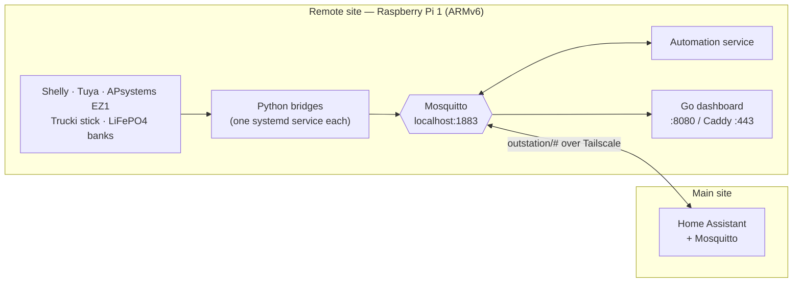
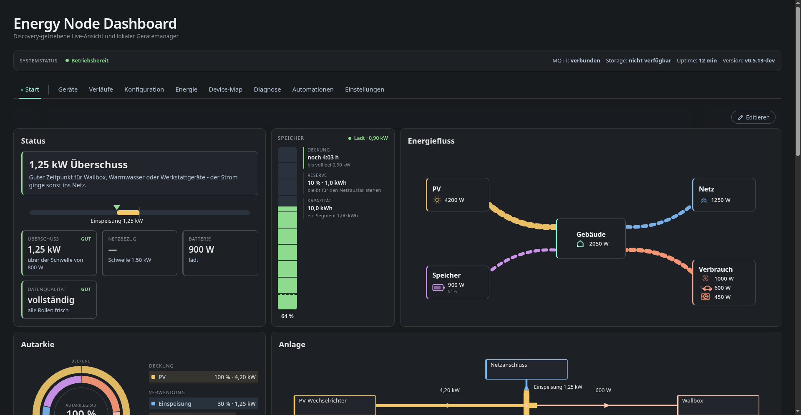
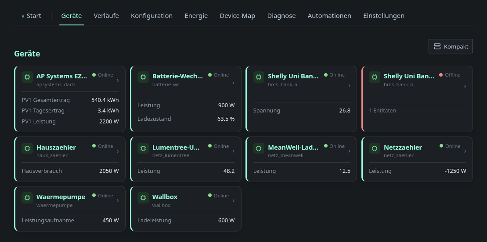
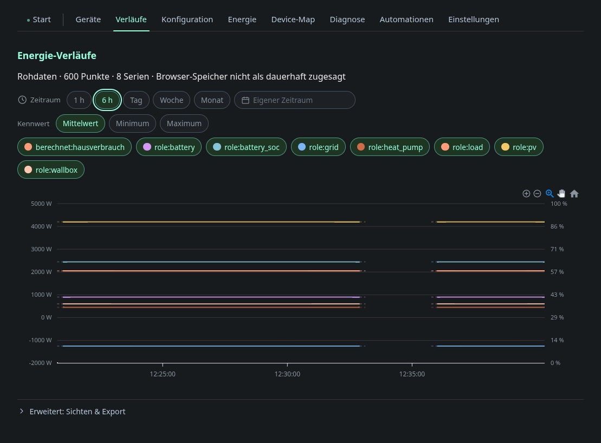

# Energy Node


Energy Node **extends an existing Home Assistant setup with the energy side of
a remote site** — a workshop, barn, garage or second property that has its own
solar, battery and switchable loads, but no reliable place to run a full
home-automation stack.

A single small Linux box at that site becomes a self-contained node: it polls
the local energy hardware, runs its own automation rules and serves its own
web dashboard. A Mosquitto bridge over a VPN then mirrors one topic tree to
the Home Assistant instance at the main site, which picks the devices up
through normal MQTT Discovery — PV production, battery state of charge, load
power, grid import/export, all as first-class HA entities for the energy
dashboard and your existing automations.

The **dashboard also runs standalone**. With no Home Assistant at all — or
when you just want a local energy view on site — the bridge to the main site
is optional and everything on the node works without it.

It is developed and run on a **Raspberry Pi 1 Model B (ARMv6, single core,
512 MB RAM)** — the floor every design decision is measured against. A
**Raspberry Pi Zero W** is an equally good minimum; any newer Pi has headroom
to spare.

> **Language note:** this project started as a single-site tool before it was
> made public, and the dashboard's UI — templates, JS strings, the automation
> editor — is currently **German-only**, as are most in-code comments across
> the Go and Python source. This documentation (README, INSTALLATION.md,
> `docs/`) is written in English. A proper localization layer for the
> dashboard is planned but not yet implemented; until then, changing the
> displayed language means editing the embedded templates directly.

---

## Why a "remote site" module

The problem this solves is not "read a Shelly". It is that the energy
hardware sits somewhere the main automation system cannot reach reliably:

- **Local autonomy.** Broker, bridges, automations and dashboard all run at
  the remote site. If the VPN, the internet or the main site goes down, the
  node keeps measuring, keeps its rules running and keeps its dashboard
  reachable on the local network. Nothing depends on a cloud account —
  every device is polled locally (Shelly HTTP/RPC, Tuya via `tinytuya`,
  APsystems local API, Trucki stick HTTP).
- **One narrow link to the main site.** A Mosquitto bridge over a
  [Tailscale](https://tailscale.com) tunnel mirrors exactly one topic tree,
  `outstation/#`, to the main site's broker. Home Assistant there picks the
  devices up through normal MQTT Discovery. No port forwarding, no exposed
  broker, no extra TLS layer (WireGuard already encrypts the link).
- **Cheap or old hardware is the point.** A remote site is exactly where a
  spare Raspberry Pi 1 ends up, or where a Pi Zero W is all the outlay a side
  building justifies. Running well on ARMv6 is a hard requirement, and it
  shapes the architecture: a single statically linked Go binary without CGO,
  no SQLite, no server-side history, no plugin system, no CDN assets, and
  chart history kept in the browser's IndexedDB rather than on the node.



---

## The dashboard

Server-rendered, no build step, no CDN — everything is embedded in the one
binary. The screenshots below are from the local smoke test
(`dashboard/test/smoke/run-local-dashboard.sh`), which runs the real
dashboard against a fixture broker, so anyone can reproduce them without a Pi
or a device.

**Overview** — energy status, live flow, self-sufficiency ring, balance and
role assignment, all driven by MQTT Discovery:



**Devices** — every discovered device with its entities and controls:



**History** — recorded and charted **in the browser** (IndexedDB), so the Pi
stores nothing and stays responsive; exportable as CSV or JSON:



Every page of the UI — overview and layout editor, devices, history,
configuration, energy roles, device map, diagnostics, automations, all seven
settings tabs and the four colour schemes — is walked through with screenshots
in [`docs/dashboard.md`](docs/dashboard.md).

---

## Components

| Component | Language | What it does |
|---|---|---|
| `dashboard/` | Go | Web UI and `/api/v1` HTTP API. Reads MQTT Discovery, keeps device/entity state in memory, renders server-side HTML, edits the bridge JSON configs, shows energy charts, hosts the automation rule editor and the Tailscale setup wizard. Ships as one static ARMv6 binary. |
| `services/apsystems_ez1/` | Python | APsystems EZ1 microinverters over their local REST API — power, yield, writable power limit, on/off. |
| `services/shelly/` | Python | All Shelly devices, polled over HTTP (`/status` for Gen1, `/rpc` for Gen2+). Switching, power, energy, 3-phase, ADC, temperature/humidity. MQTT stays disabled on the devices themselves. |
| `services/trucki/` | Python | Lumentree inverters with a Trucki stick (T2SG/T2MG/T2HG), read-only, polled over HTTP at an interval the node controls. |
| `services/tuya_mqtt/` | Python | Local Tuya devices via `tinytuya`, including a data-point probe for the setup flow. |
| `services/battery_soc/` | Python | State of charge for two LiFePO4 banks by coulomb counting, with voltage recalibration at the ends of the curve and per-converter efficiency. Monitoring estimate, not a BMS. |
| `services/automation/` | Python | Rule engine (conditions, hysteresis, hold times, cooldown, allowed publish prefixes). Deliberately a separate process from the dashboard, so the dashboard stays read-only. |
| `services/energy-node/` | Python | The node's own Home Assistant device: CPU/RAM/disk, throttling and undervoltage, uptime, Mosquitto and Tailscale status, pending updates. Also the **master** for the shared poll-rate protocol. |
| `libs/energy_node_common/` | Python | Installable package shared by all bridges: MQTT setup, Discovery, availability, scheduler, and the master/slave settings protocol. |
| `integrations/homeassistant/` | Python | Separate track: a native Home Assistant custom integration that brings dashboard features into HA directly, starting with LiFePO4 state of charge (same `battery_soc_core` engine). Installed via HACS — see [Home Assistant integration (HACS)](#home-assistant-integration-hacs). |

Everything couples through **exactly one local MQTT broker**. There is no
direct HTTP path between the bridges and the dashboard.

---

## Home Assistant integration (HACS)

Beyond the MQTT bridge, the plan is to make features that already exist in the
dashboard available **inside Home Assistant itself**, as a native custom
integration under
[`integrations/homeassistant/`](integrations/homeassistant/), installed
through HACS.

It **starts with the LiFePO4 state-of-charge counter**: the same coulomb
counting, voltage recalibration and per-converter efficiency that drive the
dashboard's battery view, running as a config-flow integration with a
`battery_soc.set_state_of_charge` action instead of MQTT topics. The
dashboard's **battery tiles** are the next piece to follow. Both sides share
the transport-agnostic `libs/battery_soc_core/` engine — the MQTT service and
the HA integration are two adapters over one core.

Distribution is a separate public repo (`ha-battery-soc`) wired for HACS,
assembled from this monorepo by `scripts/publish_mirror.sh`; the vendored core
inside the integration is kept in lockstep with `libs/battery_soc_core/` by
`scripts/vendor_core.py` and a commit-time drift guard. Setup and the release
runbook:
[`docs/integration/ha-integration-hacs-release.md`](docs/integration/ha-integration-hacs-release.md).

---

## Getting started

See **[INSTALLATION.md](INSTALLATION.md)** — it covers the ARMv6 specifics,
including the packages that must be installed in an outdated version first
and updated afterwards (Tailscale), and the pip flags a modern Raspberry Pi
OS needs.

Deployment from the development machine:

```sh
./scripts/deploy/deploy_dashboard_to_remote.sh          # cross-compile + ship the Go dashboard
./scripts/deploy/deploy_src_to_remote.sh                # ship the Python services
./scripts/deploy/deploy_src_to_remote.sh --service shelly   # or just one of them
```

---

## Development

```sh
.venv/bin/pytest libs/battery_soc_core services/battery_soc scripts/tests   # core, MQTT adapter, tooling
.venv/bin/pip install -r requirements-dev.txt && .venv/bin/pytest services libs   # full bridge suite (needs the bridges' own runtime deps)
bash scripts/tests/test_publish_mirror.sh                             # HACS mirror assembly
cd integrations/homeassistant && ../../.venv-ha/bin/pytest            # HA integration (separate venv, see below)
cd dashboard && go test ./...      # Go dashboard (go.mod lives in dashboard/)
cd dashboard && npm install && npm test   # browser-side JS (node --test + jsdom)
dashboard/test/smoke/run-local-dashboard.sh   # real dashboard, no Pi, no broker
```

The Home Assistant suite needs its own virtualenv — `pytest-homeassistant-custom-component`
pulls plugins that conflict with the plain suite. Build it once:

```sh
python3.14 -m venv .venv-ha
.venv-ha/bin/pip install -e ./libs/battery_soc_core -r integrations/homeassistant/requirements-test.txt
```

CI (`.github/workflows/ci.yml`, the *Vendored artefacts in sync* job) fails a PR
whose vendored copies drift out of sync — `battery_soc_core` from
`libs/battery_soc_core/`, or the Lovelace `battery-card-core.js` — run
`.venv/bin/python scripts/vendor_core.py` (resp. `scripts/vendor_card.py`) and
commit the result. Per-component patch versions are bumped on the PR branch by
the `Version bump` workflow (`scripts/version/bump-patch.sh`); see
[`docs/knowledge/releasing.md`](docs/knowledge/releasing.md).
`./scripts/deploy/check_tracked_secrets.sh` (also run as a deploy preflight) verifies that
no credentials made it into tracked files.

---

## Documentation

Reference documentation lives under [`docs/`](docs/) — a curated subset of the
project's internal notes, translated to English, and also published as a
GitHub Pages site from that folder.

**[`docs/index.md`](docs/index.md) is the entry point.** It links every page:
the dashboard walkthrough with a screenshot of every screen, the device
services, the data-flow and configuration references, measured per-service
performance on the Pi 1, the `/api/v1` HTTP API, reverse-proxy and
credentials notes, the battery state-of-charge internals, how a release is
cut, and the Home Assistant integration release runbook.

---

## About this repository

Energy Node comes out of one concrete problem. There is a workshop at a
separate address, with its own solar array, battery bank and switchable
loads — but it is too far away, and too dependent on a VPN link, for the
main Home Assistant instance to poll those devices directly. The node closes
that gap: it does the local polling and automation on site, and a Mosquitto
bridge over the VPN carries just the energy values — PV production, battery
state of charge, load and grid power — back to Home Assistant as MQTT
Discovery entities.

That one site is where it started and where it runs today, so parts of it —
the hardware set, the energy-role assignments, some automation rules — still
reflect those specifics. But the goal is a **flexible, general solution
anyone with a remote energy site could run as-is**: configuration over code,
device support added as bridges rather than forks, and site-specific
assumptions steadily pushed out into config. Contributions that widen what it
covers are what move it there — see [CONTRIBUTING.md](CONTRIBUTING.md).

## License

MIT — see [LICENSE](LICENSE).
