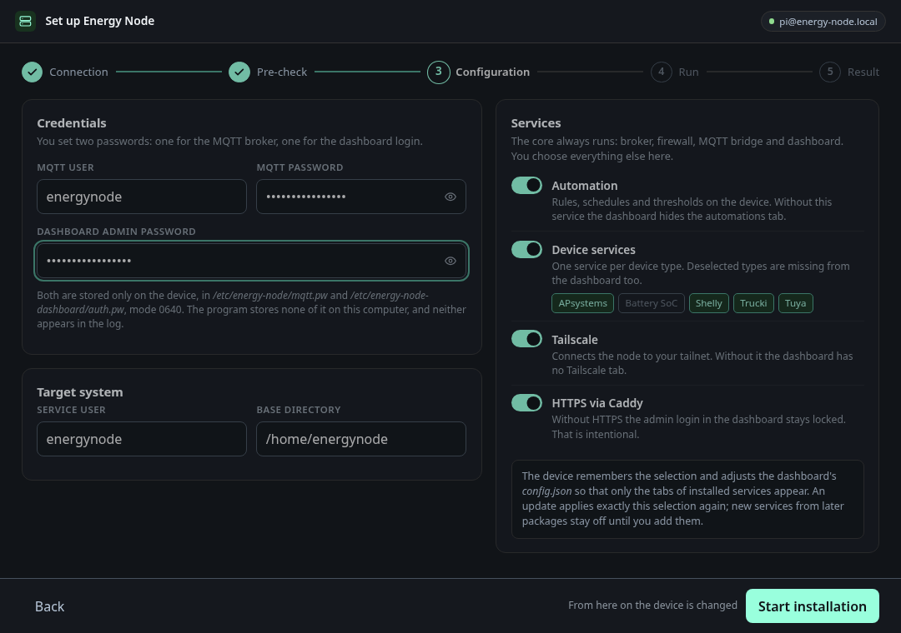
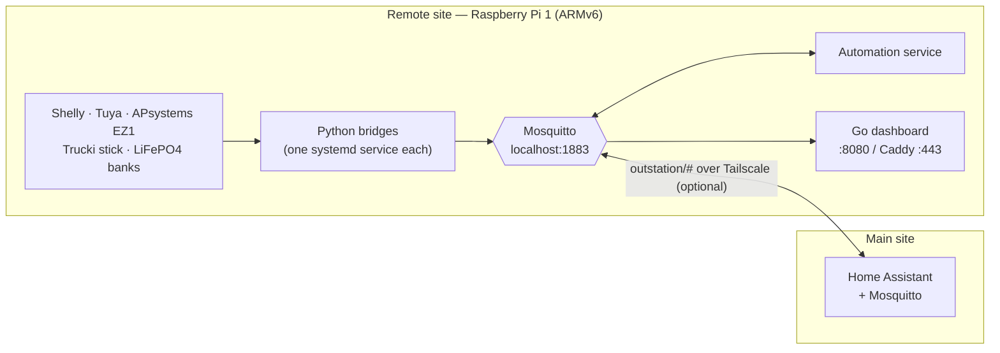

# Energy Node

**Energy monitoring and automation for a remote site. It runs on a
Raspberry Pi 1 and works with or without Home Assistant.**

## What it is

Some solar arrays, batteries and switchable loads sit at a workshop, barn,
garage or second property. Those sites are often too far away, or sit behind
too flaky a link, for the Home Assistant at home to poll their devices
directly.

Energy Node puts one small Linux box at that site and makes it a
self-contained node. It polls the local devices without any cloud account, runs
its own automation rules and serves its own web dashboard. If the internet or
the VPN goes down, the node carries on as before.

If you use Home Assistant, a Mosquitto bridge over Tailscale mirrors the node's
devices to your main site. There they appear as ordinary MQTT Discovery
entities: PV production, battery state of charge, load power, grid
import/export. Without Home Assistant, the dashboard works on its own.

## Highlights

- **Live overview**: energy flow, self-sufficiency ring, balance and cards you
  can arrange in a layout editor. You can pin favourite entities and give each
  device its own icon.
- **History in the browser**: charts are recorded in IndexedDB, so the Pi
  stores nothing. You can export them as CSV or JSON.
- **Automations**: a rule engine with conditions, hysteresis, hold times and
  cooldowns, edited in the dashboard. It runs as its own process, separate from
  the dashboard.
- **Configuration from the UI**: every device service is set up through a form
  in the dashboard, including Tuya and Tailscale setup wizards.
- **Energy roles and device map**: you tell the node which measurement is PV,
  battery, load or grid, and a map you arrange by hand records how the site is
  wired.
- **Desktop installer**: sets up a fresh Pi, updates an existing node or
  diagnoses and repairs one, from Windows, macOS or Linux.
- **Updates from the dashboard**: a notice appears when a new release is out.
  The dashboard downloads the signed package and redeploys the node without SSH.
- **Home Assistant, two ways**: devices arrive through MQTT Discovery, and two
  HACS integrations bring dashboard features into HA directly.
- **Built for weak hardware**: a single static Go binary, no CGO, no database,
  no CDN assets. The Raspberry Pi 1 (ARMv6, single core, 512 MB RAM) is the
  floor every design decision is measured against.

<table>
  <tr>
    <td width="50%"> <b>History</b>: charted in the browser, exportable</td>
    <td width="50%"> <b>Automations</b>: rules edited in the dashboard</td>
  </tr>
  <tr>
    <td width="50%"> <b>Device map</b>: how the devices are connected</td>
    <td width="50%"> <b>Installer</b>: pick the services for a new node</td>
  </tr>
</table>

Every page of the dashboard, including all settings tabs and the four colour
schemes, has a screenshot in [**the dashboard, page by page**](docs/dashboard.md).
The screenshots come from a local smoke test against a fixture broker, so you
can reproduce them without a Pi.

## Supported devices

All devices are polled locally, and none of them needs a cloud account.

| Hardware | How | Direction |
|---|---|---|
| **Shelly** Gen1 and Gen2+ (switches, meters, 3-phase, H&T, ADC) | HTTP `/status` / `/rpc` | read + switch |
| **APsystems EZ1** microinverters | local REST API | read + power limit, on/off |
| **Lumentree** inverters with a **Trucki stick** (T2SG/T2MG/T2HG) | HTTP | read-only |
| **Tuya** devices | local protocol via `tinytuya` | read + switch |
| **LiFePO4 battery banks** | computed from other devices (coulomb counting) | state of charge |
| **The node itself** | CPU, RAM, disk, throttling, Mosquitto/Tailscale status, pending updates | read |

Each family is one small Python service. [Device services](docs/device-services.md)
covers what each one publishes. A new device family is added as another
service; [CONTRIBUTING.md](CONTRIBUTING.md#new-device-services) explains how.

## How it fits together

- **Local autonomy.** The broker, services, automations and dashboard all run
  on the node. The link to the main site is optional.
- **One broker, one narrow link.** Everything on the node talks through a
  single local MQTT broker, and no service calls another over HTTP. Only one
  topic tree, `outstation/#`, crosses the Tailscale tunnel. That means no port
  forwarding and no exposed broker.
- **Cheap hardware is the point.** A side building usually gets a spare Pi 1
  or a Pi Zero W. That is why there is no SQLite, no server-side history and no
  plugin system. Any newer Pi has room to spare.

| Component | Language | Role |
|---|---|---|
| [`dashboard/`](dashboard/) | Go | Web UI, `/api/v1` HTTP API, config editor, automation editor, updater. Also reports the node itself to Home Assistant. |
| [`services/`](services/) | Python | One bridge per device family, plus the automation engine and battery state of charge. |
| [`libs/`](libs/) | Python | Code shared by the services: MQTT, Discovery, scheduling, and the battery SoC engine. |
| [`installer/`](installer/) | Go | Desktop installer for setting up, updating and diagnosing a node. |
| [`integrations/homeassistant/`](integrations/homeassistant/) | Python | Native Home Assistant integrations, shipped through HACS. |

## Getting started

**With the installer (recommended).** Download the installer for your
computer from the [latest release](https://github.com/Developer-Simon/energy-node/releases).
Point it at a Raspberry Pi with SSH enabled, choose your services and let it
run. It fetches the right installation package for the Pi itself.
[Deploying a node](docs/installer.md) walks through every screen.

**By hand.** [INSTALLATION.md](INSTALLATION.md) describes every step the
installer automates, including the ARMv6 quirks: packages that have to be
installed in an old version first (Tailscale), and the pip flags a current
Raspberry Pi OS needs.

## Home Assistant integrations

With the MQTT bridge, every device already shows up in Home Assistant. Two
HACS integrations add dashboard features that run inside HA directly:

- [**`ha-battery-soc`**](https://github.com/Developer-Simon/ha-battery-soc):
  LiFePO4 state of charge. It uses the same coulomb-counting engine as the
  node, set up through a config flow.
- [**`ha-energy-node-icons`**](https://github.com/Developer-Simon/ha-energy-node-icons):
  the dashboard's device icons as an icon set for Home Assistant's icon pickers.

Both are published from [`integrations/homeassistant/`](integrations/homeassistant/)
in this repository.

## Documentation

The [documentation site](docs/index.md) collects all pages. These are the
main entry points:

- [The dashboard, page by page](docs/dashboard.md): every screen with a screenshot
- [Deploying a node](docs/installer.md): the installer, screen by screen
- [Device services](docs/device-services.md): what each service talks to and publishes
- [Data flow](docs/knowledge/data-flow.md) and [configuration](docs/knowledge/configuration.md) reference
- [Performance on the Pi 1](docs/knowledge/performance-and-resources.md): measured CPU and RAM per service
- [Releasing](docs/knowledge/releasing.md): how versions and releases are cut

## Status

Energy Node is **in beta**. Everything described here runs every day on a
real node, but there is no 1.0 release yet. Until then, configuration formats
and screens can still change between 0.x versions, and the changelogs say when
they do.

The **dashboard's UI is German-only** for now, as are most comments in the
code. This README and the documentation are in English. A localization layer
for the dashboard is planned.

## Contributing

Bug reports, fixes and support for new device families are welcome. Before
you start, see [CONTRIBUTING.md](CONTRIBUTING.md). It covers the development
setup, the test suites and the commit conventions.

## Background

Energy Node started with a single site: a workshop at a separate address with
its own solar array, battery bank and switchable loads. That is where it still
runs today, so some defaults still reflect that setup. The goal is a general
tool that anyone with a remote energy site can run without changing the code.
The project works towards that by moving configuration out of the code and
adding device support as new services, not forks.

## License

MIT — see [LICENSE](LICENSE).
