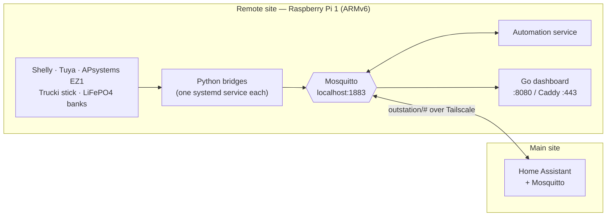
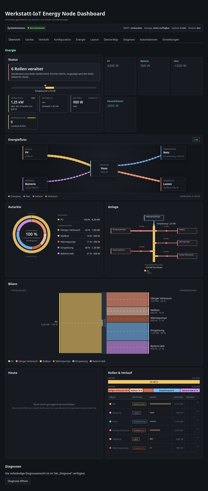
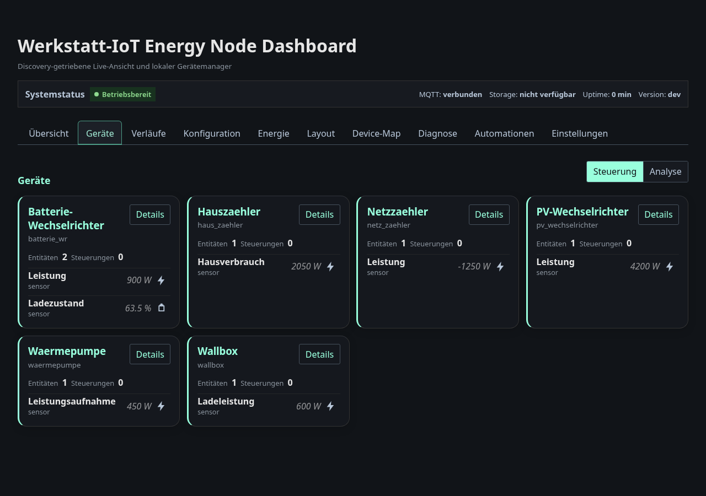
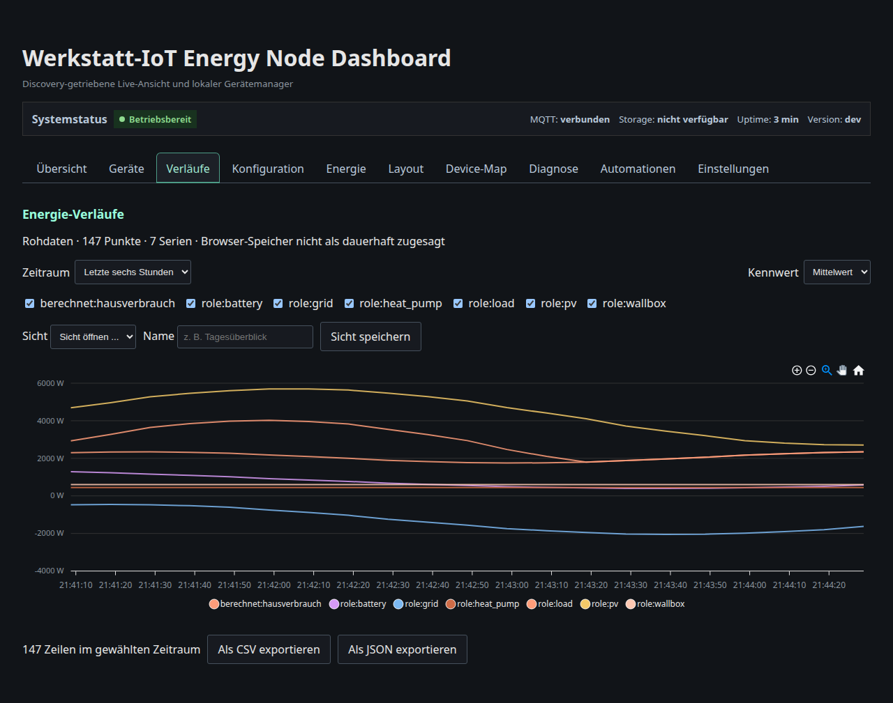

# Energy Node

Energy monitoring and automation for a **remote site** — a workshop, barn,
garage or second property that has its own solar, battery and switchable
loads, but no reliable place to run a full home-automation stack.

Energy Node turns a single small Linux box at that site into a
self-contained node: it polls the local devices, publishes them as Home
Assistant MQTT Discovery entities, runs its own automation rules, serves its
own web dashboard — and mirrors everything over a VPN to the Home Assistant
instance at the main site.

It is developed and run on a **Raspberry Pi 1 Model B (ARMv6, single core,
512 MB RAM)**. Newer Pi models work as well; the Pi 1 is the floor that every
design decision is measured against.

> **Language note:** this project started as a single-site tool before it was
> made public, and the dashboard's UI — templates, JS strings, the automation
> editor — is currently **German-only**, as are most in-code comments across
> the Go and Python source. This documentation (README, INSTALLATION.md,
> `docs/`) is written in English. A proper localization layer for the
> dashboard is planned but not yet implemented; until then, changing the
> displayed language means editing the embedded templates directly.

---

## Why a "remote site" module

The problem this solves is not "read a Shelly". It is that the energy
hardware sits somewhere the main automation system cannot reach reliably:

- **Local autonomy.** Broker, bridges, automations and dashboard all run at
  the remote site. If the VPN, the internet or the main site goes down, the
  node keeps measuring, keeps its rules running and keeps its dashboard
  reachable on the local network. Nothing depends on a cloud account —
  every device is polled locally (Shelly HTTP/RPC, Tuya via `tinytuya`,
  APsystems local API, Trucki stick HTTP).
- **One narrow link to the main site.** A Mosquitto bridge over a
  [Tailscale](https://tailscale.com) tunnel mirrors exactly one topic tree,
  `outstation/#`, to the main site's broker. Home Assistant there picks the
  devices up through normal MQTT Discovery. No port forwarding, no exposed
  broker, no extra TLS layer (WireGuard already encrypts the link).
- **Old hardware is the point.** A remote site is exactly where a spare
  Raspberry Pi 1 ends up. Running well on ARMv6 is a hard requirement, and
  it shapes the architecture: a single statically linked Go binary without
  CGO, no SQLite, no server-side history, no plugin system, no CDN assets,
  and chart history kept in the browser's IndexedDB rather than on the node.



---

## The dashboard

Server-rendered, no build step, no CDN — everything is embedded in the one
binary. The screenshots below are from the local smoke test
(`dashboard/test/smoke/run-local-dashboard.sh`), which runs the real
dashboard against a fixture broker, so anyone can reproduce them without a Pi
or a device.

**Overview** — energy status, live flow, self-sufficiency ring, balance and
role assignment, all driven by MQTT Discovery:



**Devices** — every discovered device with its entities and controls:



**History** — recorded and charted **in the browser** (IndexedDB), so the Pi
stores nothing and stays responsive; exportable as CSV or JSON:



---

## Components

| Component | Language | What it does |
|---|---|---|
| `dashboard/` | Go | Web UI and `/api/v1` HTTP API. Reads MQTT Discovery, keeps device/entity state in memory, renders server-side HTML, edits the bridge JSON configs, shows energy charts, hosts the automation rule editor and the Tailscale setup wizard. Ships as one static ARMv6 binary. |
| `src/apsystems_ez1/` | Python | APsystems EZ1 microinverters over their local REST API — power, yield, writable power limit, on/off. |
| `src/shelly/` | Python | All Shelly devices, polled over HTTP (`/status` for Gen1, `/rpc` for Gen2+). Switching, power, energy, 3-phase, ADC, temperature/humidity. MQTT stays disabled on the devices themselves. |
| `src/trucki/` | Python | Lumentree inverters with a Trucki stick (T2SG/T2MG/T2HG), read-only, polled over HTTP at an interval the node controls. |
| `src/tuya_mqtt/` | Python | Local Tuya devices via `tinytuya`, including a data-point probe for the setup flow. |
| `src/battery_soc/` | Python | State of charge for two LiFePO4 banks by coulomb counting, with voltage recalibration at the ends of the curve and per-converter efficiency. Monitoring estimate, not a BMS. |
| `integrations/homeassistant/` | Python | Native Home Assistant custom integration for LiFePO4 state of charge (same core as the MQTT adapter). Installed via HACS — see [Home Assistant integration (HACS)](#home-assistant-integration-hacs). |
| `src/automation/` | Python | Rule engine (conditions, hysteresis, hold times, cooldown, allowed publish prefixes). Deliberately a separate process from the dashboard, so the dashboard stays read-only. |
| `src/energy-node/` | Python | The node's own Home Assistant device: CPU/RAM/disk, throttling and undervoltage, uptime, Mosquitto and Tailscale status, pending updates. Also the **master** for the shared poll-rate protocol. |
| `src/energy_node_common/` | Python | Installable package shared by all bridges: MQTT setup, Discovery, availability, scheduler, and the master/slave settings protocol. |

Everything couples through **exactly one local MQTT broker**. There is no
direct HTTP path between the bridges and the dashboard.

---

## Home Assistant integration (HACS)

The LiFePO4 state-of-charge logic in `src/battery_soc/` is also available as a
**native Home Assistant custom integration** under
[`integrations/homeassistant/`](integrations/homeassistant/). Both share the
same transport-agnostic `src/battery_soc_core/` engine — the MQTT service and
the HA integration are two adapters over one core.

It is an **alternative** to the MQTT-Discovery bridge, for people who run Home
Assistant directly on the site and would rather add a battery through
*Settings → Devices & Services* than run another Python service against the
broker. Same coulomb counting, voltage recalibration and per-converter
efficiency; a config-flow UI and a `battery_soc.set_state_of_charge` action
instead of MQTT topics.

Distribution is a separate public repo (`ha-battery-soc`) wired for HACS,
assembled from this monorepo by `scripts/publish_mirror.sh`; the vendored core
inside the integration is kept in lockstep with `src/battery_soc_core/` by
`scripts/vendor_core.py` and a commit-time drift guard. Setup and the release
runbook:
[`docs/integration/ha-integration-hacs-release.md`](docs/integration/ha-integration-hacs-release.md).

---

## Getting started

See **[INSTALLATION.md](INSTALLATION.md)** — it covers the ARMv6 specifics,
including the packages that must be installed in an outdated version first
and updated afterwards (Tailscale), and the pip flags a modern Raspberry Pi
OS needs.

Deployment from the development machine:

```sh
./scripts/deploy/deploy_dashboard_to_remote.sh          # cross-compile + ship the Go dashboard
./scripts/deploy/deploy_src_to_remote.sh                # ship the Python services
./scripts/deploy/deploy_src_to_remote.sh --service shelly   # or just one of them
```

---

## Development

```sh
.venv/bin/pytest src/battery_soc_core src/battery_soc scripts/tests   # core, MQTT adapter, tooling
.venv/bin/pip install -r requirements-dev.txt && .venv/bin/pytest src   # full bridge suite (needs the bridges' own runtime deps)
bash scripts/tests/test_publish_mirror.sh                             # HACS mirror assembly
cd integrations/homeassistant && ../../.venv-ha/bin/pytest            # HA integration (separate venv, see below)
cd dashboard && go test ./...      # Go dashboard (go.mod lives in dashboard/)
cd dashboard && npm install && npm test   # browser-side JS (node --test + jsdom)
dashboard/test/smoke/run-local-dashboard.sh   # real dashboard, no Pi, no broker
```

The Home Assistant suite needs its own virtualenv — `pytest-homeassistant-custom-component`
pulls plugins that conflict with the plain suite. Build it once:

```sh
python3.14 -m venv .venv-ha
.venv-ha/bin/pip install -e ./src/battery_soc_core -r integrations/homeassistant/requirements-test.txt
```

`./scripts/install_git_hooks.sh` links this repo's hooks into `.git/hooks/`; the
pre-commit hook bumps the patch version in `dashboard/VERSION` and
`src/VERSION` for commits on `main` that touch the matching directory, and
(on every branch) rejects a commit whose staged files leave the vendored
`battery_soc_core` copy out of sync with `src/battery_soc_core/` — run
`.venv/bin/python scripts/vendor_core.py` and stage the result.
`./scripts/deploy/check_tracked_secrets.sh` (also run as a deploy preflight) verifies that
no credentials made it into tracked files.

---

## Documentation

Reference documentation lives under [`docs/`](docs/). It is a curated subset of
the project's internal notes, translated to English:

- [`docs/knowledge/data-flow.md`](docs/knowledge/data-flow.md) — what data is
  produced where, which channels it travels through, and who consumes it
- [`docs/knowledge/konfiguration.md`](docs/knowledge/konfiguration.md) — every
  field of the central `config.json`
- [`docs/knowledge/performance-und-ressourcen.md`](docs/knowledge/performance-und-ressourcen.md)
  — measured CPU/RAM per service on the Pi 1 and the optimisations that follow
- [`docs/knowledge/dashboard/api-dokumentation.md`](docs/knowledge/dashboard/api-dokumentation.md)
  — the `/api/v1` HTTP API, endpoint by endpoint
- [`docs/knowledge/dashboard/reverse-proxy.md`](docs/knowledge/dashboard/reverse-proxy.md)
  — running the dashboard under a sub-path behind another reverse proxy
- [`docs/knowledge/dashboard/secrets-und-zugangsdaten.md`](docs/knowledge/dashboard/secrets-und-zugangsdaten.md)
  — where credentials live on the node and how they are installed
- [`docs/knowledge/dashboard/lazy-assets-cache-busting.md`](docs/knowledge/dashboard/lazy-assets-cache-busting.md)
  — the frontend's manual `?v=` asset versioning
- [`docs/knowledge/src/battery-soc-funktionsweise.md`](docs/knowledge/src/battery-soc-funktionsweise.md)
  — how the LiFePO4 state-of-charge engine works
- [`docs/integration/ha-integration-hacs-release.md`](docs/integration/ha-integration-hacs-release.md)
  — the Home Assistant custom integration: HACS mirror repo and release runbook

---

## About this repository

This is a **history-free release** of a private project. The public
repository starts from a single initial commit; the original development
history (and the credentials that were once in it) stays local. Expect no
`git log` archaeology and no released-versions history.

It is published as a working reference, not as a product: it is shaped by
one specific site's hardware. Forking and adapting is the expected way to
use it.

## License

MIT — see [LICENSE](LICENSE).
