# The dashboard, page by page

The Energy Node dashboard is a single statically linked Go binary. Templates,
CSS and JavaScript are compiled into it with `go:embed`; there is no build
step, no CDN and no server-side database. It renders HTML on the server,
updates values over an SSE push, and keeps chart history in the browser.

> **Language note:** the UI is currently **German-only** — see the language
> note in the repository's README. The screenshots below therefore show German
> labels; the German term is given in parentheses wherever this page names a
> control.

Every screenshot on this page comes from the local smoke test with the
`alle-funktionen` preset — the real dashboard against a fixture broker, no
Raspberry Pi and no device involved. [Reproduce them yourself](#reproducing-these-screenshots)
in two commands.

---

## The window frame


Three things are always present, on every tab:

- **The system status bar** (`Systemstatus`) — broker connection, storage
  health, uptime and dashboard version. Which of these fields appear is
  configurable, and the whole bar can be switched off.
- **The tab bar.** The first entries are the *layout pages* — user-defined
  overview pages, named in the layout editor. After the divider come the
  fixed tabs: Devices, History, Configuration, Energy, Device Map,
  Diagnostics, Automations, Settings.
- **Who you are logged in as.** Over plain HTTP only *continue as guest* is
  offered; the admin login is refused unless the request arrives over HTTPS.
  A guest can look at everything, edit layouts and automation rules, but the
  protected actions — the MQTT and bridge configuration (`mqtt_config`),
  restart/reboot/shutdown (`system_actions`) — need a registered user with the
  matching role **and** HTTPS. See
  [`knowledge/dashboard/secrets-and-credentials.md`](knowledge/dashboard/secrets-and-credentials.md).

Panels are lazily loaded: only the active tab's HTML fragment, scripts and
stylesheets are fetched, which is what keeps the first paint cheap on a
Raspberry Pi 1.

---

## Start — the overview pages

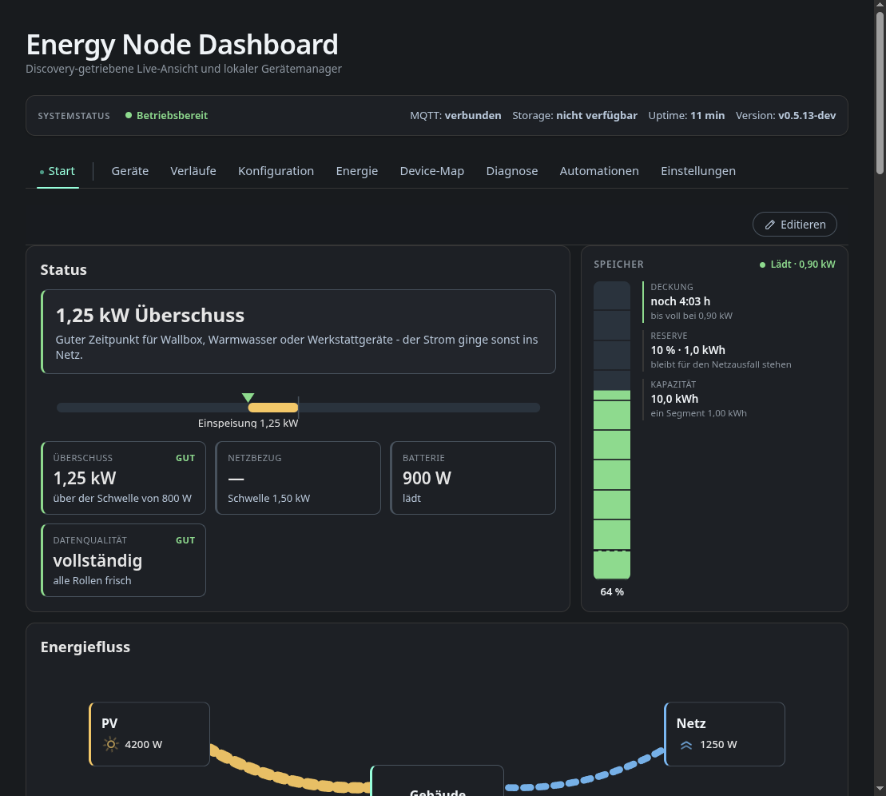

The start tab is not a fixed screen but a **grid of cards you arrange
yourself**. Above, the fixture's cards:

- **Status card** (`Statuskarte`) — the current situation in one sentence
  ("1.25 kW surplus — good moment for the wallbox"), a bar showing where the
  balance sits between grid import and feed-in, and the surplus / grid draw /
  battery / data-quality tiles with their thresholds.
- **Battery status card** (`Speicher: Statuskarte`) — segmented charge column,
  time to full or empty, the reserve kept back for a grid outage, and the
  usable capacity.
- **Energy flow** (`Energiefluss`) — PV, storage, building, grid and the
  individual loads as animated flows whose speed follows the actual watts.
- **Self-sufficiency ring** (`Autarkie-Ring`) — coverage versus use, split by
  source and by consumer.
- **Plant schema** (`Anlagenschema`) — a wiring-style diagram of the site with
  the live power on each leg.

Every card is driven purely by MQTT Discovery data plus the role assignment
from the Energy tab. Nothing here is hard-coded to a particular device.

### The layout editor

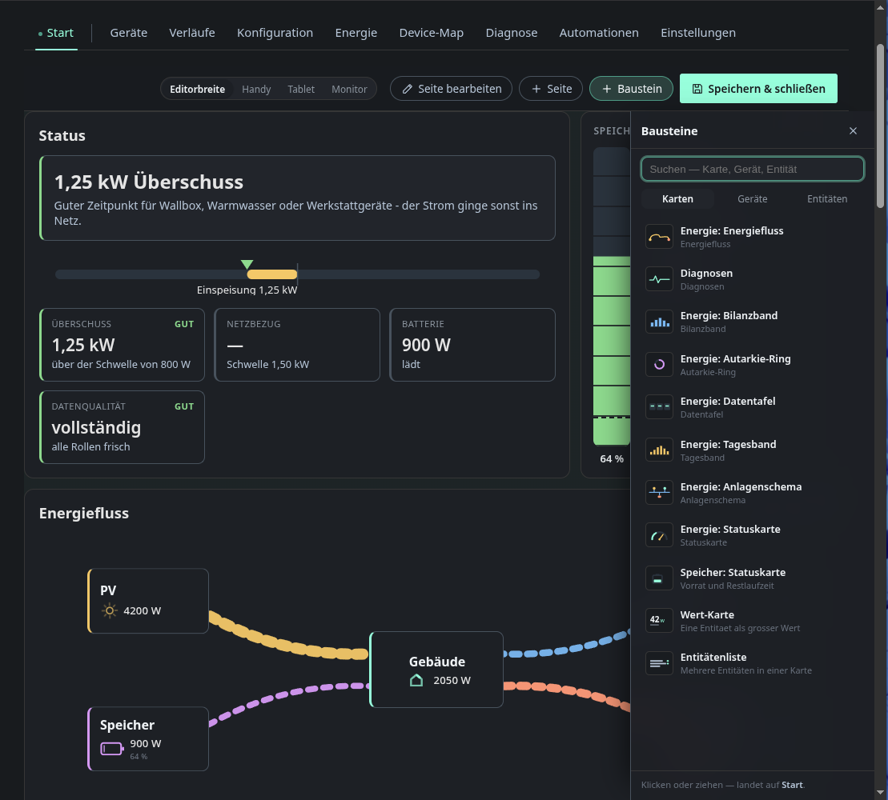

`Editieren` turns the overview into an editor: drag and resize cards, add
pages, and pick new blocks from the panel on the right. The picker has three
tabs — **cards**, **devices** and **entities** — so a layout page can mix
computed energy cards with a raw device tile or a single measured value.

| Block (German label) | Layout type | What it shows |
|---|---|---|
| Energie: Statuskarte | `energy_status` | Situation, thresholds, data quality |
| Energie: Energiefluss | `energy_flow` | Animated flow graph |
| Energie: Autarkie-Ring | `energy_ring` | Coverage/use ring |
| Energie: Anlagenschema | `energy_schema` | Plant diagram |
| Energie: Bilanzband | `energy_band` | Balance over time as a band |
| Energie: Tagesband | `energy_day` | The day's curve |
| Energie: Datentafel | `energy_board` | The balance as a plain number board |
| Speicher: Statuskarte | `battery_status` | Charge column or projection |
| Diagnosen | `diagnostics` | Health summary of all devices |
| Wert-Karte | `entity_value` | One entity as a large value |
| Entitätenliste | `entity_group` | Several entities in one card |
| (Devices tab) | `device` | A full device tile with its controls |

Editor width can be previewed as phone, tablet or monitor. Layouts are
versioned — every save is a revision that can be restored.

---

## Devices (`Geräte`)

Everything the node has seen through MQTT Discovery, grouped by device. Two
view modes, switched with the button in the top right:

**Compact** — name, availability, and the few headline values:


**Details** — every entity of every device, with its component type and its
controls: sliders for `number` entities, toggles for `switch`, live values for
`sensor`:

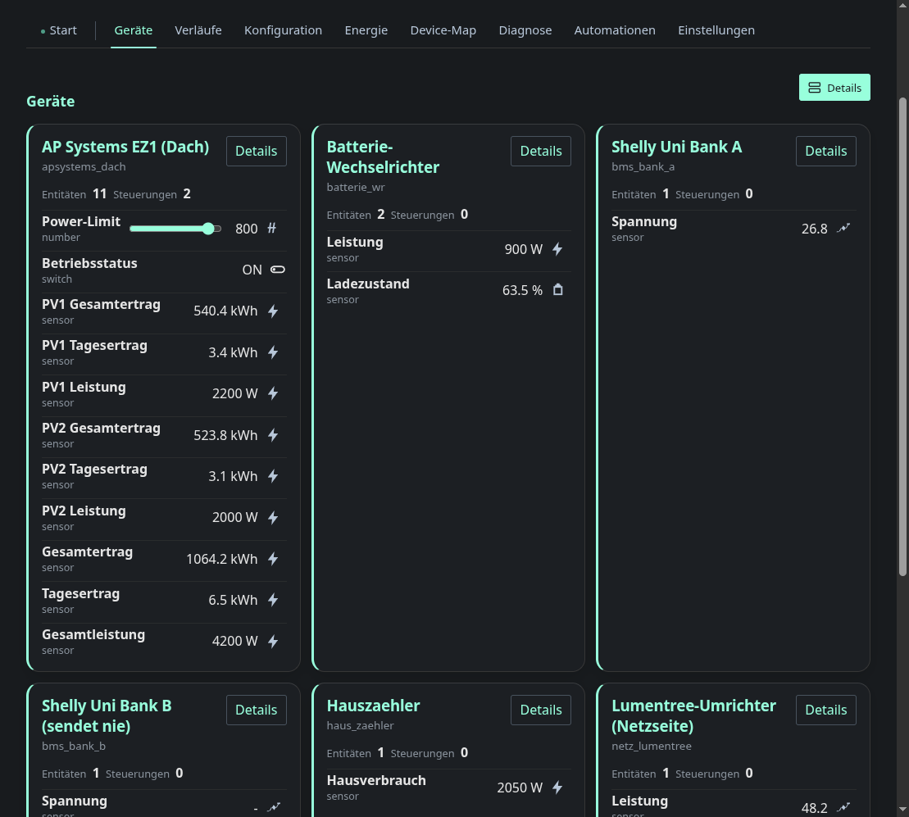

Availability comes from each device's `availability_topic`; `Shelly Uni
Bank B` above is the fixture's deliberately offline device. `Details` on a
device opens a dialog with the raw discovery payload, the topics involved and
whether the discovery message was retained — the fastest way to answer "why
does Home Assistant not see this".

The default view mode is a setting, so a wall-mounted tablet can open straight
into compact mode.

---

## History (`Verläufe`)


The node stores **no** history. The browser records it: a recorder samples
`/api/v1/energy` on an interval and writes to IndexedDB, which is what keeps
the Pi's SD card and RAM out of the loop entirely.

- **Time range** — 1 h, 6 h, day, week, month, or a custom range.
- **Statistic** — mean, minimum or maximum per bucket.
- **Series** — every energy role plus computed series such as
  `berechnet:hausverbrauch`. Click a chip to show or hide it.
- **Advanced: views & export** — save a set of series as a named view, and
  export the visible data as CSV or JSON.

Raw samples are compacted into one-minute and five-minute tiers as they age.
Two browsers that have the dashboard open at the same time will **exchange the
tiers each is missing** over the node — an SSE hub on the server, no data
stored server-side, and never overwriting a browser's own measurements.

The line above the chart names the tier, the number of points, the number of
series, and whether the browser has promised the storage as persistent.

---

## Configuration (`Konfiguration`)

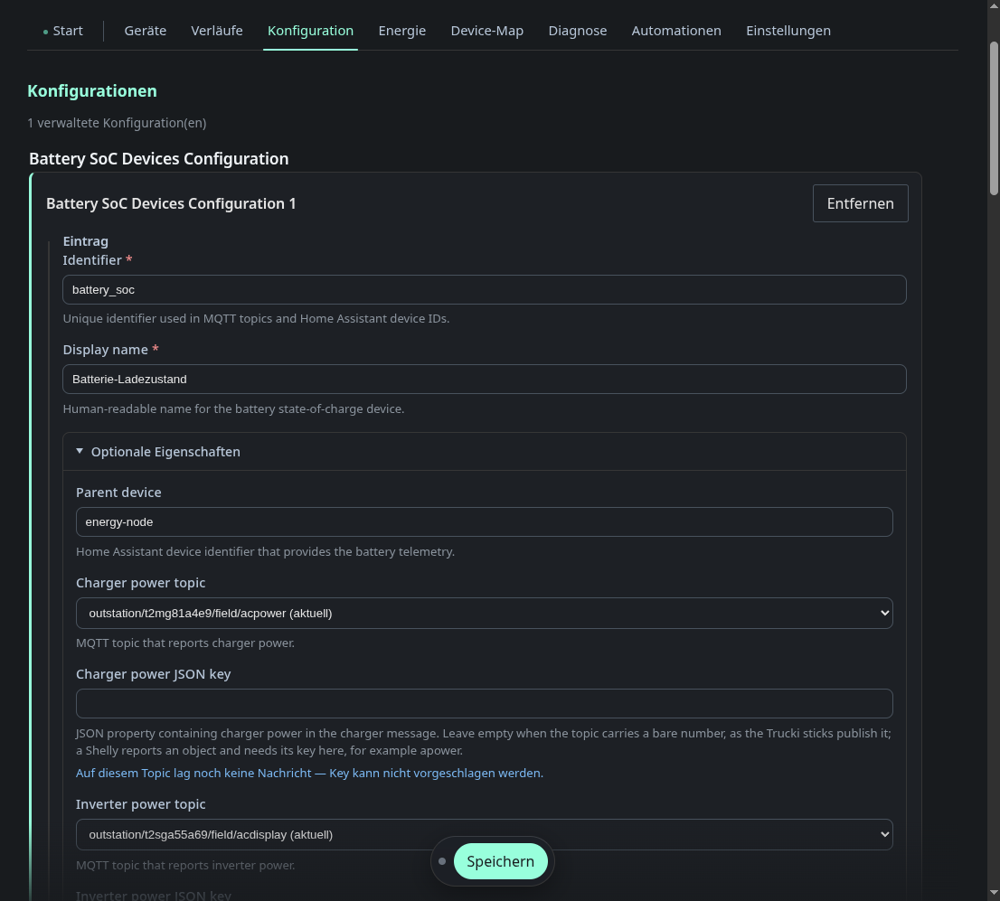

This is the editor for the **Python services' device JSON files** — the same
`*_devices.json` files described in
[Device services](device-services.md). The form is generated from the JSON
schema that sits next to each config file, so field names, help texts,
required markers and value ranges all come from one source.

Two things this page does that a text editor cannot:

- **It suggests MQTT topics and JSON keys from traffic it has actually seen.**
  The dropdowns above are filled from retained payloads on the broker, and a
  topic that has never carried a message says so instead of silently offering
  nothing.
- **It validates before writing.** A value outside the schema's range is
  rejected with an HTTP 400 rather than written and discovered later by a
  service that then fails to start.

Saving writes the file and asks the owning service to reload it — the response
carries the reload result, so a service that refused the new file says so here
rather than failing silently on the next restart. Editing automation rules
additionally requires the `automations` role and a CSRF token.

---

## Energy (`Energie`)

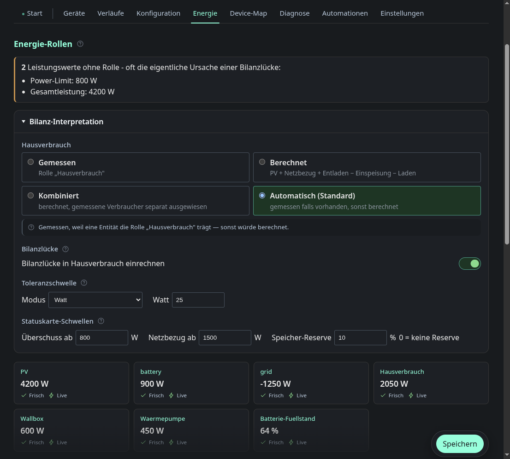

The bridge between "a pile of sensors" and "an energy balance". Each measured
entity is given a **role** — PV, grid, battery, house load, wallbox, heat
pump, battery state of charge, and the mirrored import/export and
charge/discharge variants. Several entities may share a role; they are summed.
Everything else stays unassigned and is listed at the top, because an
unassigned power sensor is the usual cause of a balance that does not add up.

**Balance interpretation** decides how house consumption is obtained:

| Mode | Meaning |
|---|---|
| Measured (`Gemessen`) | Take the entity carrying the house-load role |
| Computed (`Berechnet`) | PV + grid draw + discharge − feed-in − charge |
| Combined (`Kombiniert`) | Computed, with measured consumers shown separately |
| Automatic (default) | Measured if available, otherwise computed |

Below that sit the knobs that the status card reads: whether a remaining
balance gap is folded into house consumption, the tolerance threshold in watts
or percent, and the thresholds at which the status card calls a situation a
surplus or a grid draw, plus the battery reserve.

The tiles at the bottom show every assigned role with its current value and
two flags: whether the value is fresh, and whether it is arriving live.

---

## Device map (`Device-Map`)

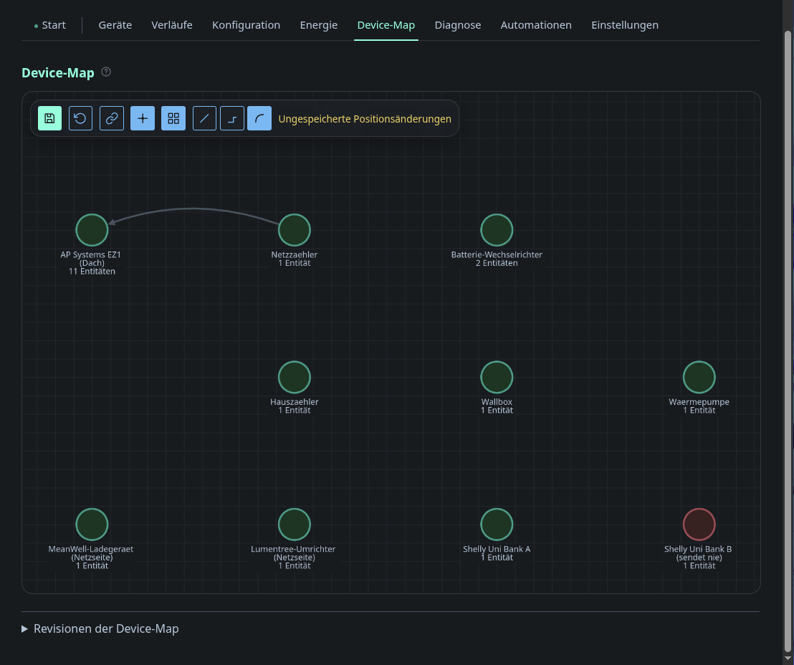

A free-form canvas of all devices. Nodes are placed by hand, coloured by
health, and can be connected with edges — straight, orthogonal or curved — to
record how the site is actually wired. It answers questions the automatic
views cannot: which meter sits ahead of which sub-distribution, what a device
is physically attached to.

Positions and edges are stored server-side and versioned like the layout, so
an accidental drag can be rolled back.

---

## Diagnostics (`Diagnose`)

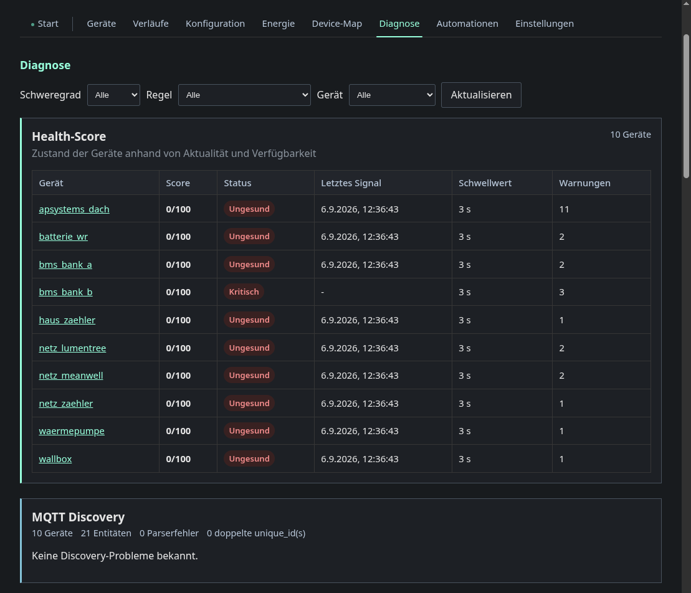

Two blocks:

- **Health score** — one row per device: score, status, the time of its last
  signal, the staleness threshold it is measured against, and the number of
  warnings. A device that has never sent shows as critical. In the screenshot
  every device is "unhealthy" because the fixture broker replays retained
  messages once and then goes quiet — on real hardware the poll intervals keep
  the scores up.
- **MQTT Discovery** — the count of devices, entities, parse errors and
  duplicate `unique_id`s, plus the concrete problems behind them. Duplicate
  unique IDs are the classic reason Home Assistant merges two devices into
  one.

Both can be filtered by severity, rule and device.

---

## Automations (`Automationen`)

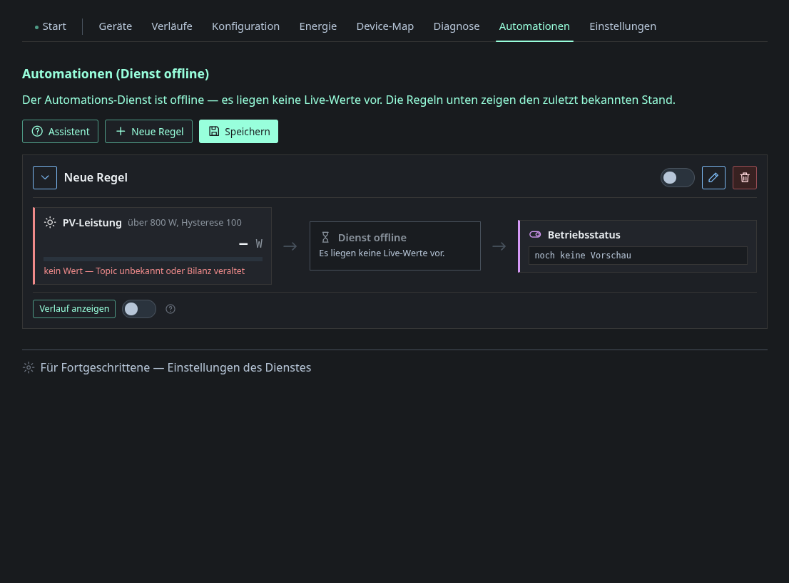

The editor for the rules of the separate `automation_mqtt.py` service. Each
rule reads left to right: **conditions → state → actions**. A condition can be
a threshold on a balance field (with hysteresis and hold time), a raw MQTT
topic value, a Home Assistant style entity template, or a time window; an
action publishes to a topic or raises a notification.

The header shows whether the automation service is reachable. In the
screenshot it is offline — the smoke-test harness does not start it — so the
rules render from their saved state with no live values. That is deliberate:
the dashboard **never** executes rules itself. It only edits the JSON, and the
Python service owns evaluation and publishing. See
[Device services → Automations](device-services.md#automations).

The `Assistent` button walks through building a rule; `Verlauf anzeigen`
shows the last triggers of a single rule.

---

## Settings (`Einstellungen`)

Seven sub-tabs.

### General (`Allgemein`)

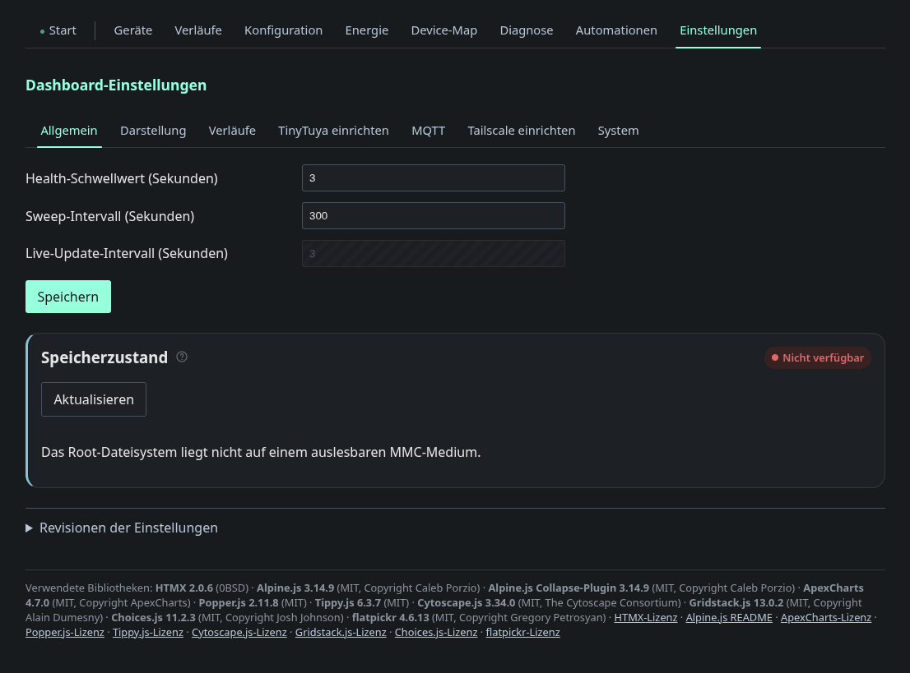

Health threshold, sweep interval and live-update interval, plus the storage
health check — on a Pi this reads the SD card's wear counters, and it says so
plainly when the root filesystem is not a readable MMC medium. Settings are
versioned; `Revisionen der Einstellungen` restores an earlier state. The
footer lists every bundled JavaScript library with its version, license and
license link.

### Display (`Darstellung`)

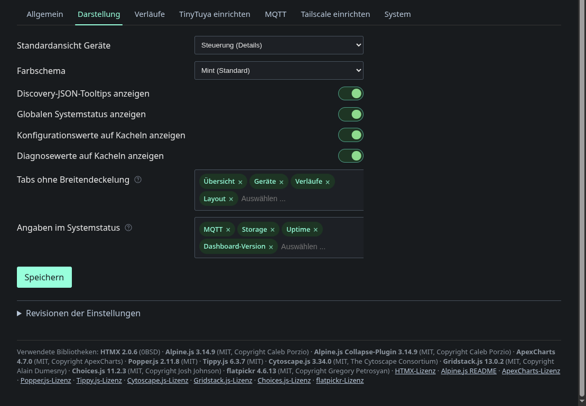

Default device view mode, colour scheme, and what extra information the UI
shows: discovery JSON tooltips, the global status bar, configuration and
diagnostic values on tiles. `Tabs ohne Breitendeckelung` lets chosen tabs use
the full window width instead of the centred column, and
`Angaben im Systemstatus` picks the fields in the status bar.

### History (`Verläufe`)

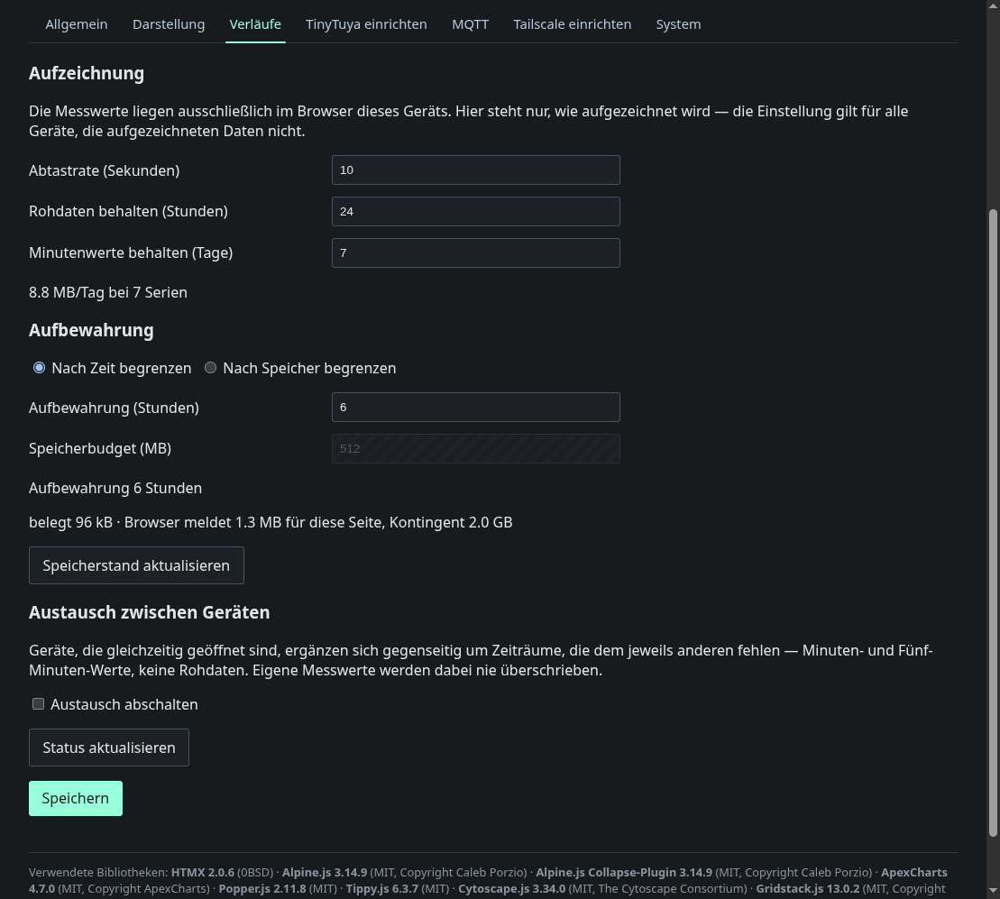

Recording and retention for the browser-side history — sample rate, how long
raw data is kept before compaction, how long minute values survive. The
retention limit is either by time or by a storage budget in MB, and the page
shows the projected daily volume, the actual usage and the browser's quota.
The last block switches the device-to-device exchange off.

Note the wording on the page: the setting applies to every browser, the
recorded data does not — the measurements live only in the browser that
recorded them.

### TinyTuya setup (`TinyTuya einrichten`)

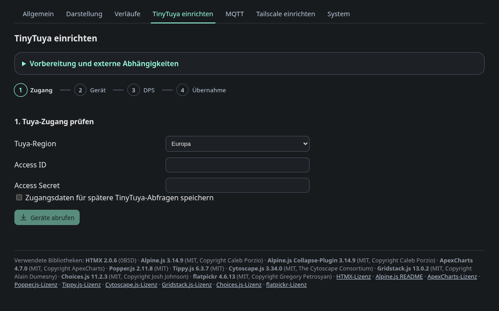

A four-step wizard — credentials, device, data points, apply — around the
`tinytuya` cloud lookup: enter the Tuya region and API credentials, list the
devices on the account, probe the device's data points locally, and write the
result into `tuya_devices.json`. The data point number for a switch is not
reliably `1`, which is the whole reason the probe step exists. Credentials are
only stored when explicitly asked for.

### MQTT

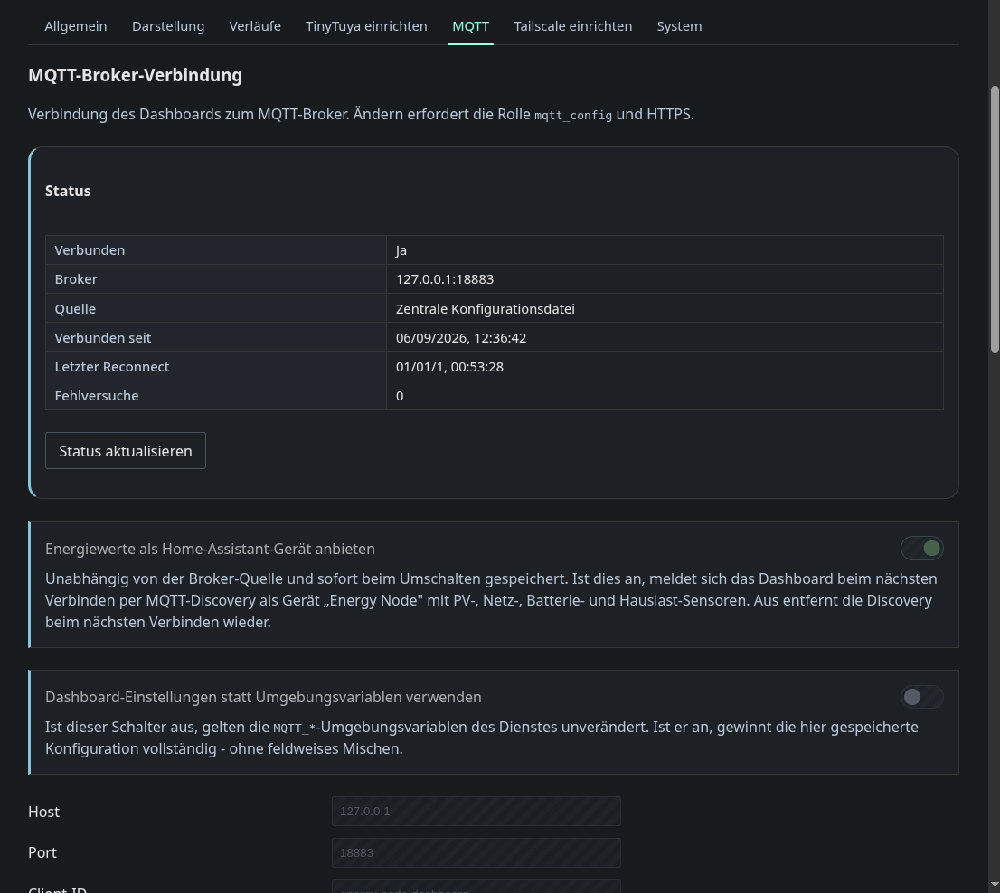

Broker connection with a live status table — connected, address, where the
configuration came from, connected since, last reconnect, failed attempts.
Two switches worth calling out:

- **Publish energy values as a Home Assistant device.** The dashboard then
  announces itself over MQTT Discovery as the device "Energy Node" with PV,
  grid, battery and house-load sensors, so the computed balance reaches Home
  Assistant without any extra service.
- **Use dashboard settings instead of the central configuration.** Off means
  the values from `/etc/energy-node/config.json` win unchanged; on means the
  settings stored here take over completely, with no field-wise merging.

Further down the same tab configures the **Mosquitto bridge to the main site**
and can apply and restart it.

### Tailscale setup (`Tailscale einrichten`)

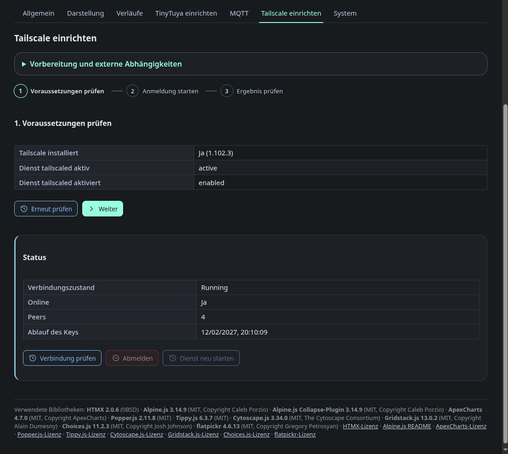

Three steps — check prerequisites, start login, check the result. It reports
whether Tailscale is installed and whether `tailscaled` is active and enabled,
and once connected shows the connection state, peer count and key expiry, with
buttons to re-check, log out or restart the service. It exists because
bringing a headless Pi onto a tailnet otherwise means an SSH session and a
copied login URL.

### System

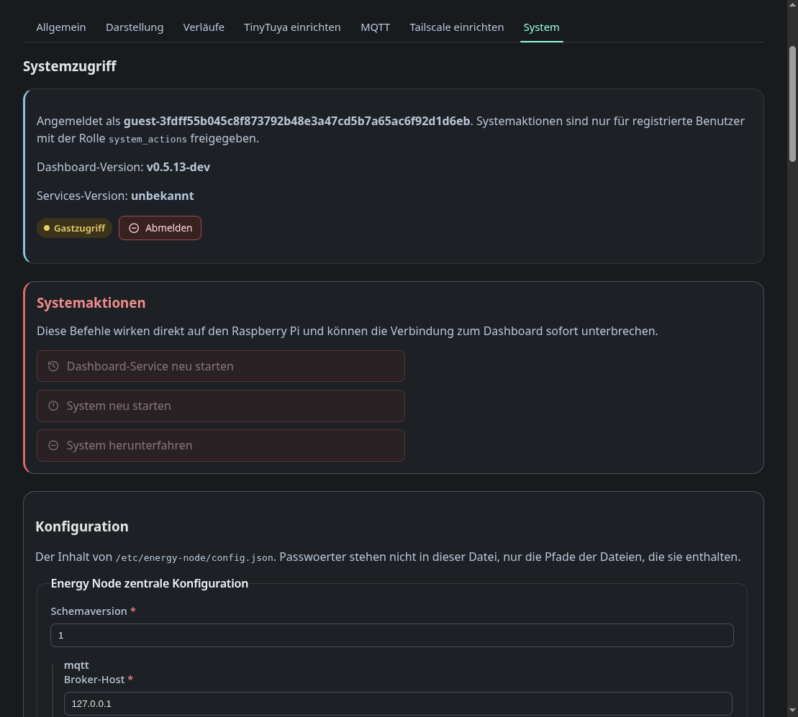

Who you are logged in as and with which role, the dashboard and services
versions, and the system actions: restart the dashboard service, reboot,
power off. They are greyed out above because the session is a guest session —
system actions need a registered user with the `system_actions` role **and**
HTTPS.

Below that, the content of `/etc/energy-node/config.json` as a generated form,
same mechanism as the configuration tab. Passwords are never in that file,
only the paths of the files that hold them.

---

## Colour schemes

Four themes ship with the dashboard, chosen in *Settings → Display*:

| Mint (default) | Stromblau |
|---|---|
| 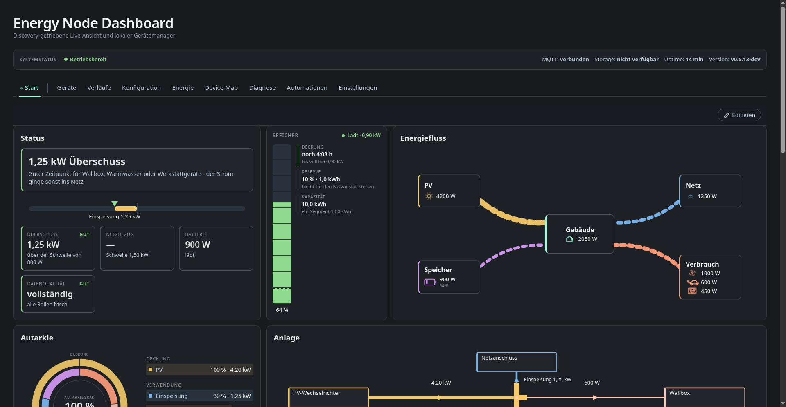 | 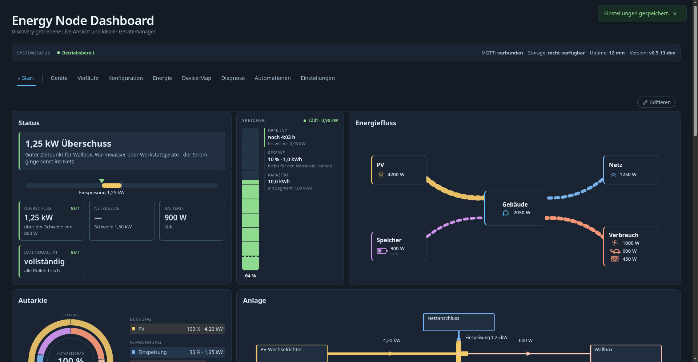 |

| Signalgelb | Tageslicht |
|---|---|
| 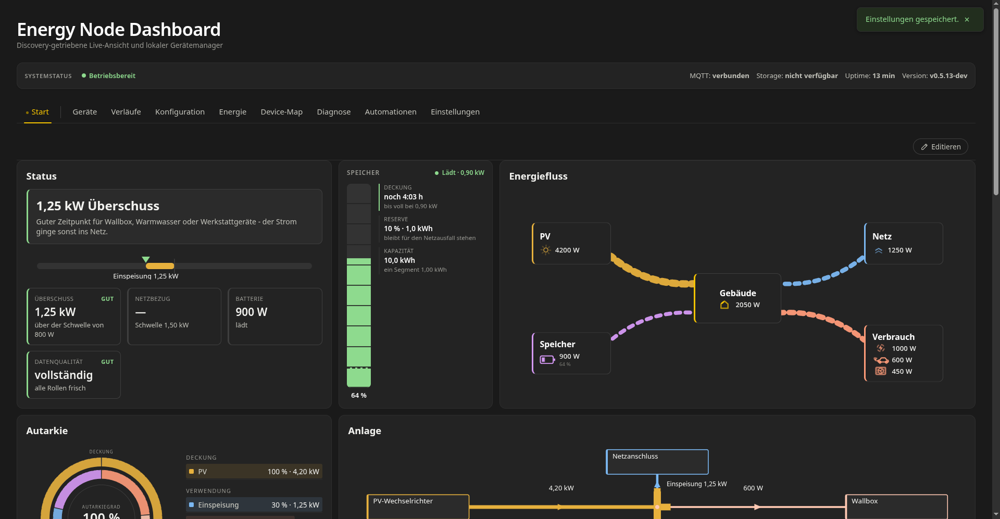 | 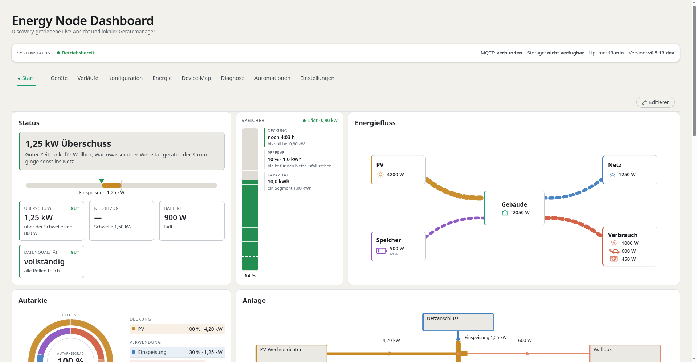 |

Three are dark; `Tageslicht` is the light one, meant for a screen in a bright
workshop.

---

## Reproducing these screenshots

The smoke test starts the real dashboard against a fixture broker — no
Raspberry Pi, no Mosquitto, no devices:

```bash
dashboard/test/smoke/run-local-dashboard.sh --keep --preset alle-funktionen
```

It prints a URL and credentials and stays up until Ctrl-C. The
`alle-funktionen` preset is the near-complete one: battery SoC devices, the
seven energy entities of a sunny moment, a fully modelled APsystems EZ1 with
two strings and a writable power limit, plus a seeded layout, role assignment
and device map.

For a screenshot without clicking anything, drive it with headless Chromium:

```bash
node dashboard/test/smoke/screenshot.mjs --out /tmp/overview.png
```

Add `--theme tageslicht` to the first command for the light theme,
`--width 390 --height 844` to the second for a phone-sized viewport. The full
option list, the other presets and the fixtures behind them are documented in
`dashboard/test/smoke/README.md` in the repository.

---

## See also

- [Device services](device-services.md) — what fills the dashboard with data
- [`knowledge/dashboard/api-documentation.md`](knowledge/dashboard/api-documentation.md) — the `/api/v1` HTTP API behind every page
- [`knowledge/data-flow.md`](knowledge/data-flow.md) — where each value comes from
- [`knowledge/dashboard/reverse-proxy.md`](knowledge/dashboard/reverse-proxy.md) — running the dashboard under a sub-path
