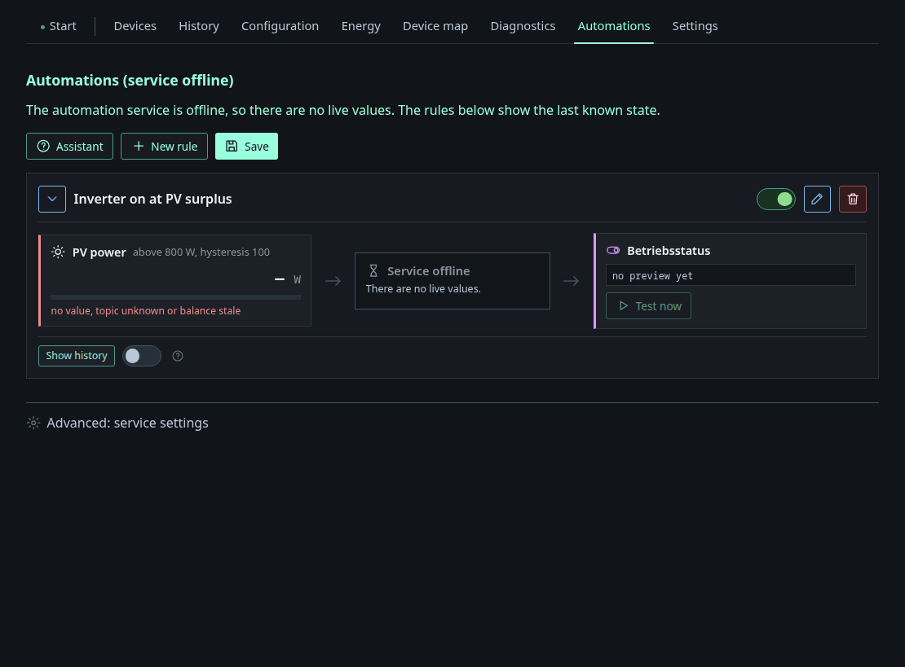

# Automations

The editor for the rules of the separate `automation_mqtt.py` service. Each
rule reads left to right: **conditions → state → actions**. A condition can be
a threshold on a balance field (with hysteresis and hold time), a raw MQTT
topic value, a Home Assistant style entity template, or a time window; an
action publishes to a topic or raises a notification.

The header shows whether the automation service is reachable. In the
screenshot it is offline — the smoke-test harness does not start it — so the
rules render from their saved state with no live values. That is deliberate:
the dashboard **never** executes rules itself. It only edits the JSON, and the
Python service owns evaluation and publishing. See
[Device services → Automations](../services/automations.md).

The **Assistant** button walks through building a rule. **Show history**
shows the last triggers of a single rule.
