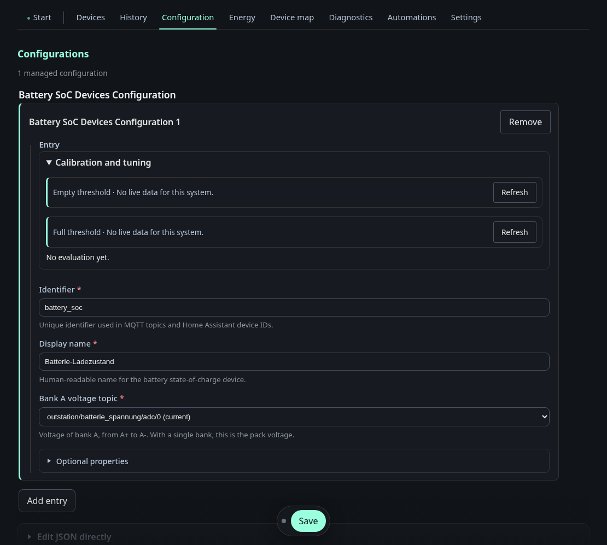

# Configuration editor

This is the editor for the **Python services' device JSON files** — the same
`*_devices.json` files described in
[Device services](../device-services.md). The form is generated from the JSON
schema that sits next to each config file, so field names, help texts,
required markers and value ranges all come from one source.

Two things this page does that a text editor cannot:

- **It suggests MQTT topics and JSON keys from traffic it has actually seen.**
  The dropdowns above are filled from retained payloads on the broker, and a
  topic that has never carried a message says so instead of silently offering
  nothing.
- **It validates before writing.** A value outside the schema's range is
  rejected with an HTTP 400 rather than written and discovered later by a
  service that then fails to start.

Saving writes the file and asks the owning service to reload it — the response
carries the reload result, so a service that refused the new file says so here
rather than failing silently on the next restart. Editing automation rules
additionally requires the `automations` role and a CSRF token.
