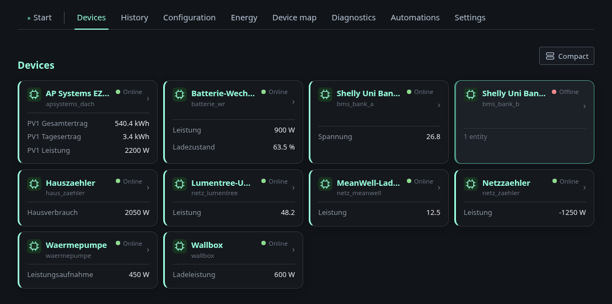
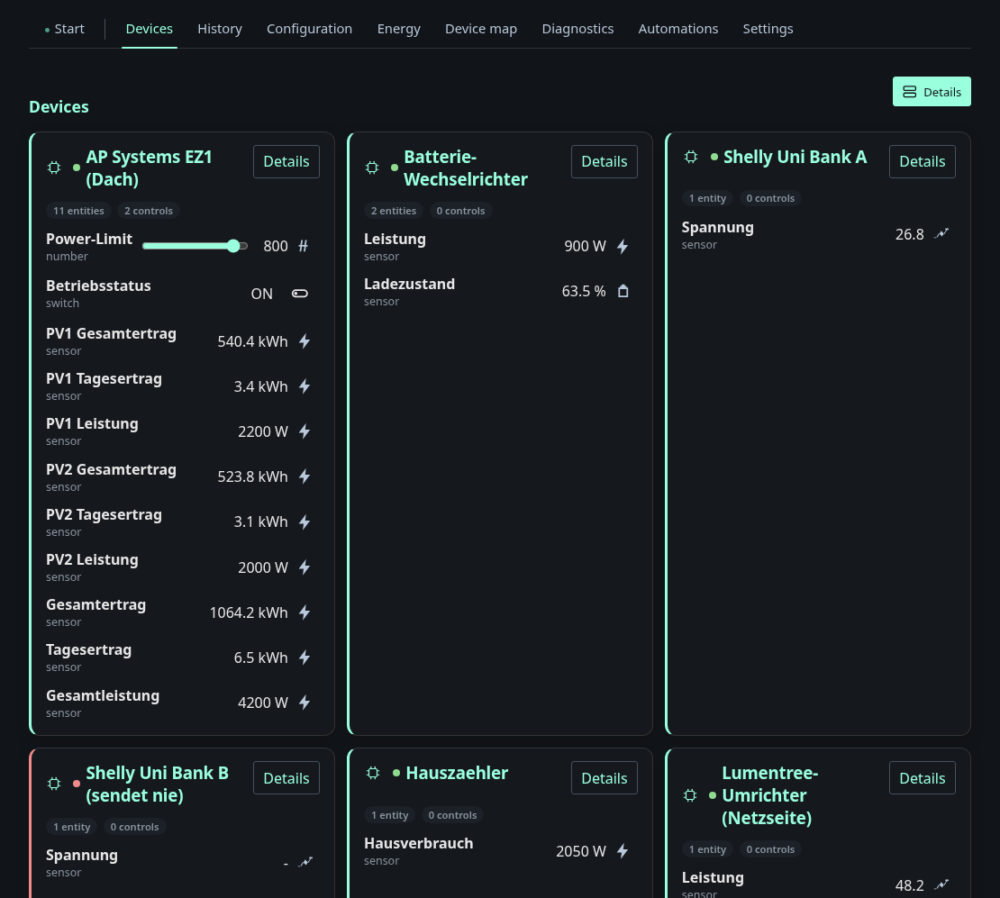

# Devices and device map

Everything the node has seen through MQTT Discovery, grouped by device. Two
view modes, switched with the button in the top right:

**Compact** — name, availability, and the few headline values:

**Details** — every entity of every device, with its component type and its
controls: sliders for `number` entities, toggles for `switch`, live values for
`sensor`:

Availability comes from each device's `availability_topic`; `Shelly Uni
Bank B` above is the fixture's deliberately offline device. `Details` on a
device opens a dialog with the raw discovery payload, the topics involved and
whether the discovery message was retained — the fastest way to answer "why
does Home Assistant not see this".

The default view mode is a setting, so a wall-mounted tablet can open straight
into compact mode.

## Device map

A free-form canvas of all devices. Nodes are placed by hand, coloured by
health, and can be connected with edges — straight, orthogonal or curved — to
record how the site is actually wired. It answers questions the automatic
views cannot: which meter sits ahead of which sub-distribution, what a device
is physically attached to.

Positions and edges are stored server-side and versioned like the layout, so
an accidental drag can be rolled back.
