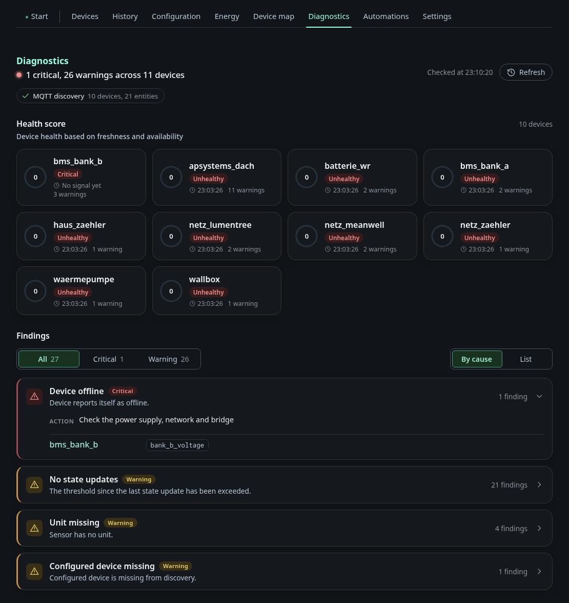

# Diagnostics

The page has two blocks.

The health score has one row per device with the score, the status, the time
of the last signal, the staleness threshold it is measured against and the
number of warnings. A device that has never sent anything shows as critical. In
the screenshot every device is "unhealthy" because the fixture broker replays
the retained messages once and then goes quiet. On real hardware the poll
intervals keep the scores up.

The MQTT Discovery block counts devices, entities, parse errors and duplicate
`unique_id`s, and lists the problems behind them. Duplicate unique IDs are the
usual reason Home Assistant merges two devices into one.

Both blocks can be filtered by severity, rule and device.
