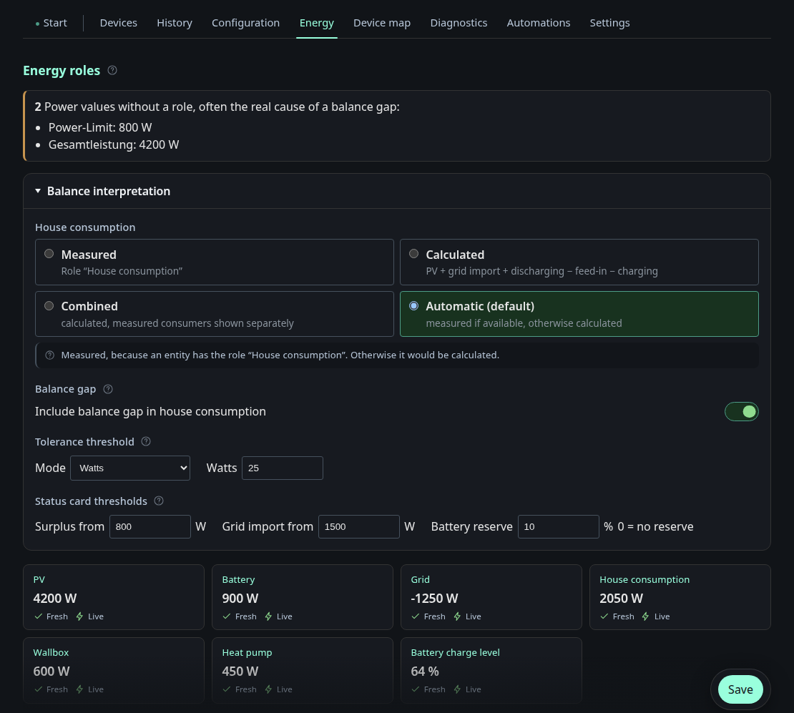

# Energy

This page turns a set of sensors into an energy balance. Each measured entity
gets a role: PV, grid, battery, house load, wallbox, heat pump, battery state of
charge, or one of the split import/export and charge/discharge variants.
Several entities can share a role, and their values are summed. Entities
without a role are listed at the top, because an unassigned power sensor is
the usual reason a balance does not add up.

**Balance interpretation** decides where the house consumption comes from:

| Mode | Meaning |
|---|---|
| Measured | Take the entity carrying the house consumption role |
| Calculated | PV + grid import + discharging − feed-in − charging |
| Combined | Calculated, with measured consumers shown separately |
| Automatic (default) | Measured if available, otherwise calculated |

Below that are the settings the status card reads: whether a remaining gap in
the balance is added to the house consumption, the tolerance in watts or
percent, the thresholds at which the status card calls a situation a surplus
or a grid draw, and the battery reserve.

The tiles at the bottom show every assigned role with its current value and
two flags: whether the value is fresh and whether it arrives live.
