# Energy and device map

The Energy tab turns your sensors into an energy balance. The Device map tab
shows where that energy flows. Both work on the same roles, groups and
categories, and a change on one tab shows up on the other right away.

## Energy tab

### Plant live

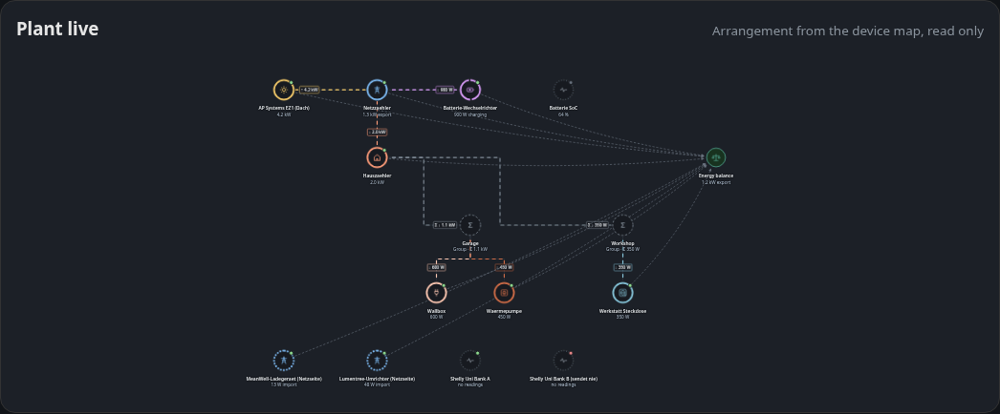

The device map arrangement, read only, with the live flow and the energy
balance. Click a device to light up its rows in the role table, click a group
to jump to its card.

### Balance interpretation

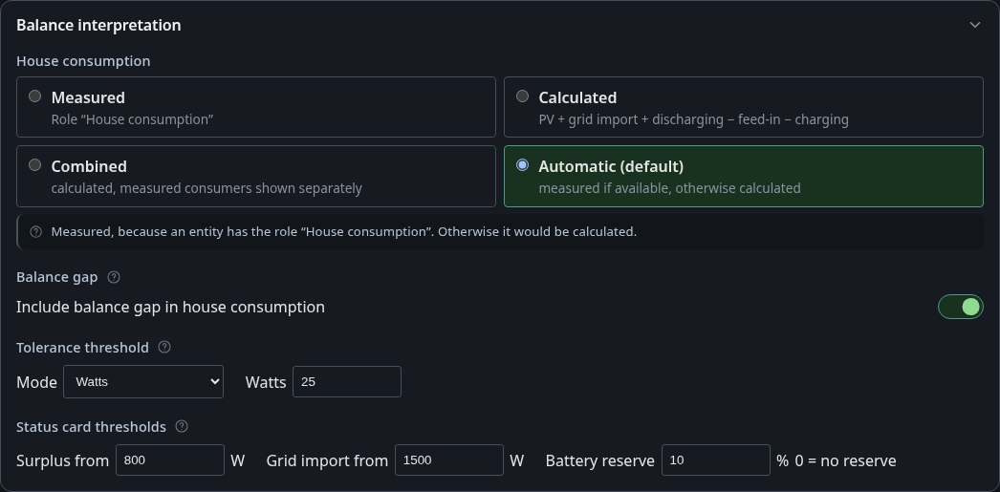

| Mode | House consumption is |
|---|---|
| Measured | the entity with the role House consumption |
| Calculated | PV + grid import + discharging − feed-in − charging |
| Combined | calculated, measured consumers shown separately |
| Automatic (default) | measured if available, otherwise calculated |

Below that: whether a remaining gap counts as house consumption, the tolerance,
the surplus and grid import thresholds of the status card and the battery
reserve.

### Energy roles

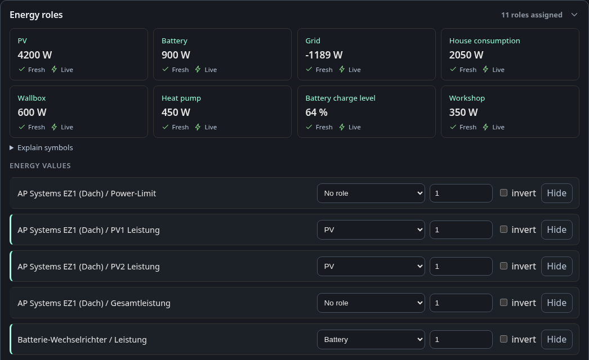

Every power and charge entity gets a role such as PV, grid, battery, house
consumption, wallbox, heat pump or a custom category. Entities sharing a role
are summed. The tiles show each role with its value and whether it is fresh and
live. Power values without a role are listed at the top of the tab, because
they are the usual reason a balance does not add up.

### Groups

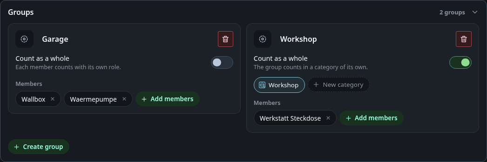

A group bundles devices without a meter of their own.

- **Count as a whole off** (Garage): every member counts with its own role.
- **Count as a whole on** (Workshop): the group counts in one consumer
  category. Pick it from the chips or create a new one in place.

A device sits in at most one group. Groups can hold other groups.

### Custom categories

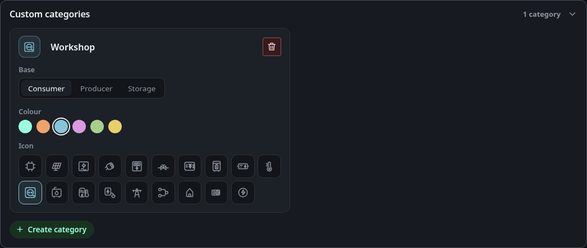

Your own consumer, producer or storage types next to the built-in roles. The
base decides how the category counts: consumers like house load, producers
like PV, storage like a battery. Each consumer category appears as a sink of
its own in the overview tiles and in the history. A category that roles or
groups still use cannot be removed. Automation rules do not block removal, but
the dashboard lists the rules that still read the category before you confirm.

## Device map

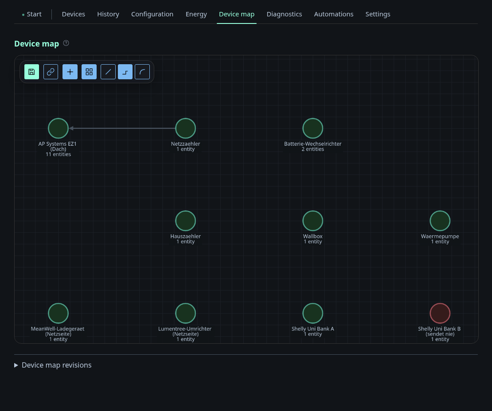

A free canvas with all devices. Place the nodes by hand and connect them to
record how the site is wired, such as which meter feeds which sub-distribution.
Positions, connections and layers are versioned, so an accidental drag can be
rolled back.

How to read a node:

- **Ring colour**: the energy roles of the device, one segment per role.
- **Solid ring**: role assigned by you. **Dashed**: only detected. **Grey
  dotted**: no role.
- **Dot top right**: availability, green, amber, red or grey without data.
- **Σ in a dashed circle**: a group, its value is the sum of its members.
- **Moving dashes**: the live flow, faster for more power, with the value at
  the child end.

### Layers and view

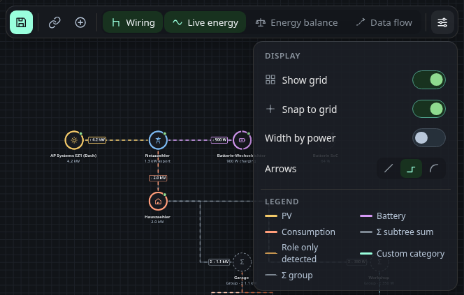

| Layer | Shows |
|---|---|
| Wiring | the connections between devices and groups |
| Live energy | roles, values and the moving flow |
| Energy balance | the balance node and every device that feeds it |
| Data flow | topics between devices, services and automation rules |

The view menu holds the grid, snap to grid, width by power, the line style and
the legend. With reduced motion enabled in the system the lines stand still and
carry an arrow.

### Device panel

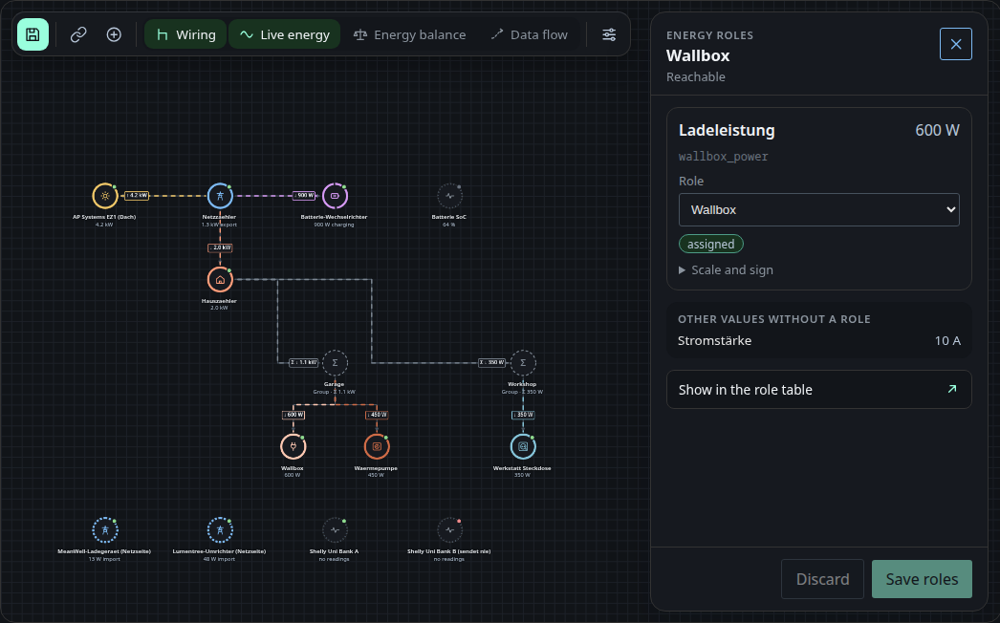

Click a device to see the roles of its measurements. A chip tells where each
role comes from: detected, assigned or no role. Changes are drafts until you
save, and the map already follows them. Show in the role table jumps to the
Energy tab.

### Group panel

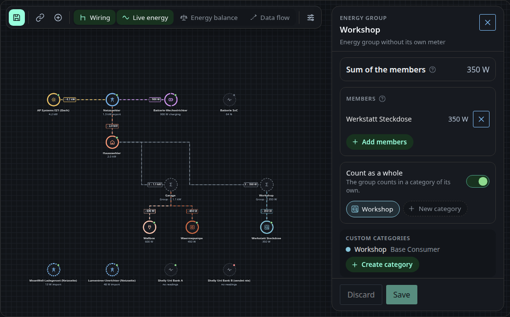

Click a group for its sum, its members and the count as a whole switch. Members
are added with the picker or by hanging a device under the group in connect
mode.

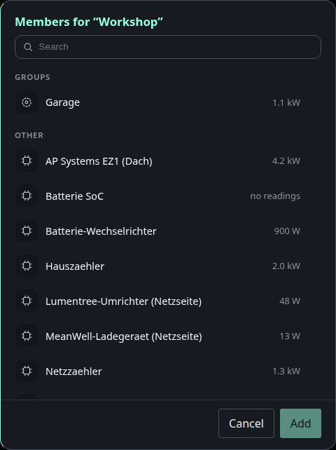

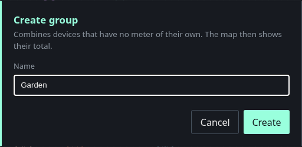

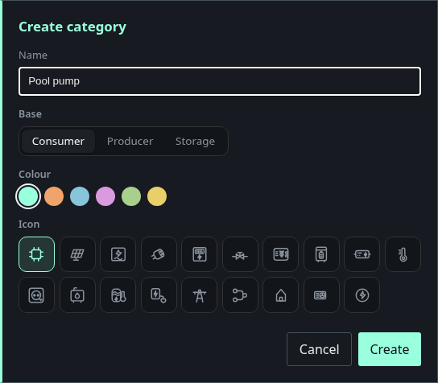

The plus in the toolbar creates a group. New category in a group creates a
category and selects it for that group.

### Energy balance layer

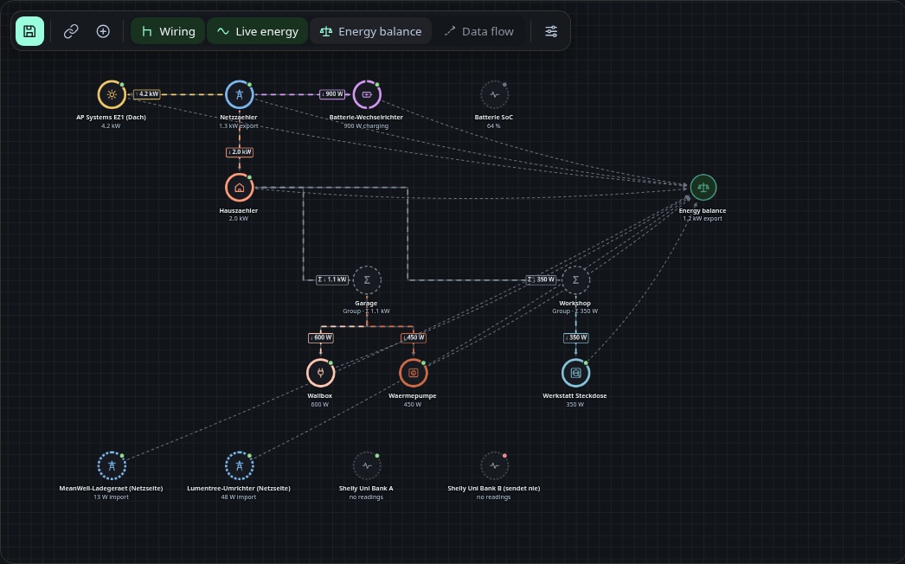

Every device with a role is connected to the balance node in the colour of its
role. The balance publishes the result for automations, so the map shows the
value a rule compares against.

### Data flow layer

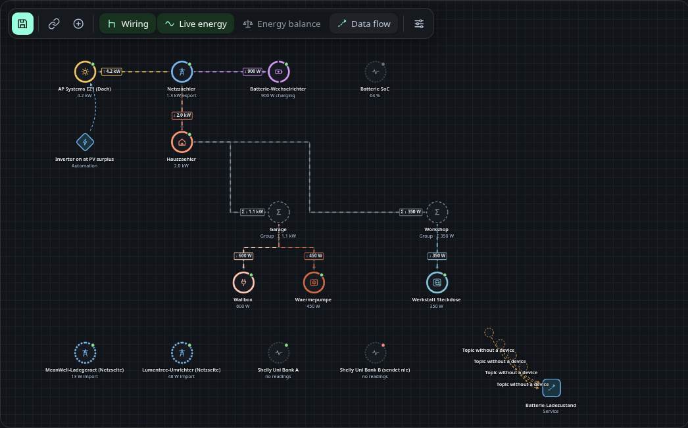

Topics as dashed edges from the producer to the receiver. Automation rules are
diamonds, services are squares, and a topic nobody publishes is a stub labelled
Topic without a device. Click an edge or a rule for its details and a link into
the configuration or the Automations tab. How a service declares its topics is
described in [Data flows](../developing/data-flow.md#12-data-flow-on-the-device-map).

## Permissions

Changing roles, groups, categories or the interpretation needs the permission
`edit_energy`. Until there is a user management every account has it, guests
included.
