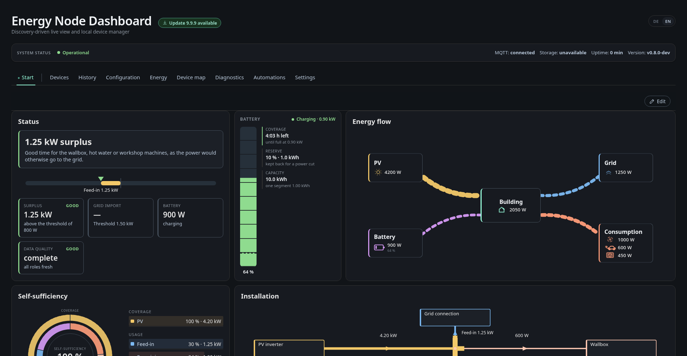

# The dashboard, page by page

The Energy Node dashboard is a single statically linked Go binary. Templates,
CSS and JavaScript are compiled into it with `go:embed`; there is no build
step, no CDN and no server-side database. It renders HTML on the server,
updates values over an SSE push, and keeps chart history in the browser.

The UI speaks German and English, chosen per browser with the `DE | EN`
switch in the header (see the localization notes in the repository).
The screenshots and the labels quoted on this page are the English ones.
Device and entity names are not translated. They come from MQTT Discovery and
stay in the language the devices announce them in, which is German for the
fixture devices in the screenshots.

Every screenshot on this page comes from the local smoke test with the
`docs-screenshots` preset. That is the real dashboard against a fixture
broker, with no Raspberry Pi and no device involved.

## The window frame

Three things are always present, on every tab:

- **The system status bar** — broker connection, storage
  health, uptime and dashboard version. Which of these fields appear is
  configurable, and the whole bar can be switched off.
- **The tab bar.** The first entries are the *layout pages* — user-defined
  overview pages, named in the layout editor. After the divider come the
  fixed tabs: Devices, History, Configuration, Energy, Device Map,
  Diagnostics, Automations, Settings.
- **Who you are logged in as.** Over plain HTTP only *continue as guest* is
  offered; the admin login is refused unless the request arrives over HTTPS.
  A guest can look at everything, edit layouts and automation rules, but the
  protected actions — the MQTT and bridge configuration (`mqtt_config`),
  restart/reboot/shutdown (`system_actions`) — need a registered user with the
  matching role **and** HTTPS. See
  [`knowledge/dashboard/secrets-and-credentials.md`](../knowledge/dashboard/secrets-and-credentials.md).

Panels are lazily loaded: only the active tab's HTML fragment, scripts and
stylesheets are fetched, which is what keeps the first paint cheap on a
Raspberry Pi 1.

## Pages

- [Overview and layout editor](overview.md)
- [Devices and device map](devices.md)
- [History](history.md)
- [Energy](energy.md)
- [Automations](automations.md)
- [Diagnostics](diagnostics.md)
- [Configuration editor](configuration.md)
- [Settings](settings.md)
- [Colour schemes](themes.md)

## See also

- [Device services](../device-services.md) — what fills the dashboard with data
- [`knowledge/dashboard/api-documentation.md`](../knowledge/dashboard/api-documentation.md) — the `/api/v1` HTTP API behind every page
- [`knowledge/data-flow.md`](../knowledge/data-flow.md) — where each value comes from
- [`knowledge/dashboard/reverse-proxy.md`](../knowledge/dashboard/reverse-proxy.md) — running the dashboard under a sub-path
