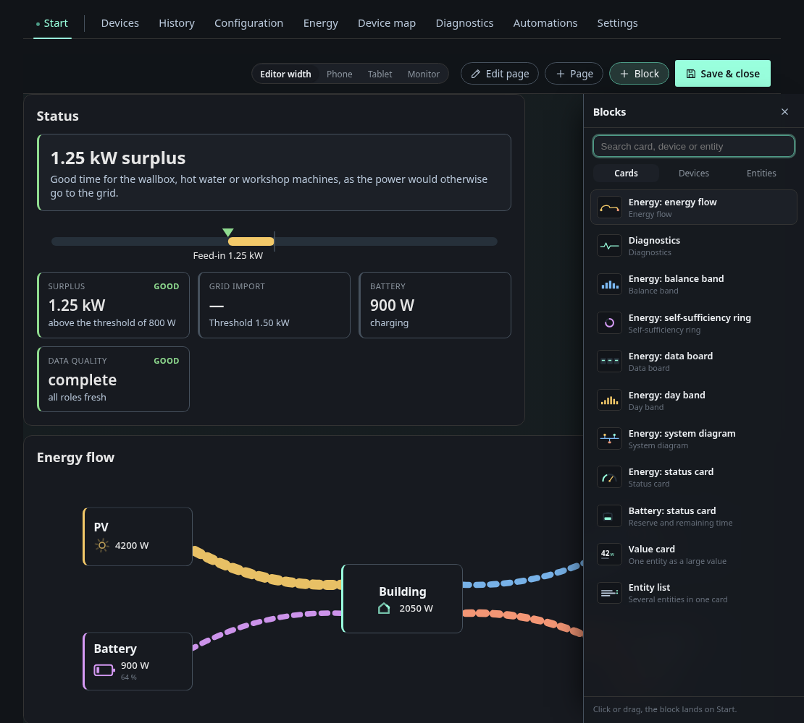

# Overview and layout editor

The start tab is a grid of cards that you arrange yourself. The screenshot
shows the fixture's cards.

The status card sums up the current situation in one sentence ("1.25 kW
surplus. Good time for the wallbox …"). Below it a bar shows where the balance
sits between grid import and feed-in, followed by tiles for surplus, grid draw,
battery and data quality with their thresholds.

The battery status card has a segmented charge column, the time to full or
empty, the reserve held back for a grid outage and the usable capacity.

The energy flow card draws PV, storage, building, grid and the individual loads
as animated flows. The animation speed follows the actual watts.

The self-sufficiency ring shows coverage against use, split by source and by
consumer.

The system diagram (titled *Installation* on the card) is a wiring style
diagram of the site with the live power on each leg.

All cards work only from MQTT Discovery data and the role assignment on the
Energy tab. None of them is hard-coded to a particular device.

## The layout editor

**Edit** turns the overview into an editor. You can drag and resize cards, add
pages and pick new blocks from the panel on the right. The picker has the tabs
**cards**, **devices** and **entities**, so one layout page can mix computed
energy cards with a raw device tile or a single measured value.

| Block | Layout type | What it shows |
|---|---|---|
| Energy: status card | `energy_status` | Situation, thresholds, data quality |
| Energy: energy flow | `energy_flow` | Animated flow graph |
| Energy: self-sufficiency ring | `energy_ring` | Coverage/use ring |
| Energy: system diagram | `energy_schema` | Plant diagram |
| Energy: balance band | `energy_band` | Balance over time as a band |
| Energy: day band | `energy_day` | The day's curve |
| Energy: data board | `energy_board` | The balance as a plain number board |
| Battery: status card | `battery_status` | Charge column or projection |
| History | `history_view` | Chart of a saved history view |
| Diagnostics | `diagnostics` | Health summary of all devices |
| Value card | `entity_value` | One entity as a large value |
| Entity list | `entity_group` | Several entities in one card |
| (Devices tab) | `device` | A full device tile with its controls |

The editor can preview the layout at phone, tablet or monitor width. Layouts
are versioned. Every save is a revision you can restore.

### History tile

The block **History** puts a chart from the history page on an overview page.
In its options, **Source** picks a saved history view. The tile then follows
that view: change the view on the history page and the tile changes with it.
**Own settings** lets the tile keep its own title, period, statistic and
series. Switching from a view to own settings starts from the view's values.

The tile only shows what this browser has recorded or received through the
history exchange, like the history page. On a device that has not recorded
yet it stays empty. If its view is deleted, the tile says so until you pick
another source.
