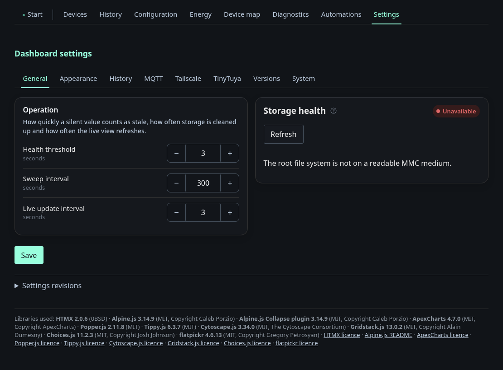
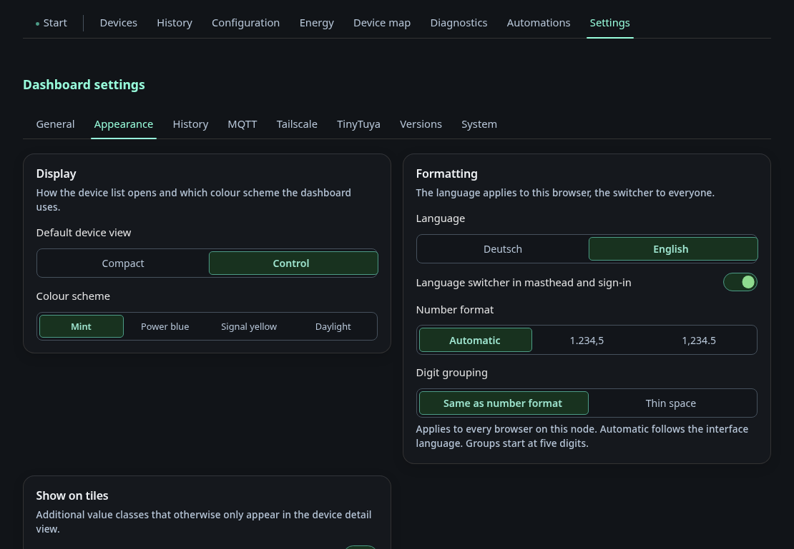
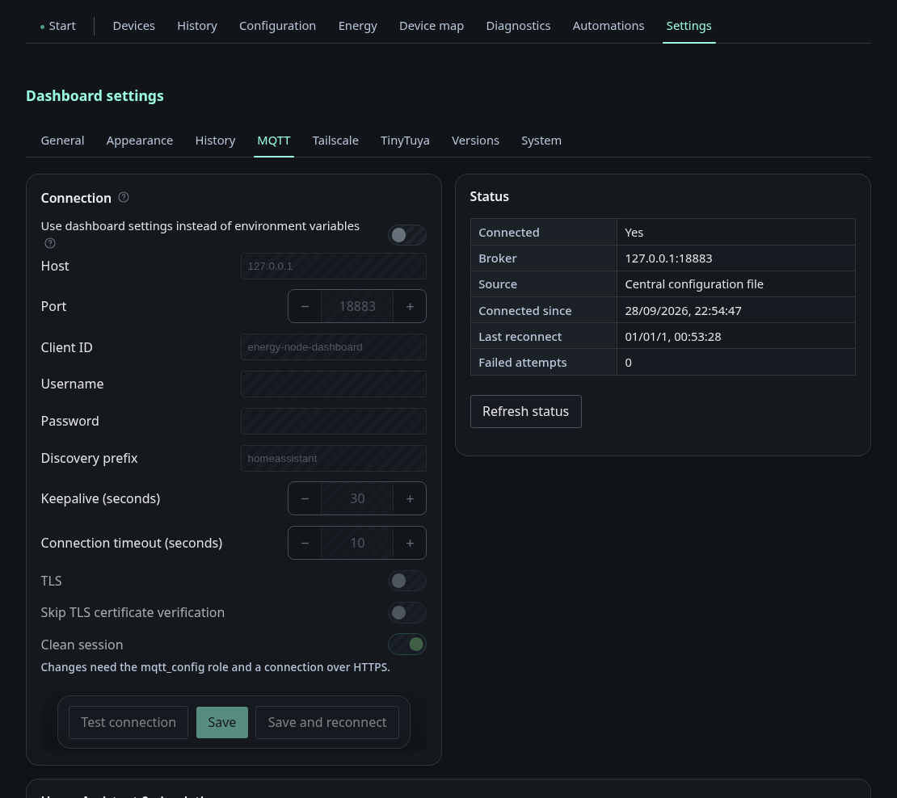
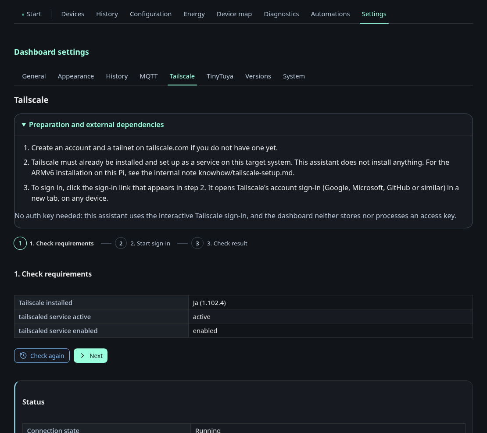
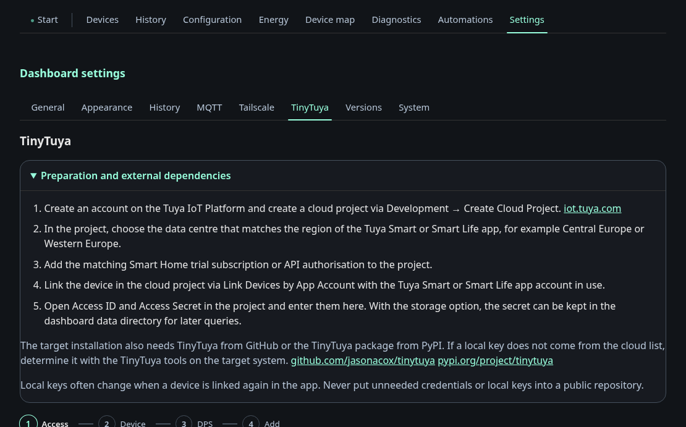
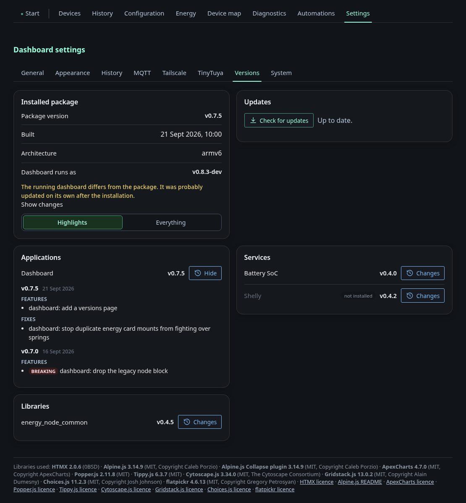
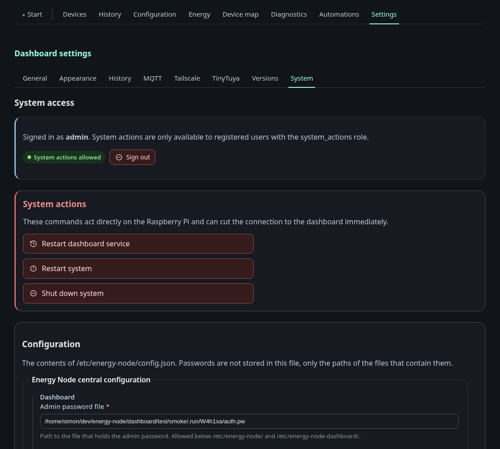
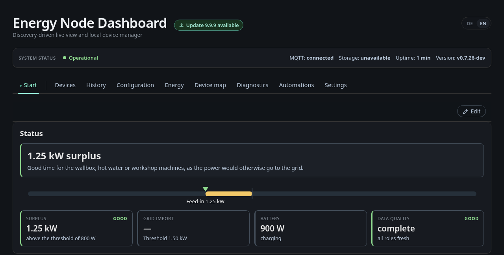
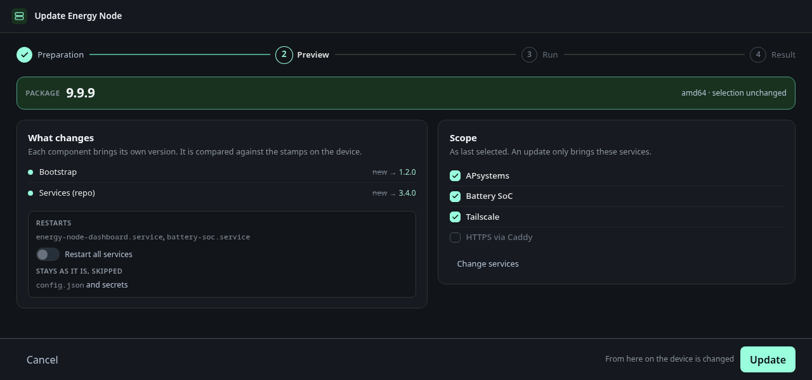

# Settings

Eight sub-tabs: General, Appearance, History, MQTT, Tailscale, TinyTuya,
Versions and System. Tailscale and TinyTuya only appear when the matching
service is installed.

## General

Health threshold, sweep interval and live-update interval, plus the storage
health check — on a Pi this reads the SD card's wear counters, and it says so
plainly when the root filesystem is not a readable MMC medium. Settings are
versioned. **Settings revisions** restores an earlier state. The
footer lists every bundled JavaScript library with its version, license and
license link.

## Appearance

Default device view mode, colour scheme, and what extra information the UI
shows: discovery JSON tooltips, the global status bar, configuration and
diagnostic values on tiles. **Tabs without a width limit** lets chosen tabs
use the full window width instead of the centred column, and
**Items in the system status** picks the fields in the status bar.

The **Formatting** card holds the language of this browser, the switch that
shows or hides the `DE | EN` pill for everyone, and the number format.

## History

Recording and retention for the browser-side history — sample rate, how long
raw data is kept before compaction, how long minute values survive. The
retention limit is either by time or by a storage budget in MB, and the page
shows the projected daily volume, the actual usage and the browser's quota.
The last block switches the device-to-device exchange off.

Note the wording on the page: the setting applies to every browser, the
recorded data does not — the measurements live only in the browser that
recorded them.

## MQTT

Broker connection with a live status table — connected, address, where the
configuration came from, connected since, last reconnect, failed attempts.
Two switches worth calling out:

- **Publish energy values as a Home Assistant device.** The dashboard then
  announces itself over MQTT Discovery as the device "Energy Node" with PV,
  grid, battery and house-load sensors, so the computed balance reaches Home
  Assistant without any extra service.
- **Use dashboard settings instead of the central configuration.** Off means
  the values from `/etc/energy-node/config.json` win unchanged; on means the
  settings stored here take over completely, with no field-wise merging.

Further down the same tab configures the **Mosquitto bridge to the main site**
and can apply and restart it.

## Tailscale

Three steps — check prerequisites, start login, check the result. It reports
whether Tailscale is installed and whether `tailscaled` is active and enabled,
and once connected shows the connection state, peer count and key expiry, with
buttons to re-check, log out or restart the service. It exists because
bringing a headless Pi onto a tailnet otherwise means an SSH session and a
copied login URL.

## TinyTuya

A four-step wizard — credentials, device, data points, apply — around the
`tinytuya` cloud lookup: enter the Tuya region and API credentials, list the
devices on the account, probe the device's data points locally, and write the
result into `tuya_devices.json`. The data point number for a switch is not
reliably `1`, which is the whole reason the probe step exists. Credentials are
only stored when explicitly asked for.

## Versions

What is installed on the node. The top card shows the installed package with
its version, build date and architecture, and the version the dashboard itself
runs as. If the two differ, the page says so, which happens when the
dashboard was updated on its own after the installation. Below that every
application, service and library is listed with its version. **Changes**
opens its changelog, and a service that is not installed is marked as such.
The switch in the package card chooses between the **Highlights** of each
release and **Everything**, every single commit included.

The **Updates** card checks GitHub for a newer release on demand
(**Check for updates**).

## System

Who you are logged in as and with which role, and the system actions:
restart the dashboard service, restart the system, shut it down. The
screenshot shows an admin session, so the actions are enabled. In a guest
session they are greyed out, because system actions need a registered user
with the `system_actions` role **and** HTTPS.

Below that, the content of `/etc/energy-node/config.json` as a generated form,
same mechanism as the configuration tab. Passwords are never in that file,
only the paths of the files that hold them.

## Updating from the dashboard

When a newer release is out on GitHub, the header shows a notice next to the
title (**Update … available**). For a registered user with the
`system_actions` role it opens the update page (`/redeploy/`), where
**View changes** lists what the new package changes. Everyone else gets the
release notes on GitHub in a new tab. The same notice appears under
*Settings → Versions*, next to the button that checks for updates on demand
(**Check for updates**) and the link **Release notes on GitHub**.

From that notice, a registered user with the `system_actions` role opens the
update page (`/redeploy/`). It first downloads the newest signed release
package for the node's architecture, then shows the same preview as the
[desktop installer](../installer.md#updating-a-node): which components change,
which services restart, and which services the node runs. **Update**
runs the pending steps on the node itself, without the installer and without
SSH.
