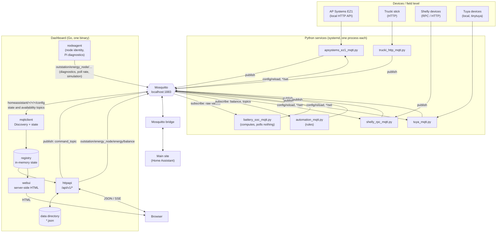
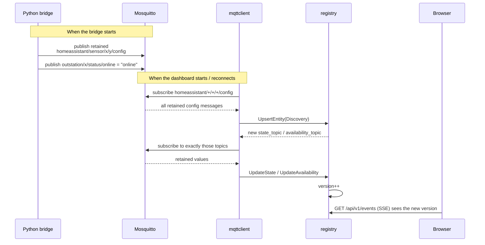
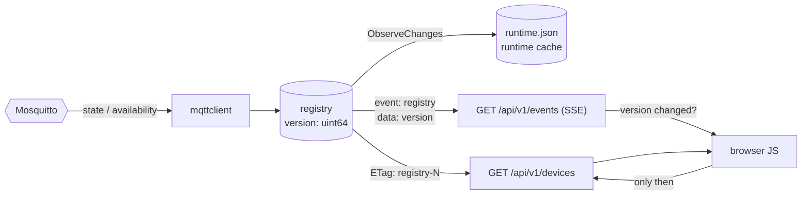
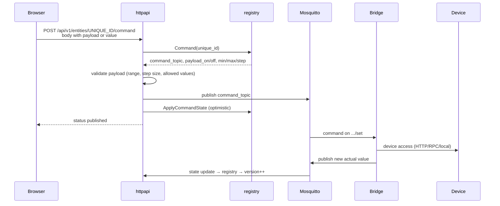
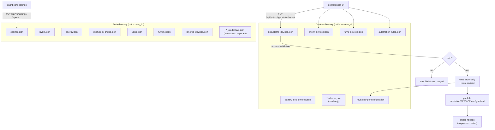
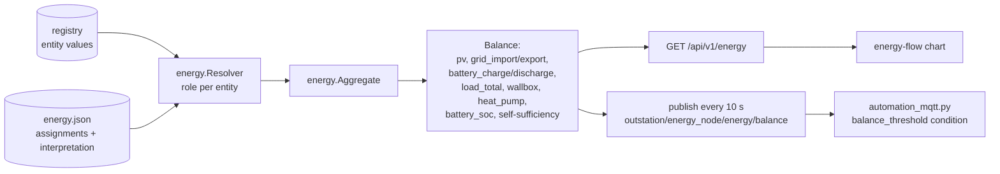
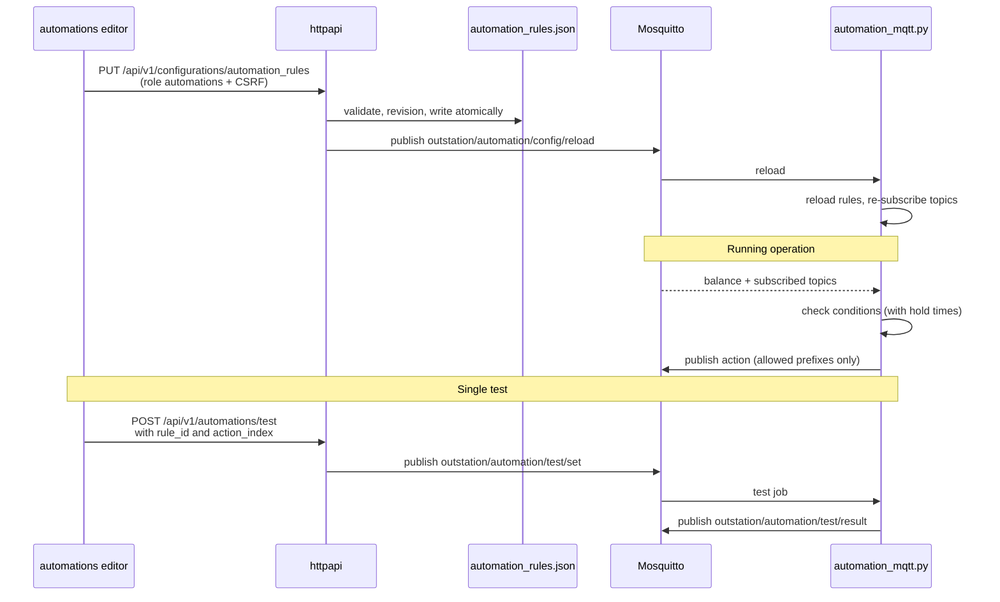
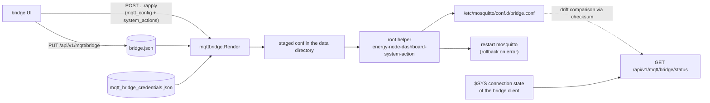
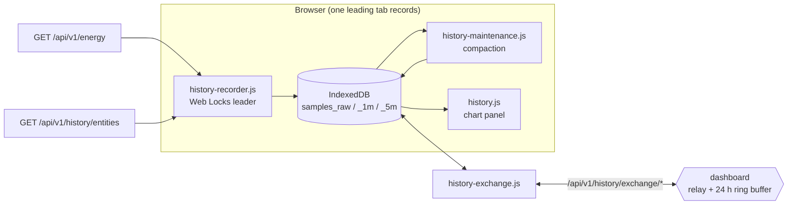

# Data flows in the Energy Node system

This page describes which data is produced where, which channels it travels
through and who reads it. It covers the whole system, so the Python bridges,
the MQTT broker, the Go dashboard and the browser all appear together.

Details of the individual parts are documented elsewhere: the dashboard's HTTP
interface in [api.md](api.md), the Python infrastructure package in
`libs/energy_node_common/`, and the Mosquitto bridge to the main site in
section 5 of INSTALLATION.md.

## 1. The whole picture

All traffic goes through one local MQTT broker (Mosquitto on the Raspberry Pi).
The device bridges and the dashboard have no direct HTTP path between them.





Device state flows up (device → bridge → broker → dashboard → browser).
Commands and configuration flow down (browser → dashboard → broker → bridge →
device).

## 2. Topic conventions

There are two namespaces with separate jobs:

| Namespace | Purpose | Retained | Who writes |
|---|---|---|---|
| `homeassistant/{component}/{device_id}/{object_id}/config` | Discovery: which entity exists and where its value is | yes | Python bridges |
| `outstation/{device_id}/...` | Payload data: measurements, status, commands | partly | bridges and dashboard |

The main topics below `outstation/`:

| Topic | Direction | Content |
|---|---|---|
| `outstation/{device_id}/{group}/{field}` | bridge → broker | Measurement (for example `outstation/t2mg81a4e9/field/acpower`) |
| `outstation/{device_id}/status/online` | bridge → broker | Availability, also set as the MQTT last will |
| `outstation/{device_id}/.../set` | broker → bridge | Switch command (`command_topic` from Discovery) |
| `outstation/{service_id}/config/reload` | dashboard → bridge | The bridge reloads its JSON configuration |
| `outstation/energy_node/energy/balance` | dashboard → broker | Energy balance, every 10 s |
| `outstation/automation/test/set` | dashboard → automation | Run one rule action as a test |
| `outstation/automation/test/result` | automation → broker | Result of the test |
| `$SYS/broker/connection/{remote_client_id}/state` | broker → dashboard | Whether the bridge to the main site is up (`1`/`0`) |

The automation service refuses to publish to wildcards, to `homeassistant/...`
(no forged Discovery), to `$SYS/...` and to the dashboard's own topics
`outstation/energy_node/energy/balance` and
`outstation/energy_node/status/online`.

## 3. Discovery: how the dashboard learns what exists

The dashboard has no device list in a configuration file. It learns everything
at runtime from retained Discovery messages. After a restart of the dashboard
the broker delivers the retained messages again.





The dashboard only subscribes to topics it has discovered, never to
`outstation/#`. If a Discovery field is empty, the dashboard does not see that
value.

An empty payload on a `config` topic deletes the entity, and topics nobody
needs any more are unsubscribed.

Parse errors are collected in `reg.DiscoveryErrors()` and shown by
`GET /api/v1/discovery`, so they do not get lost.

The `discovery_prefix` is configurable (default `homeassistant`).

## 4. Live values all the way to the browser

The browser does not get MQTT values pushed to it. A simple version mechanism
sits between the registry and the browser.





SSE carries no values, only `{"version": N}`. After a change the client
fetches the devices with `GET /api/v1/devices`, so neither side needs a diff
implementation.

The poll interval of the SSE loop comes from `settings.json`
(`live_update_interval_seconds`, default 3 s) and takes effect without a
reconnect.

`GET /api/v1/devices` returns `ETag: "registry-N"`. With a matching
`If-None-Match` the server answers `304`.

The runtime cache (`runtime.json`) survives restarts. It remembers the last
values and restores them when an entity comes back, so tiles are not empty
after a restart.

## 5. Commands: from the click to the device





The dashboard only publishes to `command_topic`s from Discovery. No API path
writes to an arbitrary topic, except the fixed automation test on
`outstation/automation/test/set`.

Each command is recorded per device in an in-memory history (at most 12
entries) and appears in `GET /api/v1/devices/{id}` as `command_actions`.

## 6. Configuration: files, not a database

There are two directories with different owners.





Writes are atomic (temp file and `rename`) and store a revision first. Every
configuration can be viewed under `.../revisions` and restored with
`.../restore`.

The reload goes over MQTT and not through systemd. The target service swaps its
configuration inside the running process. `automation_rules` maps to the
service ID `automation`, otherwise `{name}_devices` maps to `{name}`.

Passwords always live in their own files (`*_credentials.json`), so they stay
out of the revision copies. The API never returns them in clear text and only
reports `password_configured: true/false`.

## 7. Energy balance

The balance is derived data. Entities get roles, and the roles produce a
balance object that is available over HTTP and over MQTT.





The automation service takes the balance as finished numbers and computes
nothing itself. If the balance is older than `balance_max_age_s` (default
30 s), rules based on it stop firing.

## 8. Automations





The condition types are `balance_threshold`, `battery_soc`, `topic_value`,
`time_window`, `sun_window` and `entity_value`. The action types are `publish`
and `notification`.

## 9. Path to the main site

The Mosquitto bridge mirrors both namespaces in both directions to the main
site (`topic outstation/# both 0`, `topic homeassistant/# both 0`), so the main
site sees the same Discovery and measurement topics as the dashboard.

The dashboard manages the bridge but is not part of its data path:





The dashboard never writes to `/etc` itself. It puts a file into its own data
directory and lets a root helper do the rest. The status combines three
sources: the systemd service state, the `$SYS` connection state and a checksum
comparison between the stored and the installed configuration.

## 10. Browser history (IndexedDB, not on the Pi)

The dashboard keeps a rolling measurement history in each browser's IndexedDB
(`energy-node-dashboard`, store version 2). The Pi stores nothing.
`internal/history` on the server only defines the data contract and the
retention window and holds no samples.





The browser records the energy roles (`role:pv`, `role:grid_import`, …) from
the balance. It also records the entities listed in `settings.json` under
`history_extra_entities` and polls their values from
`GET /api/v1/history/entities`. That endpoint is an allowlist on the server, so
the browser cannot ask for arbitrary IDs. The sampling interval comes from the
dashboard settings.

Each browser has one recorder. The writing tab holds a Web Locks lease
(`energy-node-historizer`). The other tabs only read and are notified over a
`BroadcastChannel`. Two tabs writing slightly different timestamps would break
the composite key and bloat the store.

There are three tiers with limited retention: `samples_raw` (~6 h), `samples_1m`
(~7 days) and `samples_5m` (~30 days). `history-maintenance.js` compacts raw to
1 m and 1 m to 5 m in the leading tab. It moves a watermark forward in the
`meta` store, so each run only touches the newest span.

For the exchange between devices (`/api/v1/history/exchange/*`) the server only
relays and stores nothing. Offers go to all peers. Requests and deliveries go to
exactly one peer over an SSE stream, and nothing is written to disk. A 24 h ring
buffer in memory joins as the pseudo-peer `server`, so a single browser can
still fill gaps after a reload. Peers announce their coverage as coarse rasters
(counts per time bucket), compare them and request only the missing ranges.
Only the `1m` and `5m` tiers are exchanged. Raw samples are not, because their
offset timestamps would not deduplicate. Protocol version 1 allows 500 rows per
delivery, 20 000 per request and 1 MiB per body.

Home Assistant can join as a permanent peer that supplies data, through the
`energy_node_companion` integration (guest session, labelled "Home
Assistant"). It answers from its recorder (states for `1m`, 5-minute statistics
for `5m`) and only offers the series the announcement lists. It never supplies
`role:load`, because HA's `house_load` sensor carries `load_total` and not the
measured `load` role.

## 11. What the system does not do on purpose

Several design decisions above follow from these limits.

There is no time series database on the server. The Pi's registry only holds
the current state. The rolling history lives in the browser (§10), and a long
term archive is the main site's job.

There is no event history on the server either. Command history, the last
bridge apply and the last Tailscale action live in memory and are lost on a
restart, like the ring buffer of the history exchange (§10).

There is no wildcard subscription. The dashboard does not see what was not
announced through Discovery.

The dashboard does not access devices directly. The only exception is the
TinyTuya helper, which calls a Python script for the initial setup.
