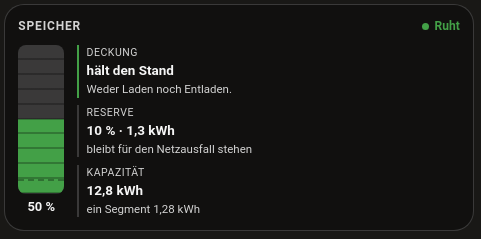
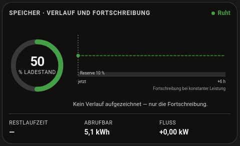

# Lovelace card

The integration comes with its own Lovelace card, `custom:battery-soc-card`,
and registers it with the frontend itself, so you do not need a resource entry
under **Settings → Dashboards → Resources**. The card has two displays: a
column (stored energy and time remaining) and a trajectory (a ring with six
hours of history and a six hour projection).

| `display: column` | `display: trajectory` |
|---|---|
|  |  |

## Configuration

```yaml
type: custom:battery-soc-card
display: trajectory          # column | trajectory
soc_entity: sensor.speicher_soc_combined
power_entity: sensor.speicher_net_power
capacity_kwh: 12.8
reserve_percent: 10          # 0 = no reserve
invert_power: false          # true if your meter reports discharge as positive
runtime_entity: sensor.speicher_time_to_empty   # optional, wins over the linear estimate
```

| Option | Meaning |
|---|---|
| `display` | `column` or `trajectory`. |
| `soc_entity` | The state of charge sensor. The only required option. |
| `power_entity` | Net battery power, positive while charging. |
| `capacity_kwh` | Usable capacity, used for stored energy and time remaining. |
| `reserve_percent` | Reserve the battery should not go below. 0 means no reserve. |
| `invert_power` | `true` if your meter reports discharge as positive. |
| `runtime_entity` | Optional time remaining sensor. Wins over the linear estimate. |

Without a Recorder history for `soc_entity` (Recorder disabled, or retention
shorter than six hours) the trajectory display only shows the projection. That
is normal after a restart.

## The card does not appear

The card only appears once the integration is set up as a device. It is
registered with the frontend from `async_setup_entry`, so add a **Battery SoC**
entry under *Settings → Devices & Services* first and then restart Home
Assistant. Until then Lovelace reports *Custom element doesn't exist:
battery-soc-card*. If it still fails after the restart, reload the browser
with Ctrl+Shift+R to drop the cached dashboard.
