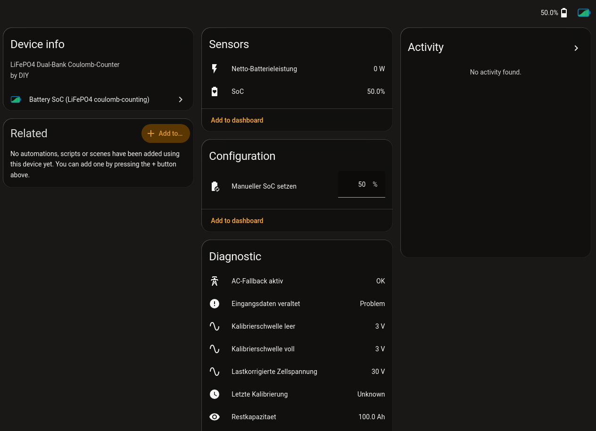

# Entities and actions

Each configured battery becomes one device.



The screenshot comes from a German Home Assistant, so the entity names read in
German. The integration ships English and German translations.

## Entities

| Entity | Meaning |
|---|---|
| `sensor` SoC (`soc_combined`) | Main state of charge (%). In series, the weakest bank. |
| `sensor` Net battery power (`net_power`) | Charge (+) or discharge (−) power (W). |
| `sensor` Time to full / Time to empty | Projection at the current rate (h, diagnostic). |
| `binary_sensor` Inputs stale | A source sensor stopped updating. |
| `binary_sensor` AC fallback active | Running on AC power sensors because a DC sensor went stale. Only exists when one side has both an AC and a DC sensor. |
| `sensor` Voltage / Current / Remaining Ah / Load-corrected cell voltage | Per unit (pack, bank A, bank B), diagnostic. |
| `sensor` Calibration thresholds / Last calibration | When and at what voltage the counter was last reset. |
| `sensor` Voltage-based SoC (uncertain) and `binary_sensor` Voltage/coulomb mismatch | Plausibility check against the coulomb count. |
| Series only: `sensor` SoC Bank A/B, Voltage delta A/B, `binary_sensor` Banks imbalanced | |
| `sensor` Open suggestions (`open_suggestions_<unit>`) | Number of open calibration suggestions, see [Calibration suggestions](battery-soc-suggestions.md). |
| `number` Set manual SoC (per bank in series) | Writes a known SoC to anchor the counter. |

The full list lives in
[`battery_soc_core/entities.py`](https://github.com/Developer-Simon/energy-node/blob/main/libs/battery_soc_core/battery_soc_core/entities.py).

## Action: `battery_soc.set_state_of_charge`

Anchors the coulomb counter to a known value, for example right after a full
charge or from a shunt based reference.

```yaml
action: battery_soc.set_state_of_charge
target:
  device_id: <your battery device>
data:
  state_of_charge: 100     # percent, 0 to 100
  # bank: a                # series topology only: which bank to anchor
```

The **SoC** sensor jumps to the value immediately. The `number` entities do the
same from the UI.

## Action: `battery_soc.apply_suggestion`

Applies an open calibration suggestion. See
[Calibration suggestions](battery-soc-suggestions.md#apply-a-suggestion).
