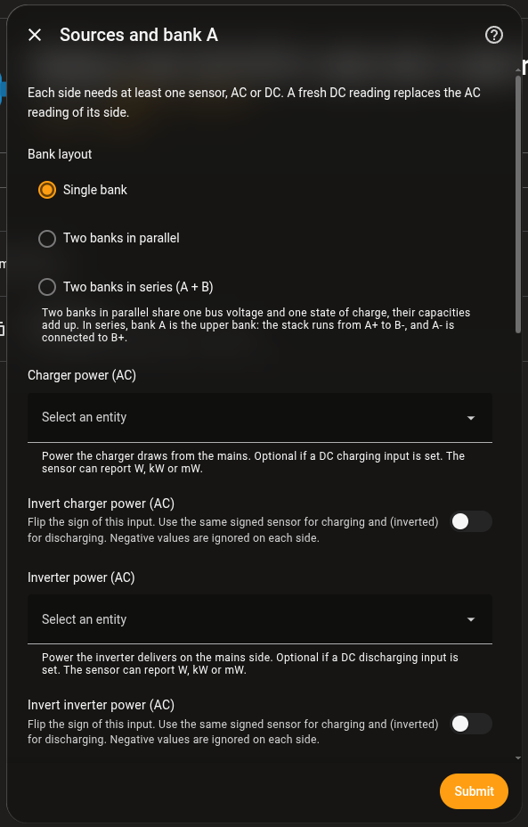

# Setup

**Settings → Devices & Services → Add Integration → "Battery SoC (LiFePO4 coulomb-counting)".**

The setup has four steps. All of them can be changed later in the
integration's **Configure** dialog, including the system type and the bank
layout.

## Battery

The `user` step asks for a name and the system type.

- In an *AC-coupled system* the charger, the inverter or both are measured on
  the mains (AC) side, optionally refined by DC measurements. That is typical
  for grid connected home batteries.
- In a *DC-only system* all power or current measurements sit on the
  battery's DC bus, which is typical for embedded devices.

## Sources and bank A

The `sources_ac` or `sources_dc` step asks for the bank layout (*Single
bank*, *Two banks in parallel*, *Two banks in series (A + B)*), one or more
power sensors per side, bank A's voltage sensor and scale, capacity, cells in
series, chemistry and SoC curve. Charging and discharging each need at least
one sensor.

- DC inputs accept power (W, kW, mW) or current (A, mA). A current is
  converted with the pack voltage. The unit is read from the sensor, so you do
  not set it.
- Every power input has an **invert** switch. A single signed sensor, for
  example an INA219 shunt, goes into both the charging and the discharging
  input, inverted in one of them. Each side ignores negative values, so each
  input only sees its own direction.

Power sensors must report a unit. A reading without one, or with an
unsupported unit, is ignored and logged once as a warning.

## Bank B

The `bank_b` step only appears with two banks. It asks for capacity and cell
count, and for banks in series also a voltage sensor and scale.

In series, bank A is the upper bank. The stack runs from A+ to B-, and A- is
connected to B+ (the middle tap). The bank B sensor measures bank B alone
(B+ to B-). The bank A sensor measures either bank A alone (A+ to A-) or the
whole stack (A+ to B-). For the whole stack, choose *The whole stack (A+ to
B-)* in this step. Bank A is then calculated as the stack minus bank B.

## Advanced battery parameters

The `advanced` step holds the empty and full volts per cell, efficiencies,
calibration tolerance and hold time, thresholds for the voltage/coulomb
mismatch and the imbalance, timeouts for stale inputs and DC age, the internal
resistance (mΩ per cell) and the fallback interval. DC-only systems do not
show the AC converter efficiencies or the DC age timeout.

Four values fine tune when a calibration counts:

| Field | Meaning |
|---|---|
| Tail Current for Full Calibration (C-rate) | The battery only counts as full when its current at full voltage stays below this C-rate. Leave empty to turn the check off. The cell data sheet usually lists this tail current, often around 0.05 C. |
| Calibration Tolerance, Empty (V/cell) | Tolerance for the empty threshold only. Leave empty to use the shared tolerance. A generous value helps when the BMS or inverter cuts off well above the empty voltage. |
| Calibration Tolerance, Full (V/cell) | Tolerance for the full threshold only. Keep it small if your charger reaches the full voltage, so a battery that is not full yet does not get set to 100 %. |
| Calibration Grace Period (s) | How long a short dropout may interrupt the hold time without restarting it. 0 restarts it on every dropout. |

The [calibration suggestions](battery-soc-suggestions.md) help you find good
values for the efficiency and the internal resistance.

## Support and feedback

Report problems with the integration as an issue in
[ha-battery-soc](https://github.com/Developer-Simon/ha-battery-soc/issues). The
integration is developed in the
[energy-node repository](https://github.com/Developer-Simon/energy-node) under
`integrations/homeassistant/custom_components/battery_soc/`, so pull requests
belong there and not in the mirror.
