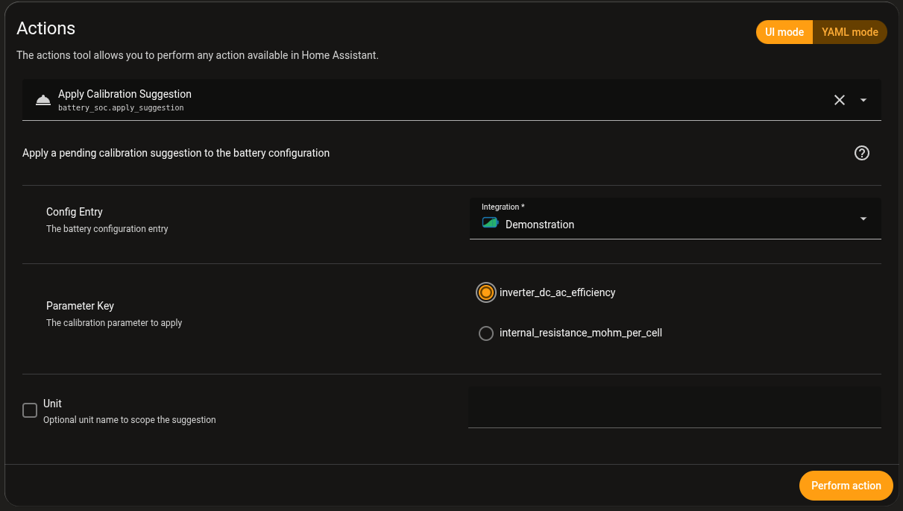

# Calibration suggestions

Every recalibration at full or empty records how far off the coulomb counter
was and how much charge went in and out since the previous one. From these
events the integration derives suggestions for two settings:

- `inverter_dc_ac_efficiency`, the share of DC power that becomes AC on the
  discharge side,
- `internal_resistance_mohm_per_cell`, used to correct the voltage under load.

It also reports findings about the thresholds, for example when most full
calibrations happened too close to the tail current limit. That points to a
full voltage that is too low or a tolerance that is too wide.

Nothing is applied automatically. With fewer than five usable calibrations
there is no suggestion at all, because a single cycle is not enough data. The
internal resistance only uses calibrations at 2 A or more. The
[service documentation](../services/battery-soc-how-it-works.md#5-calibration-telemetry-and-tuning-suggestions)
explains the calculation.

## Read the suggestions

Each unit (pack, bank A, bank B) has a diagnostic sensor
`open_suggestions_<unit>`. Its value is the number of open suggestions. The
attributes hold the details:

- `suggestions`: one entry per setting with the current and the suggested
  value,
- `findings`: notes about the thresholds that need no new value.

Open the sensor on the device page and expand **Attributes** to read them.

## Apply a suggestion

Either enter the suggested value yourself in the integration's **Configure**
dialog, or call the action, for example under **Developer tools → Actions**:



```yaml
action: battery_soc.apply_suggestion
data:
  entry_id: <your battery configuration entry>
  key: inverter_dc_ac_efficiency    # or internal_resistance_mohm_per_cell
  # unit: bank_a                    # optional, limits it to one unit
```

The action writes the suggested value into the integration's options and
reloads it. It fails when there is no open suggestion for that key.
