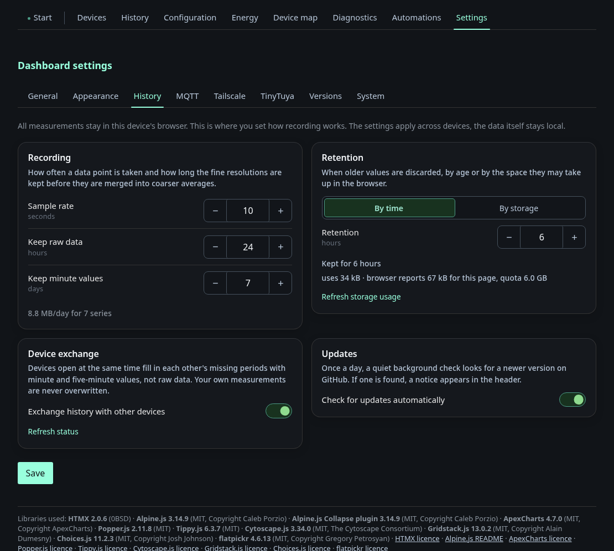

# History backfill

The dashboard keeps its history in each browser. A browser only knows the
hours it was open itself, so a phone that was closed overnight shows an empty
chart for the night. With **Supply history** on, Home Assistant fills these
gaps from its recorder. It joins the dashboard's history exchange as a
permanent peer that only supplies data and never asks for any.

## What it supplies

The integration offers only the series the dashboard announces as recorded.

| Dashboard series | Home Assistant source |
|---|---|
| PV power | `energy_node_pv_power` |
| Grid power | grid import minus grid export |
| Battery power | battery charge minus battery discharge |
| Battery state of charge | `energy_node_battery_soc` |
| Additional history entities | the MQTT entity with the same `unique_id` |

Load, wallbox and heat pump are **not** supplied. The dashboard's load series
is the measured load, while the Home Assistant sensor carries the total load
including the computed part. Wallbox and heat pump have no sensor of their own
in Home Assistant.

| Tier | Source | Fallback |
|---|---|---|
| `1m` | recorder states, weighted by how long each value held | none |
| `5m` | 5-minute statistics | states, for entities without `state_class` and for derived series |

Units are converted to the dashboard's unit, for example kW to W. A series
whose unit cannot be converted (°C instead of W) is skipped. Unavailable values
stay gaps and never become zeros.

The current minute is never delivered while it is incomplete. The browser
never overwrites a value, so a half minute would stay half for good.

## How you see it working

Open the dashboard in a browser that missed some time, then go to
**Settings → History** (German: **Verläufe**). After the first backfill the
status of the device exchange shows a second line:

> Last filled in by Home Assistant.

In German: "Zuletzt ergänzt von Home Assistant."

The history chart then shows the hours the browser had missed.

## How it works

The integration is an ordinary peer of the dashboard's history exchange
(protocol 1). The [HTTP API](../developing/api.md) describes the endpoints,
and [Data flows](../developing/data-flow.md) describes the exchange between
devices.

1. **Login.** The integration logs in as a guest and keeps the session cookie.
   It logs in again only after the dashboard answers 401, for example after a
   dashboard restart. Every guest login is written to the node's SD card, so a
   plain network reconnect does not log in again.
2. **Announcement.** It reads which series the dashboard records
   (`GET /api/v1/history/exchange`) and matches them to Home Assistant
   entities.
3. **Offer.** It holds the event stream `/api/v1/history/exchange/stream` open
   and tells every browser which hours and days it can supply, labelled
   "Home Assistant". It recomputes this every full hour, so the browser's
   raster and the offer always line up.
4. **Requests.** A browser that misses rows asks for them, and the
   integration answers from the recorder in chunks of at most the announced
   row limit.

If the connection drops, the integration reconnects on its own, with a growing
pause of 2 to 60 seconds.
