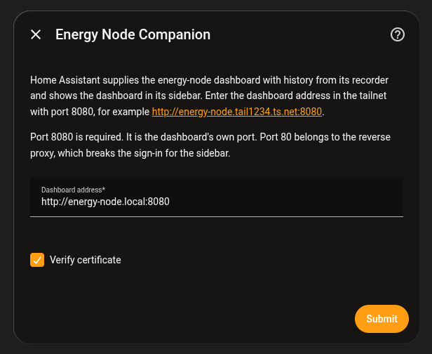
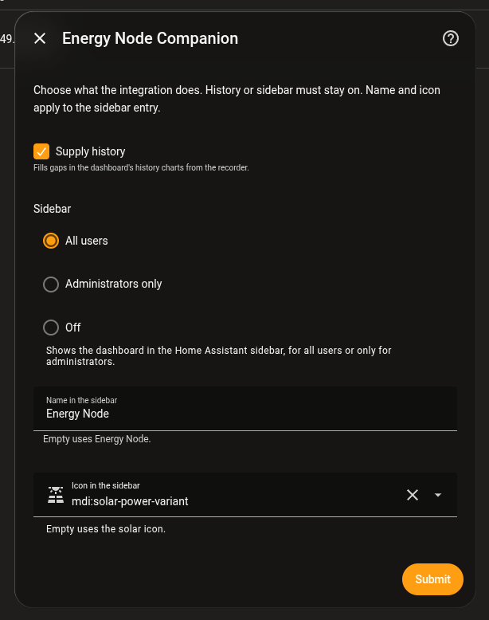

# Setup and options

This page assumes the integration is installed, see
[Energy Node Companion](companion.md#install-via-hacs).

## Set up

1. **Settings → Devices & Services → Add Integration → "Energy Node Companion"**.
2. Check the address. It is pre-filled from the node's device link in Home
   Assistant, for example `http://energy-node.tail1234.ts.net:8080`.
3. Submit. The integration checks that the dashboard answers and speaks the
   same exchange version, then connects.

Use the dashboard's own port (`8080` by default), not port 80. The reverse
proxy on port 80 overwrites headers the integration relies on. If the
dashboard runs on another port, change it in the address field.

Leave **Verify certificate** on unless the address uses `https://` with a
self-signed certificate.

To change the address later, open the integration and choose **Reconfigure**.

The address is only suggested when Home Assistant knows the MQTT device
"Energy Node" and the node has a Tailscale name. Otherwise the field is empty
and you enter the address by hand.

## Options

Open the integration and choose **Configure** to change what it does. Saving
reloads the integration.

| Option | What it does | Default |
|---|---|---|
| Supply history | Fills gaps in the dashboard's history charts from the recorder. See [History backfill](companion-history.md). | On |
| Sidebar | Shows the dashboard in the Home Assistant sidebar, for all users, only for administrators, or not at all. See [Dashboard in the sidebar](companion-sidebar.md). | All users |
| Name in the sidebar | The label of the sidebar entry. | Energy Node |
| Icon in the sidebar | The icon of the sidebar entry. | `mdi:solar-power-variant` |

Clear the name or the icon to go back to the default.

History or the sidebar must stay on. With both off the integration would do
nothing, so the form refuses to save.
