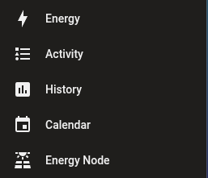
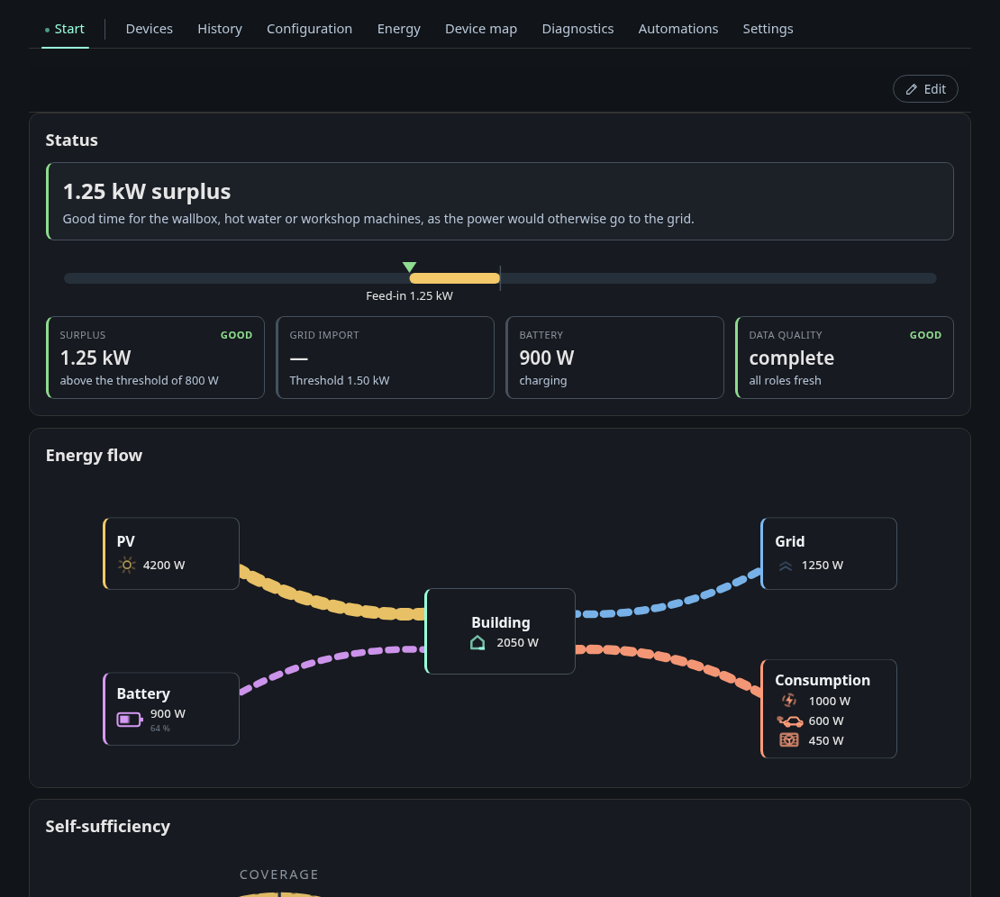

# Dashboard in the sidebar

With the **Sidebar** option on, the node's dashboard appears as its own entry
in the Home Assistant sidebar. It opens inside Home Assistant with all tabs,
just as it does in a browser on the tailnet.

## Who sees it

The **Sidebar** option decides who gets the entry:

- **All users** (default): every Home Assistant user.
- **Administrators only**: only users with the administrator flag. Other
  users neither see the entry nor can open the page by its address.
- **Off**: no sidebar entry.

Name and icon of the entry are set in the [options](companion-setup.md#options).

## How it reaches the dashboard

Home Assistant passes the dashboard through to the browser. The browser only
talks to Home Assistant, so the page also works on a phone that is not in your
tailnet, for example through the Home Assistant app on the go. Only the Home
Assistant host has to reach the node.

## Signing in

The page opens with a guest session of the dashboard. A guest can look at
everything and edit layouts and automation rules (see
[Dashboard](../dashboard/index.md)). For the protected actions, sign in with
a dashboard user as usual. The dashboard only accepts that sign-in when Home
Assistant itself is served over HTTPS.

The page renews its access on its own while it is open. After a Home
Assistant restart it fetches new access the next time you open it.

If the dashboard is offline, the page shows "The dashboard cannot be reached
right now." instead of the dashboard.
