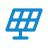
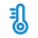

# Icon catalogue

Every icon of the set with the name you enter in Home Assistant and the device
type it stands for in the dashboard.

<!-- icon-table:start (generated by scripts/icons/flatten_icons.py) -->
| Icon | Name | Device type |
|:---:|---|---|
|  | `energy-node:chip-outline` | Generic device (fallback) |
|  | `energy-node:solar-panel` | Solar panel |
|  | `energy-node:current-ac` | Inverter |
|  | `energy-node:power-plug` | Smart plug |
|  | `energy-node:meter-electric` | 3-phase energy meter |
|  | `energy-node:pipe-valve` | Heating-pipe valve |
|  | `energy-node:raspberry-pi` | Raspberry Pi |
|  | `energy-node:home-battery` | Battery |
|  | `energy-node:battery-charging` | Charger |
|  | `energy-node:thermometer` | Thermometer |
|  | `energy-node:power-socket-de` | Flush-mounted socket |
|  | `energy-node:gas-burner` | Heating (oil/gas) |
|  | `energy-node:water-boiler` | Water boiler |
|  | `energy-node:ev-station` | Wallbox (EV charger) |
|  | `energy-node:transmission-tower` | Power grid |
|  | `energy-node:sitemap` | Automations |
|  | `energy-node:home` | Building |
|  | `energy-node:heat-pump` | Heat pump |
|  | `energy-node:flash-circle` | Consumption |
<!-- icon-table:end -->

## Support and feedback

The icon set is maintained as part of the energy-node project. Suggest new
icons or redraws in the [energy-node issues](https://github.com/Developer-Simon/energy-node/issues).
Report problems with the Home Assistant integration in the
[ha-energy-node-icons issues](https://github.com/Developer-Simon/ha-energy-node-icons/issues).
Pull requests belong in the
[energy-node repository](https://github.com/Developer-Simon/energy-node/) and
not in the mirror, because the mirror is regenerated with each release.
