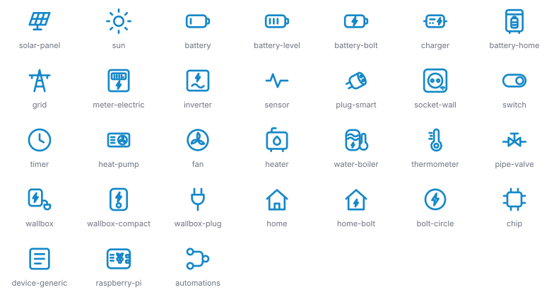
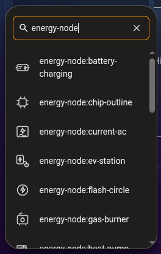

# energy-node Icons for Home Assistant

energy-node Icons is a custom icon set for Home Assistant with the eighteen
device symbols of the energy-node dashboard plus a generic fallback. Each icon
is an outline that Home Assistant fills with your theme's icon colour, so the
icons match the rest of your dashboard.



The set covers batteries, solar panels, the grid, heat pumps, meters and a few
infrastructure symbols. The [Icon catalogue](icons-catalogue.md) lists every
icon with its name.

## Install via HACS

Install the set through [HACS](https://hacs.xyz/) as a custom repository.

[](https://my.home-assistant.io/redirect/hacs_repository/?owner=Developer-Simon&repository=ha-energy-node-icons&category=integration)

The button opens HACS in your Home Assistant with the repository pre-filled. Or add it by hand:

1. Open **HACS** → **⋮** (top right) → **Custom repositories**.
2. Repository URL: `https://github.com/Developer-Simon/ha-energy-node-icons`
3. Category: **Integration** → **Add**.
4. Search for **energy-node Icons** → **Download**.
5. **Restart Home Assistant.**
6. **Settings → Devices & Services → Add Integration → "energy-node Icons"** (this loads the icon set into Home Assistant).

### Manual install

1. Download the latest release from [ha-energy-node-icons](https://github.com/Developer-Simon/ha-energy-node-icons/releases).
2. Extract to `<config>/custom_components/energy_node_icons/`.
3. Restart Home Assistant.
4. **Settings → Devices & Services → Add Integration → "energy-node Icons"** (this loads the icon set into Home Assistant).

## How to use

Click the **icon** field of an entity card or sensor. The icon picker opens.
Type `energy-node` to show only this set, then click the icon you want.



The entity now has the icon name, for example `energy-node:solar-panel`. Home
Assistant shows the icon in your dashboard, badges and entity rows, filled with
the icon colour of your theme. In YAML, use the name directly:

```yaml
type: tile
entity: sensor.energy_node_pv_power
icon: energy-node:solar-panel
```

Icons renamed in October 2026 keep working under their old names, for
example `energy-node:ev-station` still shows the wallbox. The icon picker
only lists the current names.

## About the drawings

The icon strokes are converted to filled outlines at the dashboard's stroke
width, so each icon takes Home Assistant's icon colour and looks like the
dashboard's stroked symbol.

## License

MIT, see [LICENSE](https://github.com/Developer-Simon/ha-energy-node-icons/blob/main/LICENSE).
