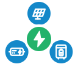

# energy-node Icons integration for Home Assistant

energy-node Icons is a custom icon set for Home Assistant with the eighteen
device symbols of the energy-node dashboard plus a generic fallback. Each icon
is an outline that Home Assistant fills with your theme's icon colour, so the
icons match the rest of your dashboard.

The set covers batteries, solar panels, the grid, heat pumps, meters and a few
infrastructure symbols.

## What is energy-node Icons?

The icon set is installed as a Home Assistant integration (`energy_node_icons`).
After that you can give any entity an icon from the set: click the entity's
icon field, type `energy-node` and pick one from the catalogue.

Each icon is named `energy-node:symbol-name`, where `symbol-name` is one of the
icons listed below.

## Install via HACS

The easiest way is [HACS](https://hacs.xyz/) with a custom repository:

1. Open **HACS** → **⋮** (top right) → **Custom repositories**.
2. Repository URL: `https://github.com/Developer-Simon/ha-energy-node-icons`
3. Category: **Integration** → **Add**.
4. Search for **energy-node Icons** → **Download**.
5. **Restart Home Assistant.**
6. **Settings → Devices & Services → Add Integration → "energy-node Icons"** (this loads the icon set into Home Assistant).

### Manual install

1. Download the latest release from [ha-energy-node-icons](https://github.com/Developer-Simon/ha-energy-node-icons/releases).
2. Extract to `<config>/custom_components/energy_node_icons/`.
3. Restart Home Assistant.
4. **Settings → Devices & Services → Add Integration → "energy-node Icons"** (this loads the icon set into Home Assistant).

## Icon catalogue

<!-- icon-table:start (generated by scripts/icons/flatten_icons.py) -->
| Icon | Name | Device type |
|:---:|---|---|
|  | `energy-node:chip-outline` | Generic device (fallback) |
|  | `energy-node:solar-panel` | Solar panel |
|  | `energy-node:current-ac` | Inverter |
|  | `energy-node:power-plug` | Smart plug |
|  | `energy-node:meter-electric` | 3-phase energy meter |
|  | `energy-node:pipe-valve` | Heating-pipe valve |
|  | `energy-node:raspberry-pi` | Raspberry Pi |
|  | `energy-node:home-battery` | Battery |
|  | `energy-node:battery-charging` | Charger |
|  | `energy-node:thermometer` | Thermometer |
|  | `energy-node:power-socket-de` | Flush-mounted socket |
|  | `energy-node:gas-burner` | Heating (oil/gas) |
|  | `energy-node:water-boiler` | Water boiler |
|  | `energy-node:ev-station` | Wallbox (EV charger) |
|  | `energy-node:transmission-tower` | Power grid |
|  | `energy-node:sitemap` | Automations |
|  | `energy-node:home` | Building |
|  | `energy-node:heat-pump` | Heat pump |
|  | `energy-node:flash-circle` | Consumption |
<!-- icon-table:end -->

## How to use

Click the **icon** field of an entity card or sensor. The icon picker opens.
Type `energy-node` to show only this set, then click the icon you want.

The entity now has the icon name, for example `energy-node:solar-panel`. Home
Assistant shows the icon in your dashboard, badges and entity rows, filled with
the icon colour of your theme.

## About the drawings

The icon strokes are converted to filled outlines at the dashboard's stroke width, so each icon takes Home Assistant's icon colour and looks like the dashboard's stroked symbol.

## Support and feedback

The icon set is maintained as part of the energy-node project. Suggest new
icons or redraws in the [energy-node issues](https://github.com/Developer-Simon/energy-node/issues).
Report problems with the Home Assistant integration in the
[ha-energy-node-icons issues](https://github.com/Developer-Simon/ha-energy-node-icons/issues).
Pull requests belong in the
[energy-node monorepo](https://github.com/Developer-Simon/energy-node/) and not
in the mirror, because the mirror is regenerated with each release.

## License

MIT, see [LICENSE](https://github.com/Developer-Simon/ha-energy-node-icons/blob/main/LICENSE).
