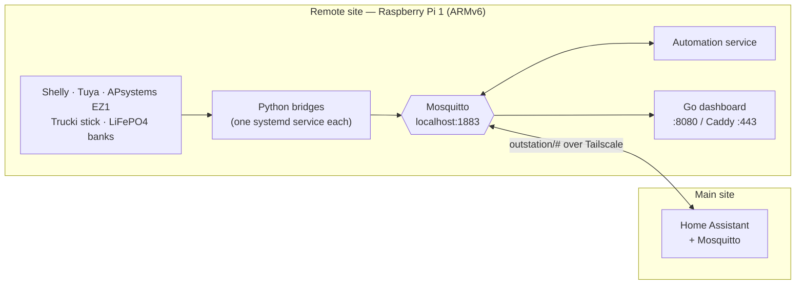

# Energy Node

Energy monitoring and automation for a **remote site** — a workshop, barn,
garage or second property that has its own solar, battery and switchable loads,
but no reliable place to run a full home-automation stack.

Energy Node turns a single small Linux box at that site into a self-contained
node: it polls the local devices, publishes them as Home Assistant MQTT
Discovery entities, runs its own automation rules, serves its own web
dashboard — and mirrors everything over a VPN to the Home Assistant instance at
the main site.

It is developed and run on a **Raspberry Pi 1 Model B** (ARMv6, single core,
512 MB RAM). Newer models work as well; the Pi 1 is the floor every design
decision is measured against.

---

## Start here

**[The dashboard, page by page](dashboard.md)** — every screen of the web UI
with a screenshot: overview cards and the layout editor, devices, browser-side
history, the configuration editor, energy roles, device map, diagnostics,
automations, all seven settings tabs and the four colour schemes.

**[Device services](device-services.md)** — what each service talks to and what
it publishes: Shelly, APsystems EZ1, Trucki sticks, Tuya, the computed battery
state of charge, the automation engine and the node's own diagnostics — plus
the conventions they all share.

---

## How it fits together

Everything couples through **exactly one local MQTT broker**. There is no
direct HTTP path between the device bridges and the dashboard.





Three properties shape the whole design:

- **Local autonomy.** Broker, bridges, automations and dashboard all run at the
  remote site. If the VPN, the internet or the main site goes down, the node
  keeps measuring, keeps its rules running and keeps its dashboard reachable on
  the local network. Every device is polled locally — no cloud account.
- **One narrow link to the main site.** A Mosquitto bridge over a
  [Tailscale](https://tailscale.com) tunnel mirrors exactly one topic tree,
  `outstation/#`. Home Assistant picks the devices up through normal MQTT
  Discovery. No port forwarding, no exposed broker.
- **Old hardware is the point.** Running well on ARMv6 is a hard requirement:
  one statically linked Go binary without CGO, no SQLite, no server-side
  history, no plugin system, no CDN assets, and chart history kept in the
  browser's IndexedDB rather than on the node.

---

## Reference documentation

- [Data flows](knowledge/data-flow.md) — what data is produced where, which
  channels it travels through, and who consumes it
- [Configuration](knowledge/configuration.md) — every field of the central
  `config.json`
- [Performance and resources](knowledge/performance-and-resources.md) —
  measured CPU/RAM per service on the Pi 1, and the optimisations that follow
- [HTTP API](knowledge/dashboard/api-documentation.md) — the dashboard's
  `/api/v1`, endpoint by endpoint
- [Reverse proxy](knowledge/dashboard/reverse-proxy.md) — running the dashboard
  under a sub-path behind another proxy
- [Secrets and credentials](knowledge/dashboard/secrets-and-credentials.md) —
  where credentials live on the node and how they are installed
- [Lazy assets and cache busting](knowledge/dashboard/lazy-assets-cache-busting.md)
  — the frontend's manual `?v=` asset versioning
- [Battery state of charge](knowledge/src/battery-soc-how-it-works.md) — how
  the LiFePO4 engine works
- [Home Assistant integration (HACS)](integration/ha-integration-hacs-release.md)
  — the native custom integration, its mirror repo and release runbook

Installation is documented in `INSTALLATION.md` in the repository; it covers
the ARMv6 specifics, including the packages that must be installed in an
outdated version first and updated afterwards.

---

## A note on language

The project started as a single-site tool before it was made public. The
dashboard's UI — templates, JS strings, the automation editor — is currently
**German-only**, as are most in-code comments across the Go and Python source.
This documentation is written in English. A localization layer is planned but
not yet implemented; until then, changing the displayed language means editing
the embedded templates.

---

## About

This is a history-free release of a private project, published as a working
reference rather than as a product: it is shaped by one specific site's
hardware. Forking and adapting is the expected way to use it. MIT licensed.
