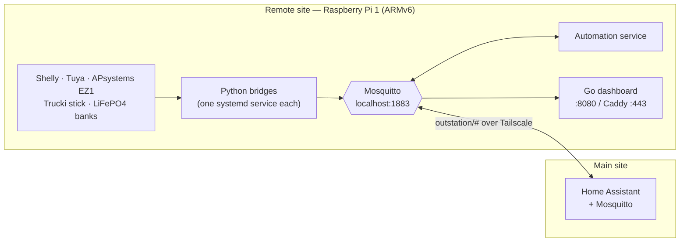



# What is Energy Node?

Energy monitoring and automation for a **remote site** — a workshop, barn,
garage or second property that has its own solar, battery and switchable loads,
but no reliable place to run a full home-automation stack.

Energy Node turns a single small Linux box at that site into a self-contained
node: it polls the local devices, publishes them as Home Assistant MQTT
Discovery entities, runs its own automation rules, serves its own web
dashboard — and mirrors everything over a VPN to the Home Assistant instance at
the main site.

It is developed and run on a **Raspberry Pi 1 Model B** (ARMv6, single core,
512 MB RAM). Newer models work as well; the Pi 1 is the floor every design
decision is measured against.

## How it fits together

Everything couples through **exactly one local MQTT broker**. There is no
direct HTTP path between the device bridges and the dashboard.



```mermaid
flowchart LR
    subgraph Remote["Remote site — Raspberry Pi 1 (ARMv6)"]
        DEV["Shelly · Tuya · APsystems EZ1<br/>Trucki stick · LiFePO4 banks"]
        BR["Python bridges<br/>(one systemd service each)"]
        MQ{{"Mosquitto<br/>localhost:1883"}}
        AUT["Automation service"]
        DASH["Go dashboard<br/>:8080 / Caddy :443"]
        DEV --> BR --> MQ
        MQ <--> AUT
        MQ --> DASH
    end

    MQ <-->|"outstation/# over Tailscale"| HA

    subgraph Main["Main site"]
        HA["Home Assistant<br/>+ Mosquitto"]
    end
```


Three properties shape the whole design:

- **Local autonomy.** Broker, bridges, automations and dashboard all run at the
  remote site. If the VPN, the internet or the main site goes down, the node
  keeps measuring, keeps its rules running and keeps its dashboard reachable on
  the local network. Every device is polled locally — no cloud account.
- **One narrow link to the main site.** A Mosquitto bridge over a
  [Tailscale](https://tailscale.com) tunnel mirrors exactly one topic tree,
  `outstation/#`. Home Assistant picks the devices up through normal MQTT
  Discovery. No port forwarding, no exposed broker.
- **Old hardware is the point.** Running well on ARMv6 is a hard requirement:
  one statically linked Go binary without CGO, no SQLite, no server-side
  history, no plugin system, no CDN assets, and chart history kept in the
  browser's IndexedDB rather than on the node.

---

## Knowledge base

Reference material, grouped the same way as the sidebar: general topics that
span the node, then the dashboard, then the device services under `src/`.

**General**

- [Data flows](developing/data-flow.md) — what data is produced where, which
  channels it travels through, and who consumes it
- [Configuration](operating/configuration.md) — every field of the central
  `config.json`
- [Performance and resources](operating/performance.md) —
  measured CPU/RAM per service on the Pi 1, and the optimisations that follow
- [Cutting a release](developing/releasing.md) — the tag-driven build-and-publish
  workflow and how to publish `vX.Y.Z`

**Dashboard**

- [HTTP API](developing/api.md) — the dashboard's
  `/api/v1`, endpoint by endpoint
- [Reverse proxy](operating/reverse-proxy.md) — running the dashboard
  under a sub-path behind another proxy
- [Secrets and credentials](operating/secrets.md) —
  where credentials live on the node and how they are installed
- Updater job protocol (see the architecture notes in the repository) — how the
  dashboard hands a local redeploy to the root updater unit

**Services**

- [Battery state of charge](services/battery-soc-how-it-works.md) — how
  the LiFePO4 engine works

## Integration

- [Battery SoC integration](ha/battery-soc.md) — the
  `battery_soc` custom integration, its Home Assistant mirror repo and release
  runbook

[Manual installation](install/index.md) covers the ARMv6 specifics, including the packages that must be installed in an outdated version first and updated afterwards.

---

## A note on language

The project started as a single-site tool before it was made public. The
dashboard's UI is available in **German and English**. Each browser chooses
its language, either with the `DE | EN` switch in the header or from the
browser's language setting. German stays the default. How the catalogs work
and how to add a language is described in the localization notes in the repository.
This documentation is written in English. Most in-code comments across the Go
and Python source are still German.

---

## About

This is a history-free release of a private project, published as a working
reference rather than as a product: it is shaped by one specific site's
hardware. Forking and adapting is the expected way to use it. MIT licensed.
