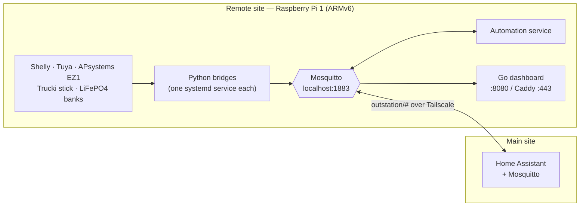



# What is Energy Node?

Energy Node does energy monitoring and automation for a remote site: a
workshop, barn, garage or second property with its own solar, battery and
switchable loads, but no reliable place to run a full home automation stack.

It runs on a single small Linux box at that site. The box polls the local
devices, publishes them as Home Assistant MQTT Discovery entities, runs its own
automation rules and serves its own web dashboard. Everything is mirrored over
a VPN to the Home Assistant instance at the main site.

Energy Node is developed and run on a Raspberry Pi 1 Model B (ARMv6, single
core, 512 MB RAM). Newer models work too. Every design decision has to hold up
on the Pi 1.

## How it fits together

All parts talk to each other through one local MQTT broker. The device
bridges and the dashboard have no direct HTTP path between them.



```mermaid
flowchart LR
    subgraph Remote["Remote site — Raspberry Pi 1 (ARMv6)"]
        DEV["Shelly · Tuya · APsystems EZ1<br/>Trucki stick · LiFePO4 banks"]
        BR["Python bridges<br/>(one systemd service each)"]
        MQ{{"Mosquitto<br/>localhost:1883"}}
        AUT["Automation service"]
        DASH["Go dashboard<br/>:8080 / Caddy :443"]
        DEV --> BR --> MQ
        MQ <--> AUT
        MQ --> DASH
    end

    MQ <-->|"outstation/# over Tailscale"| HA

    subgraph Main["Main site"]
        HA["Home Assistant<br/>+ Mosquitto"]
    end
```


Broker, bridges, automations and dashboard all run at the remote site. If the
VPN, the internet or the main site goes down, the node keeps measuring, keeps
running its rules and keeps its dashboard reachable on the local network. All
devices are polled locally and need no cloud account.

The link to the main site is a Mosquitto bridge over a
[Tailscale](https://tailscale.com) tunnel. It mirrors one topic tree,
`outstation/#`, and Home Assistant picks the devices up through normal MQTT
Discovery. You need no port forwarding, and the broker is not exposed.

Running well on ARMv6 is a hard requirement. The dashboard is one statically
linked Go binary without CGO. There is no SQLite, no server side history, no
plugin system and no CDN asset. Chart history is kept in the browser's
IndexedDB instead of on the node.

## Knowledge base

Reference material, grouped like the sidebar.

General topics:

- [Data flows](developing/data-flow.md): what data is produced where, which
  channels it travels through and who reads it.
- [Configuration](operating/configuration.md): every field of the central
  `config.json`.
- [Performance and resources](operating/performance.md): measured CPU and RAM
  per service on the Pi 1, and the optimisations that came out of it.
- [Cutting a release](developing/releasing.md): the tag driven build and
  publish workflow, and how to publish `vX.Y.Z`.
- [Version overview](developing/versions.md): which component versions each
  release contains.

Dashboard:

- [HTTP API](developing/api.md): the dashboard's `/api/v1`, endpoint by
  endpoint.
- [Reverse proxy](operating/reverse-proxy.md): running the dashboard under a
  sub-path behind another proxy.
- [Secrets and credentials](operating/secrets.md): where credentials live on
  the node and how they get there.
- The updater job protocol, described in the architecture notes in the
  repository, explains how the dashboard hands a local redeploy to the root
  updater unit.

Services:

- [Battery state of charge](services/battery-soc-how-it-works.md): how the
  LiFePO4 engine works.

Home Assistant:

- [Battery SoC integration](ha/battery-soc.md): the `battery_soc` custom
  integration, its Home Assistant mirror repo and the release runbook.

[Manual installation](install/index.md) covers the ARMv6 specifics, including
the packages that have to be installed in an older version first and updated
afterwards.

## Language

The project started as a tool for one site before it was made public. The
dashboard UI is available in German and English. Each browser picks its
language, either with the `DE | EN` switch in the header or from the browser's
language setting. German is the default. The localization notes in the
repository explain how the catalogs work and how to add a language. This
documentation is in English. Most code comments in the Go and Python source
are still in German.

## About

This is a history free release of a private project. It is published as a
working reference and is shaped by the hardware of one specific site, so expect
to fork and adapt it. MIT licensed.
