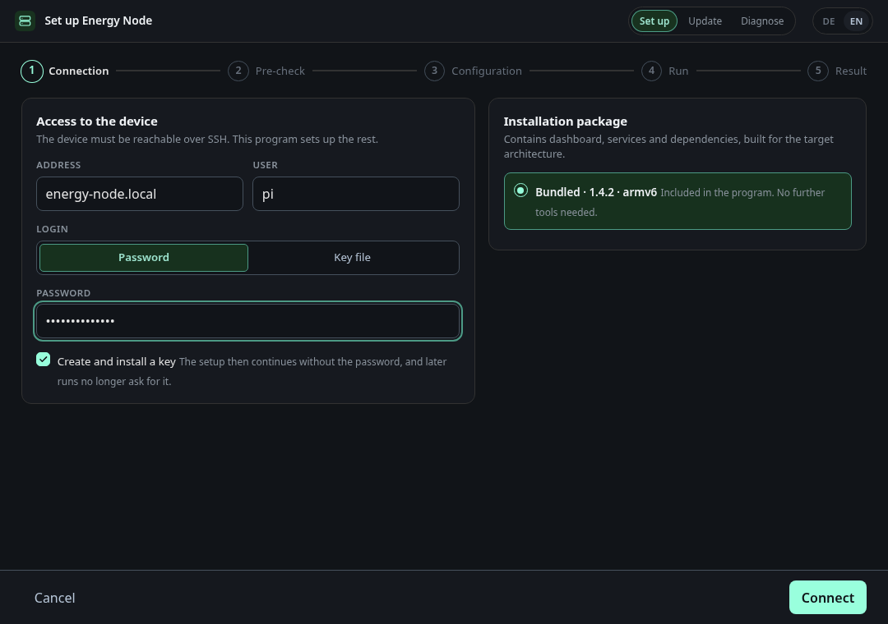
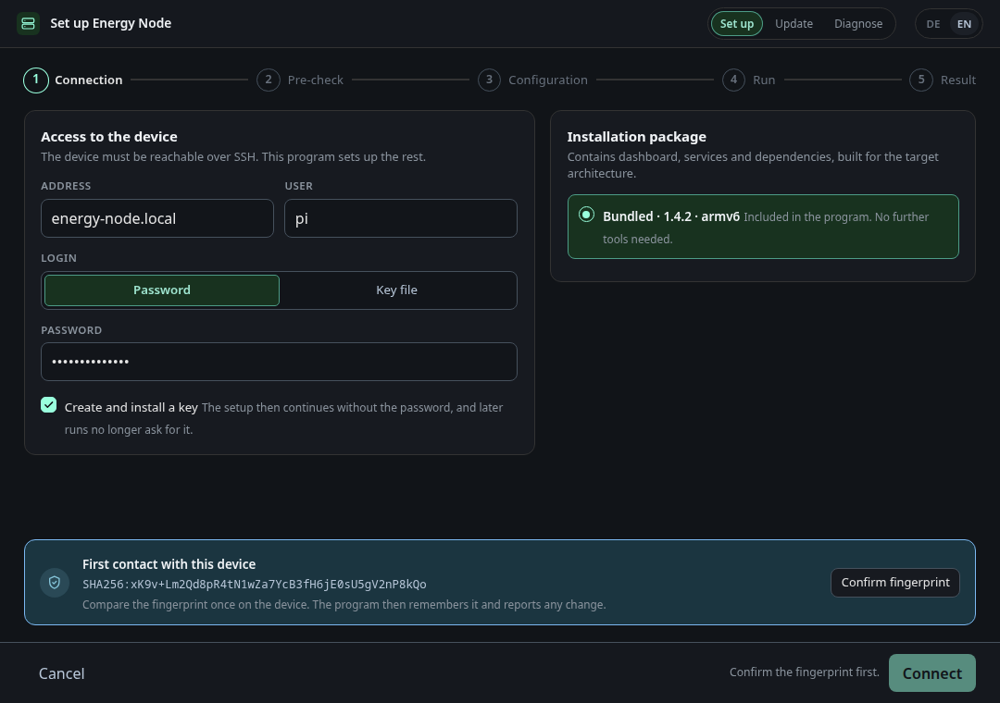
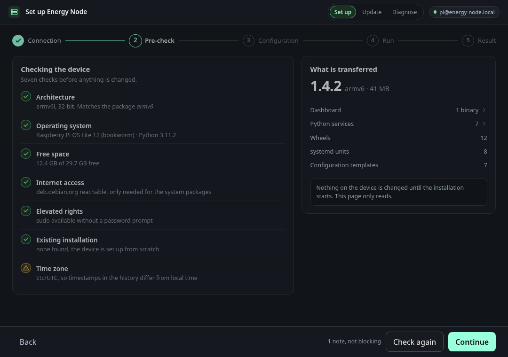
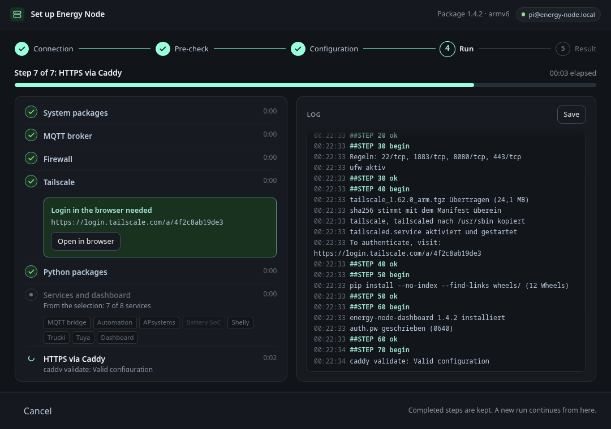
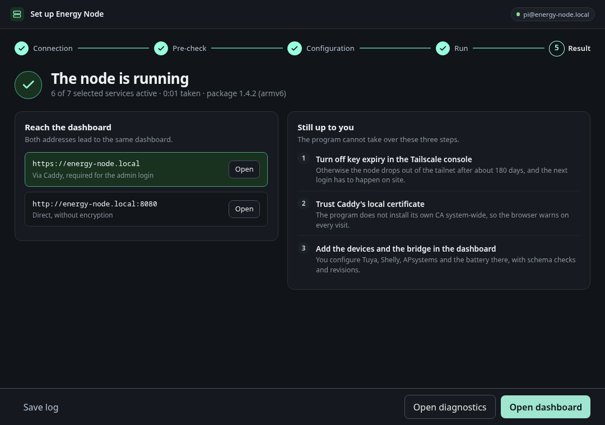
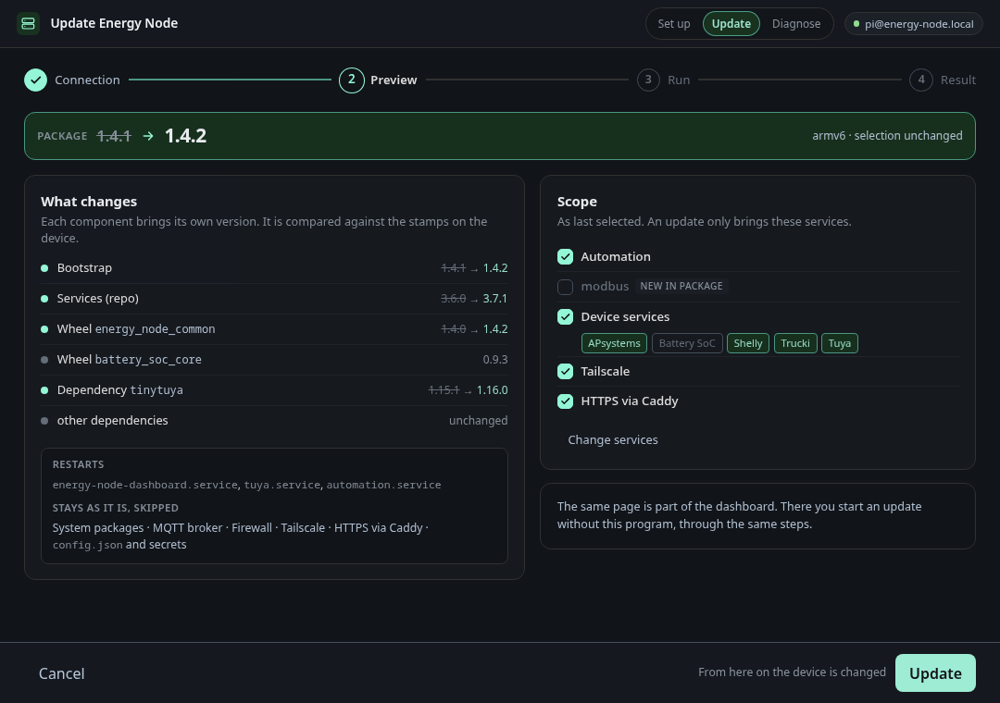
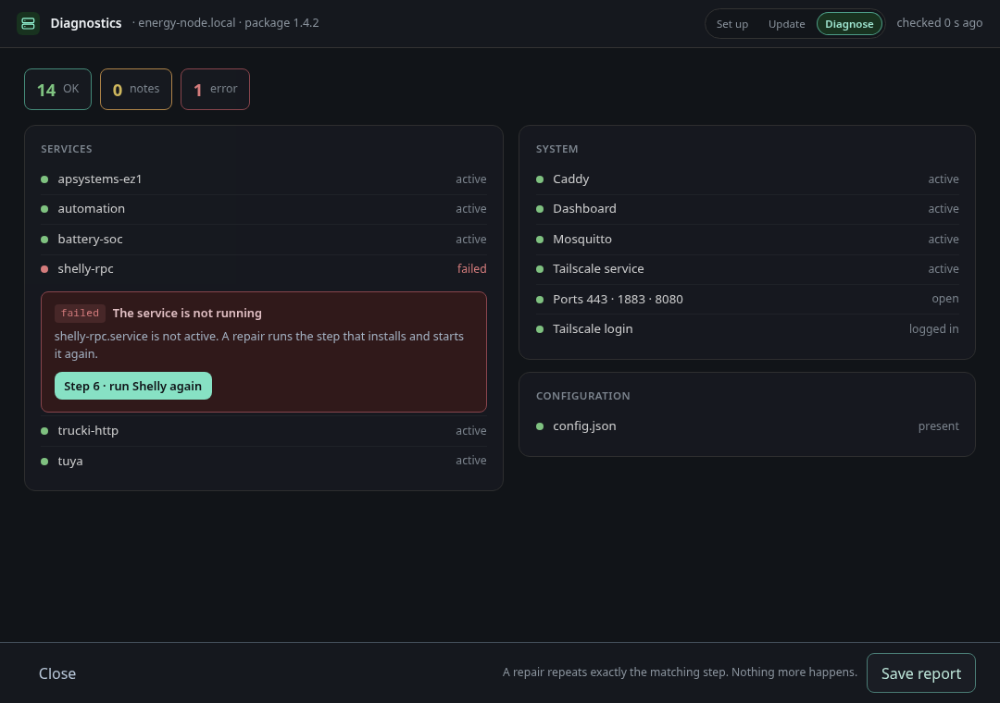

# Deploying a node

The installer is a desktop program that brings Energy Node onto a Raspberry Pi
from your own computer. You point it at the Pi, choose which services you want,
and it runs the same idempotent setup steps a manual install would — packages,
MQTT broker, firewall, Tailscale, the dashboard, HTTPS and one systemd unit per
device service. Nothing is built on the Pi.

It has three entry points, switchable in the top bar of the window:

- **Set up** — a first installation on a fresh Pi.
- **Update** — bring an installed node to the version in the installer's package.
- **Diagnose** — check an installed node and repair one failing part.

> **Status: preview.** The installer runs and installs a real node, but it is
> not yet packaged for end users. The release archives contain only the
> program; the installation package (`bundle/`) has to be built from a
> checkout of this repository and unpacked next to the program — see
> [Getting the installer](#getting-the-installer). Until that changes,
> [INSTALLATION.md](https://github.com/Developer-Simon/energy-node/blob/main/INSTALLATION.md)
> stays the reference for what the installer automates.

Every screenshot on this page comes from the installer's demo host, not from a
real Pi: the real window and the real screens, backed by canned data. The
version numbers, the service states and the log lines are made up. You can
[run the demo yourself](#reproducing-these-screenshots).

---

## Before you start

**The Pi**

- Raspberry Pi OS (or Debian) with SSH enabled and a user that can use `sudo`
  **without a password**. The very first thing the installer does is create a
  working directory under `/var/lib`, which needs root.
- Internet access on the Pi, for the system packages and for Tailscale.
- The Pi must be reachable from your computer by name or IP address.

**Your computer**

Windows, macOS or Linux. On Windows the window uses the Edge WebView2 runtime,
which current Windows 10 and 11 installations include. On Linux it needs GTK with WebKitGTK
installed. If a window cannot be opened, the installer falls back to a browser
— see [The window](#the-window).

---

## Getting the installer

Every release on the repository's GitHub releases page carries the installer:

| Your computer | File |
|---|---|
| Windows | `energy-node-installer_windows_amd64.exe` — start it with a double click |
| macOS (Intel and Apple Silicon) | `energy-node-installer_macos_universal.zip` — unzip, then start `energy-node-installer` |
| Linux (x86-64) | `energy-node-installer_linux_amd64.tar.gz` |
| Linux (ARM64) | `energy-node-installer_linux_arm64.tar.gz` |

`SHA256SUMS.installer` lists their checksums. The builds are unsigned, so
Windows SmartScreen and macOS Gatekeeper warn before the first start. The
installer downloads the signed installation package for your Pi from the same
releases, so the program is all you need.

To run the installer from a checkout with a package built locally instead:

```sh
bash scripts/build/make_bundle.sh --arch armv6
mkdir -p installer/bundle
tar -xzf dist/energy-node-*-armv6.tar.gz -C installer/bundle
scripts/dev/run-installer.sh
```

`--arch` is the Pi's architecture: `armv6` for a Pi 1 or Pi Zero (the default
target), `arm64` or `amd64` otherwise. `run-installer.sh` builds the program
and starts it (`--no-build` skips the build). The
[Installer developer CLI](knowledge/installer-developer-cli.md) page has the
details, such as a quicker package build for a first try.

---

## Setting up a node

### 1. Connect



Enter the Pi's address and the SSH user, then either the password or a key
file. With a password, leave **Create and install a key** ticked: the installer
generates a key pair, installs the public half on the Pi, and every later run
— updates, diagnostics — connects without asking for the password again.

The right-hand card shows which installation package is used and for which
architecture. It has to match the Pi; the next step checks that.

The first time you connect to a Pi, the installer shows its host key
fingerprint.



Compare it once on the Pi itself, then confirm. The installer remembers the
key in `~/.energy-node/known_hosts` and warns if it ever changes.

### 2. Pre-check



Before anything is changed, the installer looks at the Pi: operating system,
architecture and Python version against the package, free disk space, `sudo`
without a password, internet access and the time zone. A finding either
**blocks** the installation or is a **note** you can continue past. A package
built for another architecture or Python version than the Pi runs is a
blocker; a Pi that is still on UTC is a note. The card on the right lists what
will be transferred. Nothing on the Pi has changed at this point.

### 3. Configuration


Two passwords and the services you want.

- **Credentials.** A password for the MQTT broker and one for the dashboard's
  admin login. They are written only to the Pi
  (`/etc/energy-node/mqtt.pw` and `/etc/energy-node-dashboard/auth.pw`, mode
  `0640`). The installer stores neither on your computer and keeps them out of
  its log.
- **Services.** The core always runs: broker, firewall, MQTT bridge and
  dashboard. On top of that you choose Automation, the individual device
  services (APsystems, Battery SoC, Shelly, Trucki, Tuya), Tailscale and HTTPS
  via Caddy. A service you deselect is also hidden in the dashboard. The Pi
  remembers the selection in `config.json`
  (`installed_services`, see [Configuration file](knowledge/configuration.md)),
  and an update applies exactly that selection again.
- **Target system.** The service user and its base directory on the Pi.

**Start installation** is the point of no return: from here on, the Pi is
changed.

### 4. Run



The left column follows the steps; the right shows the live log. If a step
needs you — Tailscale wants a login in a browser — it shows the address and an
**Open in browser** button, and waits.

If a step fails or you cancel, the steps that finished are kept. Starting again
continues where the run stopped, because every step checks whether its work is
already done.

### 5. Result



The result page gives the dashboard's addresses — HTTPS through Caddy, which
the admin login requires, and plain HTTP on port 8080 — and a short list of
what the installer cannot do for you, such as turning off Tailscale key expiry
and trusting Caddy's local certificate. **Save log** writes the full log to a
file.

---

## Updating a node



Choose **Update** and connect. The preview compares each component's version
against the stamp on the Pi and lists what changes, which services restart, and
which steps are skipped because their work is done. By default, only a service
whose own version changed restarts; a change to `energy_node_common` restarts
every service, and a change to `battery_soc_core` restarts `battery_soc` alone.
Tick **Restart all services** to restart every service unit regardless. A unit
that is not currently running always starts, whatever the rule says, and a node
whose last run predates per-service versions restarts every service once. The
scope card shows the services as they were last selected; a service that is new
in the package stays off until you tick it (**Change services**). **Update**
runs exactly the steps that are pending — the same code path as a fresh
install, so there is no separate "partial" update to go wrong.

The dashboard serves the same page under `/redeploy/`, behind its login, and
runs the same steps on the node itself, without this program and without SSH.
It works with a package that is already staged on the node; it cannot fetch
one.

---

## Diagnosing a node



**Diagnose** reads the installed package version from the Pi and runs a
checklist: every systemd unit, the open ports, the Tailscale login and the
presence of `config.json`. A failing check comes with a button that repeats
exactly the step responsible — nothing else runs. **Save report** writes the
result to a file, which is what to attach to a bug report.

---

## The window

The installer runs a small web server on `127.0.0.1` and opens its page with a
one-time token in the address, so nothing else on your computer can talk to it.
It shows that page in the first of these that works:

1. **An embedded system window** (WebView) — the normal case.
2. **A Chrome, Chromium or Edge app window**, without tabs or address bar.
3. **Your default browser**, as a normal tab.
4. **Nothing** — the address is printed in the terminal; open it yourself.

Start it with `--no-window` to go straight to the fourth option, for instance
when running it over SSH on a headless machine. Closing the embedded window
ends the program; in the other modes, press `Ctrl+C`.

| Flag | Purpose |
| --- | --- |
| `--bundle <dir>` | Use the installation package in this directory instead of `bundle/` next to the program |
| `--lang <code>` | Interface language, `de` or `en`; default: from your operating system's locale |
| `--port <n>` | Port on `127.0.0.1`; default: any free port |
| `--no-window` | Do not open a window, only print the address |

The interface language can also be switched in the top bar.

---

## Reproducing these screenshots

The installer's web UI has a demo host that serves the real screens against a
fake backend, so no Pi is needed:

```sh
cd installer/webui
go run ./cmd/fakehost --lang en --port 8099
```

Open the printed address and connect with any address, user and password.
`--scenario vorlage-update` serves the update preview, `--hold-step <id>` stops
a run at that step, and `--fail-step <id>:<CODE>` makes one fail.

---

## For developers

The installer also has a command-line mode that builds a bundle from your
checkout and deploys it to a Pi over SSH. See
[Installer developer CLI](knowledge/installer-developer-cli.md).
