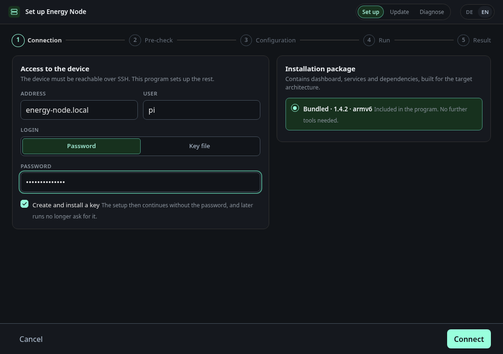
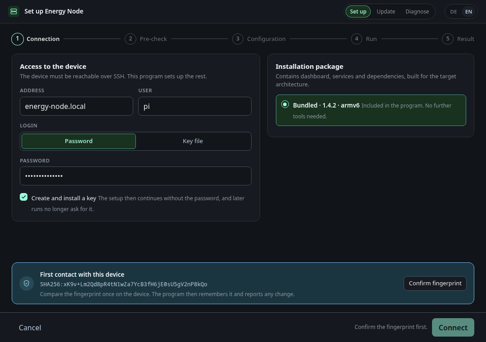
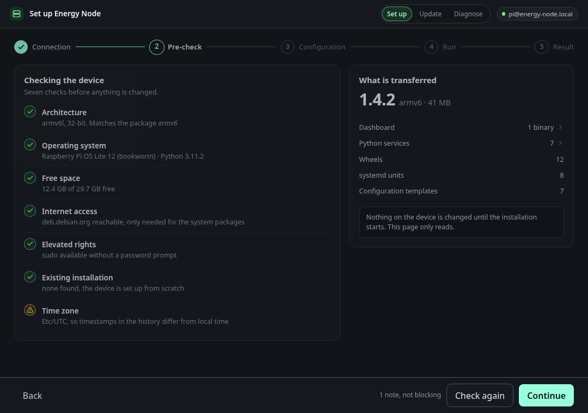
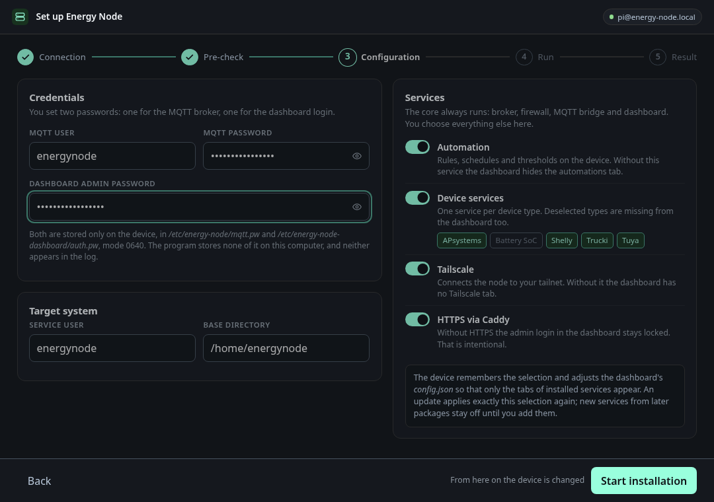
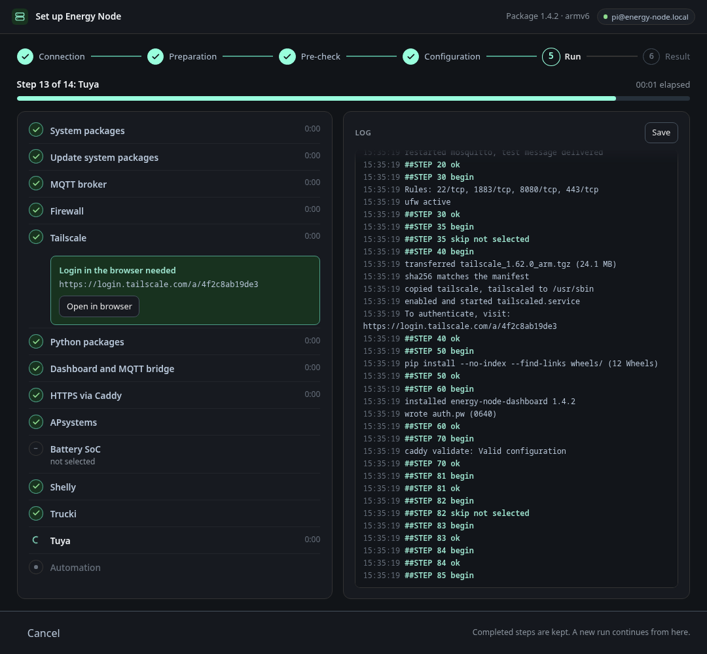
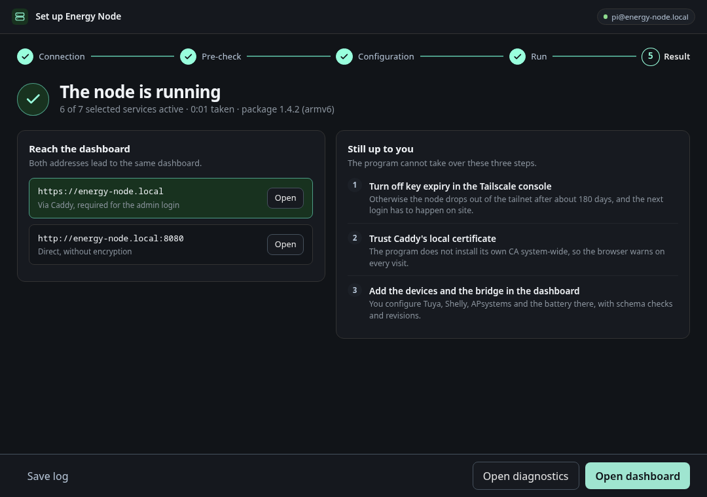
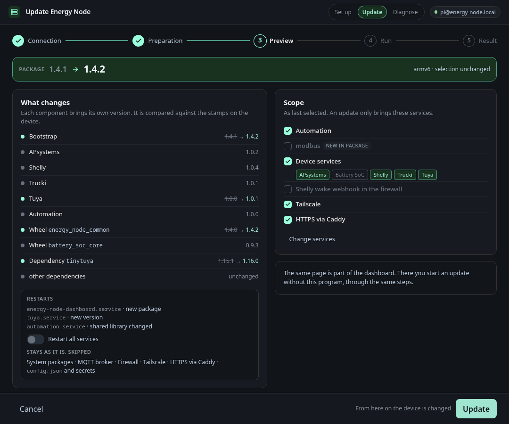
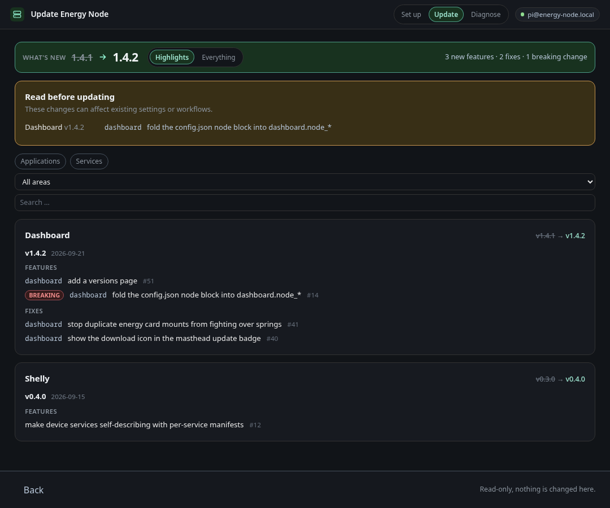
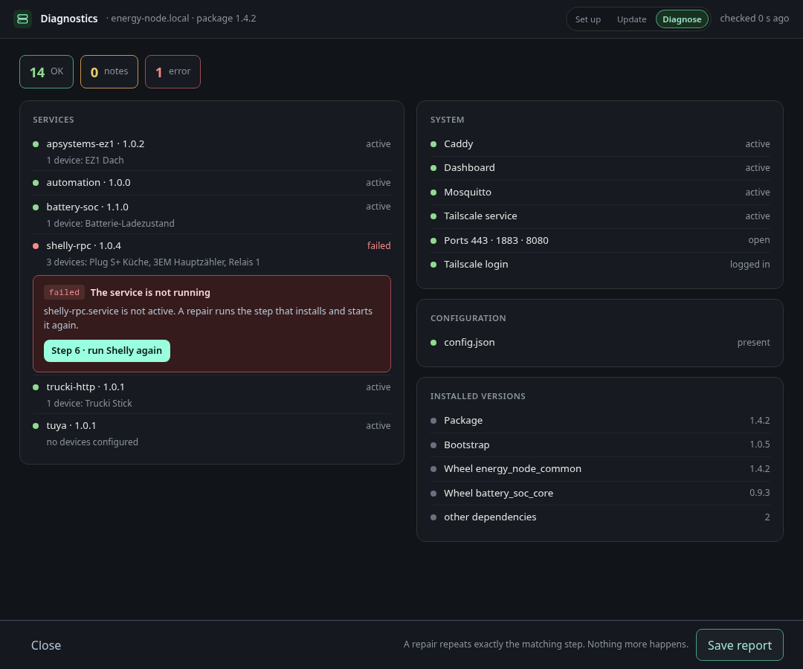

# Deploying a node

The installer is a desktop program that puts Energy Node on a Raspberry Pi from
your own computer. You point it at the Pi and choose the services you want.
It then runs the same idempotent setup steps as a manual install: packages,
MQTT broker, firewall, Tailscale, the dashboard, HTTPS and one systemd unit per
device service. Nothing is built on the Pi.

The top bar of the window switches between three modes. **Set up** installs a
fresh Pi. **Update** brings an installed node to the version in the
installer's package. **Diagnose** checks an installed node and repairs one
failing part.

> The installer is in beta. It already sets up, updates and diagnoses real
> nodes, but 1.0 is not released yet. Until then, screens and steps can change
> between versions. [Manual installation](install/index.md) documents what the
> installer automates and why.

The screenshots on this page come from the installer's demo host and not from
a real Pi. Window and screens are real, but the data behind them is canned, so
version numbers, service states and log lines are made up. The screenshot
notes in the repository explain how to run the demo yourself.

## Before you start

The Pi needs Raspberry Pi OS (or Debian) with SSH enabled and a user that can
run `sudo` without a password. The installer's first action is to create a
working directory under `/var/lib`, which needs root. The Pi also needs
internet access for the system packages and for Tailscale, and your computer
must reach it by name or IP address.

Your computer can run Windows, macOS or Linux. On Windows the window uses the
Edge WebView2 runtime, which current Windows 10 and 11 installations include.
On Linux it needs GTK with WebKitGTK. If no window can be opened, the installer
falls back to a browser, see [The window](#the-window).

## Getting the installer

Every release on the repository's GitHub releases page includes the installer:

| Your computer | File |
|---|---|
| Windows | `energy-node-installer_windows_amd64.exe`, start it with a double click |
| macOS (Intel and Apple Silicon) | `energy-node-installer_macos_universal.zip`, unzip it and start `energy-node-installer` |
| Linux (x86-64) | `energy-node-installer_linux_amd64.tar.gz` |
| Linux (ARM64) | `energy-node-installer_linux_arm64.tar.gz` |

`SHA256SUMS.installer` lists their checksums. The builds are unsigned, so
Windows SmartScreen and macOS Gatekeeper warn before the first start. The
installer downloads the signed installation package for your Pi from the same
releases, so the program is all you need.

To run the installer from a checkout with a locally built package instead:

```sh
bash scripts/build/make_bundle.sh --arch armv6
mkdir -p installer/bundle
tar -xzf dist/energy-node-*-armv6.tar.gz -C installer/bundle
scripts/dev/run-installer.sh
```

`--arch` is the Pi's architecture: `armv6` for a Pi 1 or Pi Zero (the default
target), otherwise `arm64` or `amd64`. `run-installer.sh` builds the program
and starts it (`--no-build` skips the build). The
[Installer developer CLI](developing/installer-cli.md) page has the details,
such as a quicker package build for a first try.

## Setting up a node

### 1. Connect



Enter the Pi's address and the SSH user, then either the password or a key
file. With a password, leave **Create and install a key** on. The installer
then generates a key pair and installs the public half on the Pi, so later
runs for updates or diagnostics connect without asking for the password.

**Remember access details** keeps the address, the user and the password or key
file in your computer's keychain: Windows Credential Manager, macOS Keychain or
the Secret Service on Linux. On the next start the form is filled in and the
password field shows **Saved password**, so you only press **Connect**. The
saved password is only used for the same address and user. To delete the entry,
switch the option off and connect once. Without a keychain, for example on a
Linux desktop without a Secret Service, the switch is hidden.

The card on the right shows which installation package is used and for which
architecture. It has to match the Pi, and the next step checks that.

The first time you connect to a Pi, the installer shows its host key
fingerprint.



Compare it once on the Pi itself, then confirm. The installer remembers the
key in `~/.energy-node/known_hosts` and warns if it ever changes.

### 2. Pre-check



Before it changes anything, the installer checks the Pi: operating system,
architecture and Python version against the package, free disk space, `sudo`
without a password, internet access and the time zone. A finding either blocks
the installation or is a note you can ignore. A package built for a different
architecture or Python version than the Pi's blocks. A Pi still on UTC only
gets a note. The card on the right lists what will be transferred. Nothing on
the Pi has changed yet.

### 3. Configuration



This screen asks for two passwords and the services you want.

The credentials are a password for the MQTT broker and one for the dashboard's
admin login. They are only written to the Pi (`/etc/energy-node/mqtt.pw` and
`/etc/energy-node-dashboard/auth.pw`, mode `0640`). The installer does not
store them on your computer and keeps them out of its log.

The core always runs: broker, firewall, MQTT bridge and dashboard. On top of
that you choose Automation, the individual device services (APsystems,
Battery SoC, Shelly, Trucki, Tuya), Tailscale and HTTPS via Caddy. A service
you deselect is hidden in the dashboard as well. The Pi remembers the
selection in `config.json` (`installed_services`, see
[Configuration file](operating/configuration.md)), and an update applies the
same selection again.

**Update system packages** is on by default. It installs pending Debian
updates once per installer version and tells you when the node needs a reboot.
In the update preview, **Check for updates** counts the pending updates, and
the diagnose lists them. Both use the package lists from the node's last
refresh (apt-daily runs daily) and say when that was. **Fetch again now** in
the diagnose refreshes the lists first.

Under **Target system** you set the service user and its base directory on the
Pi.

**Start installation** starts changing the Pi. There is no way back after
this point.

### 4. Run



The left column follows the steps and the right one shows the live log. When a
step needs you, for example because Tailscale wants a login in a browser, it
shows the address and an **Open in browser** button and waits.

If a step fails or you cancel, the steps that finished are kept. Starting again
continues where the run stopped, because every step checks whether its work is
already done.

### 5. Result



The result page lists the dashboard's addresses: HTTPS through Caddy, which
the admin login requires, and plain HTTP on port 8080. It also lists what the
installer cannot do for you, such as turning off Tailscale key expiry and
trusting Caddy's local certificate. **Save log** writes the full log to a file.

## Updating a node



Choose **Update** and connect. The preview compares each component's version
with the stamp on the Pi. It lists what changes, which services restart and
which steps are skipped because their work is already done. Every selected
service shows its own version, and every unit that restarts names the reason:
a new version, a changed shared library, a first install or an unknown
installed version.

A step counts as done while nothing it uses has changed since its last
successful run: its own script, the helpers it loads and the files it takes
from the package. An update with a new dashboard therefore skips Mosquitto,
the firewall, Tailscale and every unchanged service. Three steps still run
once per package version. System updates bring in new packages, the Shelly
webhook rule follows the port set in the dashboard, and the dashboard
configuration is written on every run. The first update after this rule was
introduced still runs every step once, because older stamps carry no record
of the inputs.

By default only a service whose own version changed restarts. A change to
`energy_node_common` restarts every service, and a change to
`battery_soc_core` restarts only `battery_soc`. **Restart all services**
restarts every service unit anyway. A unit that is not running always starts,
and a node whose last run predates per-service versions restarts every service
once. The scope card shows the services as last selected. A service that is new
in the package stays off until you tick it under **Change services**.
**Update** runs the pending steps through the same code as a fresh install, so
there is no separate partial update path that could break.

When the package carries a changelog, the first card adds a line such as
"3 new features · 2 fixes · 1 breaking change" and a **View changes** button.
The page behind it lists, per component, only what is newer than the version on
the Pi. Breaking changes come first, then one card per component. The page
opens on the **Highlights**, one line per merged change that matters to an
operator. The switch at the top shows **Everything**, down to each commit. The
counts in the first card are based on the highlights too. You can filter by
kind (applications, services, libraries and so on) or by area, and search the
text. The page works offline and changes nothing. A package without a
changelog shows no such line.



The dashboard serves the same page under `/redeploy/`, behind its login, and
runs the same steps on the node itself, without this program and without SSH.
It can download the newest signed release package from GitHub, and its header
shows a notice when a newer release is out.

## Diagnosing a node



**Diagnose** reads the installed package version from the Pi and runs a
checklist: every systemd unit, the open ports, the Tailscale login and whether
`config.json` exists. A failing check has a button that repeats only the step
responsible for it. Next to the checks the screen shows what is installed:
each service with its version and its configured devices, services that were
never chosen marked as not installed, and a card with the package, bootstrap
and wheel versions. This part is for information and does not count as checks.
**Save report** writes the result to a file. Attach that file to a bug report.

## The window

The installer runs a small web server on `127.0.0.1` and opens its page with a
one-time token in the address, so no other program on your computer can talk
to it. It shows the page in the first of these that works:

1. An embedded system window (WebView), the normal case.
2. A Chrome, Chromium or Edge app window without tabs or address bar.
3. A normal tab in your default browser.
4. No window at all. The address is printed in the terminal and you open it
   yourself.

`--no-window` goes straight to the fourth option, for example when you run the
installer over SSH on a headless machine. Closing the embedded window ends the
program. In the other modes, press `Ctrl+C`.

| Flag | Purpose |
| --- | --- |
| `--bundle <dir>` | Use the installation package in this directory instead of `bundle/` next to the program |
| `--lang <code>` | Interface language, `de` or `en`. Default: your operating system's locale |
| `--port <n>` | Port on `127.0.0.1`. Default: any free port |
| `--no-window` | Do not open a window, only print the address |

You can also switch the interface language in the top bar.

## For developers

The installer also has a command line mode that builds a bundle from your
checkout and deploys it to a Pi over SSH. See
[Installer developer CLI](developing/installer-cli.md).
