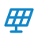

# energy-node Icons integration for Home Assistant

The **energy-node Icons** integration is a Home Assistant custom icon set containing eighteen device symbols plus a generic fallback drawn for the energy-node dashboard. Each icon is an outline that Home Assistant fills with your chosen theme color — so an icon adapts to your dashboard's look.

The set includes batteries, solar panels, grid connections, heat pumps, meters, and infrastructure symbols — everything a household energy-management dashboard needs.

## What is energy-node Icons?

The icon set is a Home Assistant integration that lives alongside `energy_node_icons` in Home Assistant's custom integration picker. Once installed, you can assign icons from the set to any entity — click the entity's icon field, type `energy-node`, and pick from the catalogue.

Each icon is named `energy-node:symbol-name`, where `symbol-name` is one of the icons listed below.

## Install via HACS

The easiest way is through [HACS](https://hacs.xyz/) as a custom repository:

1. Open **HACS** → **⋮** (top right) → **Custom repositories**.
2. Repository URL: `https://github.com/Developer-Simon/ha-energy-node-icons`
3. Category: **Integration** → **Add**.
4. Search for **energy-node Icons** → **Download**.
5. **Restart Home Assistant.**
6. **Settings → Devices & Services → Add Integration → "energy-node Icons"** (this loads the icon set into Home Assistant).

### Manual install

If you prefer not to use HACS:

1. Download the latest release from [ha-energy-node-icons](https://github.com/Developer-Simon/ha-energy-node-icons/releases).
2. Extract to `<config>/custom_components/energy_node_icons/`.
3. Restart Home Assistant.
4. **Settings → Devices & Services → Add Integration → "energy-node Icons"** (this loads the icon set into Home Assistant).

## Icon catalogue

<!-- icon-table:start (generated by scripts/icons/flatten_icons.py) -->
| Icon | Name | Device type |
|:---:|---|---|
|  | `energy-node:chip-outline` | Generic device (fallback) |
|  | `energy-node:solar-panel` | Solar panel |
|  | `energy-node:current-ac` | Inverter |
|  | `energy-node:power-plug` | Smart plug |
|  | `energy-node:meter-electric` | 3-phase energy meter |
|  | `energy-node:pipe-valve` | Heating-pipe valve |
|  | `energy-node:raspberry-pi` | Raspberry Pi |
|  | `energy-node:home-battery` | Battery |
|  | `energy-node:battery-charging` | Charger |
|  | `energy-node:thermometer` | Thermometer |
|  | `energy-node:power-socket-de` | Flush-mounted socket |
|  | `energy-node:gas-burner` | Heating (oil/gas) |
|  | `energy-node:water-boiler` | Water boiler |
|  | `energy-node:ev-station` | Wallbox (EV charger) |
|  | `energy-node:transmission-tower` | Power grid |
|  | `energy-node:sitemap` | Automations |
|  | `energy-node:home` | Building |
|  | `energy-node:heat-pump` | Heat pump |
|  | `energy-node:flash-circle` | Consumption |
<!-- icon-table:end -->

## How to use

Click the **icon** field on any entity card or sensor:

1. The icon picker opens.
2. Type `energy-node` to filter to this set.
3. Scroll to the icon you want and click to select it.

The icon name (e.g., `energy-node:solar-panel`) is now assigned to that entity. Home Assistant will display the icon in your dashboard, badges, and entity rows — filled with the icon color from your theme.

## About the drawings

The icon strokes are converted to filled outlines at the dashboard's stroke width, so each icon takes Home Assistant's icon colour and looks like the dashboard's stroked symbol.

## Support and feedback

The icon set is maintained alongside the energy-node project. For:

- **Icon suggestions or redraws**: open an issue in [energy-node](https://github.com/Developer-Simon/energy-node/issues).
- **Home Assistant integration problems**: open an issue in [ha-energy-node-icons](https://github.com/Developer-Simon/ha-energy-node-icons/issues).
- **Pull requests**: the icons belong in the [energy-node monorepo](https://github.com/Developer-Simon/energy-node/), not in the mirror — they are regenerated with each release.

## License

MIT — see [LICENSE](https://github.com/Developer-Simon/ha-energy-node-icons/blob/main/LICENSE).
