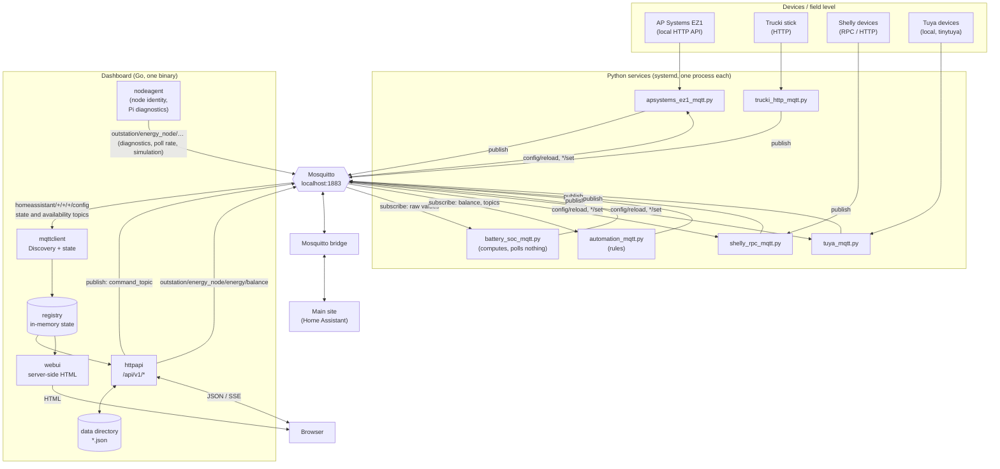
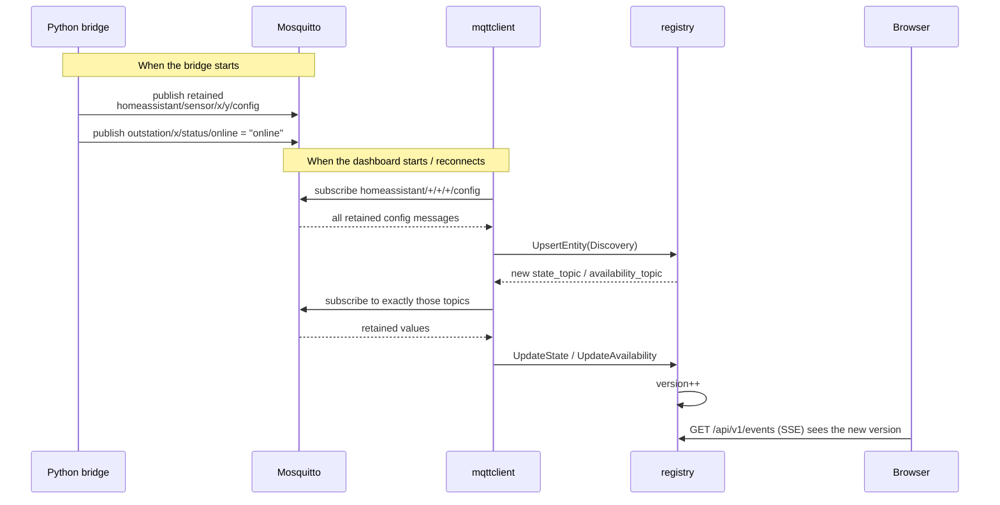
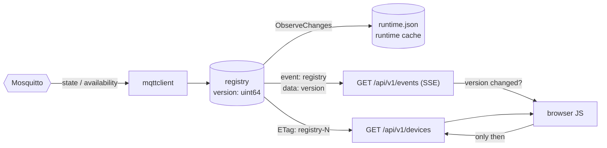
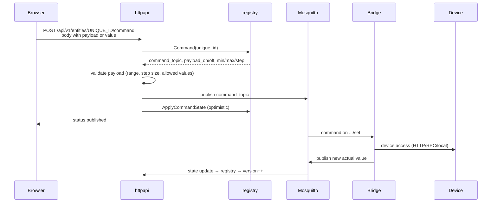
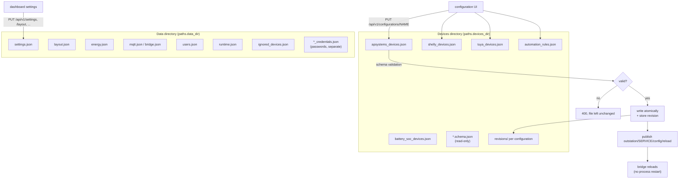
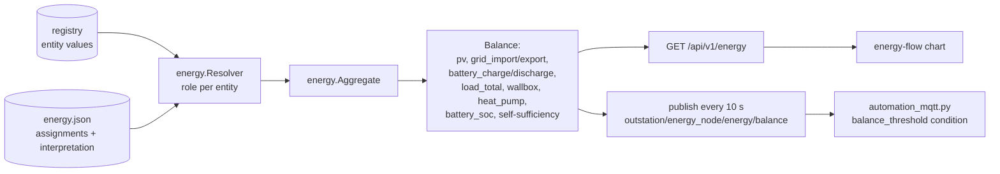
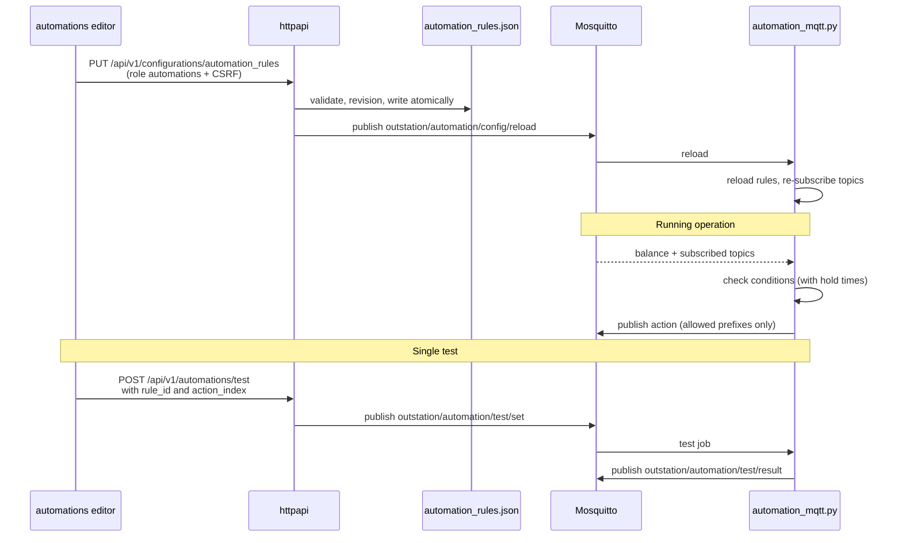
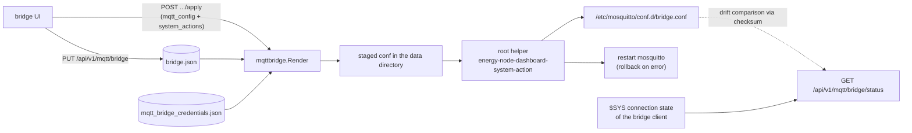
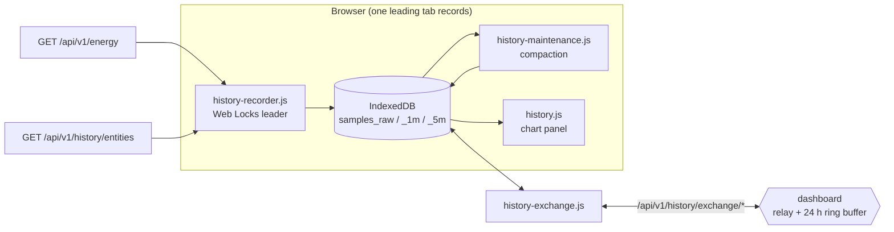

# Data flows in the Energy Node system

This document describes **which data is produced where, which channels it
travels through, and who consumes it**. It is deliberately system-wide: the
Python bridges, the MQTT broker, the Go dashboard and the browser all appear
together.

Details about individual building blocks live elsewhere:

- The dashboard's HTTP interface → [dashboard/api-documentation.md](dashboard/api-documentation.md)
- The Python infrastructure package → `libs/energy_node_common/`
- The Mosquitto bridge to the main site → see INSTALLATION.md section 5

---

## 1. The whole picture

Everything runs through **exactly one local MQTT broker** (Mosquitto on the
Raspberry Pi). There is no direct HTTP path between the device bridges and the
dashboard — the broker is the only coupling.





**Core statement:** device state flows *upward* (device → bridge → broker →
dashboard → browser), commands and configuration flow *downward* (browser →
dashboard → broker → bridge → device).

---

## 2. Topic conventions

Two namespaces, with strictly separated jobs:

| Namespace | Purpose | Retained | Who writes |
|---|---|---|---|
| `homeassistant/{component}/{device_id}/{object_id}/config` | **Discovery** — describes *which* entity exists and where its value is | yes | Python bridges |
| `outstation/{device_id}/...` | **Payload data** — measurements, status, commands | partly | bridges + dashboard |

Important sub-structures below `outstation/`:

| Topic | Direction | Content |
|---|---|---|
| `outstation/{device_id}/{group}/{field}` | bridge → broker | measurement (e.g. `outstation/t2mg81a4e9/field/acpower`) |
| `outstation/{device_id}/status/online` | bridge → broker | availability; also set as the MQTT *last will* |
| `outstation/{device_id}/.../set` | broker → bridge | switch command (`command_topic` from Discovery) |
| `outstation/{service_id}/config/reload` | dashboard → bridge | bridge reloads its JSON configuration |
| `outstation/energy_node/energy/balance` | dashboard → broker | energy balance, every 10 s |
| `outstation/automation/test/set` | dashboard → automation | run a single rule action as a test |
| `outstation/automation/test/result` | automation → broker | result of the test |
| `$SYS/broker/connection/{remote_client_id}/state` | broker → dashboard | is the bridge to the main site up? (`1`/`0`) |

When publishing, the automation service enforces guard rules: no wildcards, no
`homeassistant/...` (no forged Discovery), no `$SYS/...`, and no writes to the
dashboard's own `outstation/energy_node/energy/balance` and
`outstation/energy_node/status/online` topics.

---

## 3. Discovery — how the dashboard learns what exists

The dashboard has **no device list in a configuration file**. It learns
everything at runtime from retained Discovery messages. A restart of the
dashboard is enough, because the broker re-delivers the retained messages.





Details that matter day to day:

- The dashboard subscribes **only** to concretely discovered topics, never to
  `outstation/#`. An empty Discovery field means: the dashboard does not see the
  value.
- An **empty** payload on a `config` topic is the deletion: the entity
  disappears, orphaned topics are unsubscribed.
- Parse errors land in `reg.DiscoveryErrors()` and are visible via
  `GET /api/v1/discovery` — they are not silently dropped.
- The `discovery_prefix` is configurable (default `homeassistant`).

---

## 4. Live values all the way to the browser

The browser does **not** get values pushed from MQTT. Between the registry and
the browser sits a deliberately simple version mechanism.





- **SSE carries no payload data**, only `{"version": N}`. On a change the client
  fetches the devices via `GET /api/v1/devices` — that saves a diff
  implementation on both sides.
- The poll interval of the SSE loop comes from `settings.json`
  (`live_update_interval_seconds`, default 3 s) and takes effect **without a
  reconnect**.
- `GET /api/v1/devices` returns `ETag: "registry-N"`; with a matching
  `If-None-Match` the server answers `304`.
- The **runtime cache** (`runtime.json`) survives restarts: it remembers the
  last seen values and restores them when an entity reappears, so tiles are not
  empty after a restart.

---

## 5. Commands — from the click to the device





The dashboard publishes **only to `command_topic`s that come from Discovery** —
there is no API path to write an arbitrary topic. The one exception is the
hard-wired automation test on `outstation/automation/test/set`.

Every command is recorded per device in an in-memory history (max. 12 entries)
and appears in `GET /api/v1/devices/{id}` as `command_actions`.

---

## 6. Configuration — files, not a database

There are two separate directories with different ownership.





Characteristics of the storage path:

- **Writing is atomic** (temp file + `rename`) and stores a revision first —
  every configuration is viewable via `.../revisions` and restorable via
  `.../restore`.
- **The reload runs over MQTT**, not over systemd: the target service swaps its
  configuration in the running process. `automation_rules` maps to the service
  ID `automation`, otherwise `{name}_devices` → `{name}` applies.
- **Passwords always live in their own files** (`*_credentials.json`) and thus
  outside the revision copies. They are never returned in clear text — the API
  reports only `password_configured: true/false`.

---

## 7. Energy balance

The balance is a derived data stream: roles are assigned to entities, and from
the roles a balance object is produced that is available both over HTTP and over
MQTT.





The automation service consumes the balance as *finished numbers* — it computes
nothing itself. If the balance goes stale (older than `balance_max_age_s`,
default 30 s), balance-based rules stop firing.

---

## 8. Automations





Condition types: `balance_threshold`, `battery_soc`, `topic_value`,
`time_window`, `entity_value`. Action types: `publish`, `notification`.

---

## 9. Path to the main site

The Mosquitto bridge mirrors both namespaces bidirectionally to the main site
(`topic outstation/# both 0`, `topic homeassistant/# both 0`). This way the main
site sees the same Discovery and measurement topics as the dashboard.

The dashboard **manages** the bridge but is not itself part of the bridge data
path:





The dashboard never writes directly to `/etc` — it drops a file in its own data
directory and lets a root helper do the rest. The status combines three
independent sources: the systemd service state, the `$SYS` connection state, and
a checksum comparison between the stored and the installed configuration.

---

## 10. Browser history (IndexedDB, not on the Pi)

The dashboard keeps a rolling measurement history, but it lives **in each
browser's IndexedDB** (`energy-node-dashboard`, store version 2) — the Pi
stores nothing. `internal/history` on the server side only defines the data
contract and the retention window; it holds no samples.





- **What is recorded:** the energy roles (`role:pv`, `role:grid_import`, …)
  taken from the balance, plus any individual entities listed in `settings.json`
  under `history_extra_entities`, whose current values the browser polls from
  `GET /api/v1/history/entities` — a server-side allowlist, so the browser
  cannot ask for arbitrary IDs. The sampling interval comes from the dashboard
  settings, not from code.
- **One recorder per browser.** The writing tab holds a Web Locks lease
  (`energy-node-historizer`); the other tabs read only and are notified over a
  `BroadcastChannel`. Two tabs writing slightly offset timestamps would defeat
  the composite key and bloat the store.
- **Three tiers, bounded retention:** `samples_raw` (~6 h), `samples_1m`
  (~7 days), `samples_5m` (~30 days). `history-maintenance.js` rolls raw → 1 m
  → 5 m in the leading tab, advancing a watermark in the `meta` store so a run
  only ever touches the newest span.
- **Device-to-device exchange** (`/api/v1/history/exchange/*`): the server is a
  **relay, not a store** — offers are broadcast, requests and deliveries are
  passed to exactly one peer over an SSE stream, nothing is written to disk. A
  24 h in-memory ring buffer joins as the pseudo-peer `server`, so a single
  browser can still backfill after a reload. Peers announce coverage as coarse
  rasters (counts per time bucket), diff them, and request only the missing
  ranges. Only the `1m` and `5m` tiers are exchanged — never raw, whose offset
  timestamps would not deduplicate. Protocol version 1; limits are 500 rows per
  delivery, 20 000 per request, 1 MiB per body.

---

## 11. What the system deliberately does *not* do

These non-features explain many of the design decisions above:

- **No server-side time-series database.** The Pi's registry holds only the
  *current* state; the rolling history lives in the browser (§10), and any
  long-term archive is the main site's job.
- **No server-side event history.** Command history, the last bridge apply and
  the last Tailscale action live in memory only and are gone after a restart —
  as is the history-exchange ring buffer (§10).
- **No wildcard subscription.** What was not announced via Discovery, the
  dashboard does not see.
- **No direct device access from the dashboard.** The exception is the TinyTuya
  helper, which calls a Python script for the initial setup.
