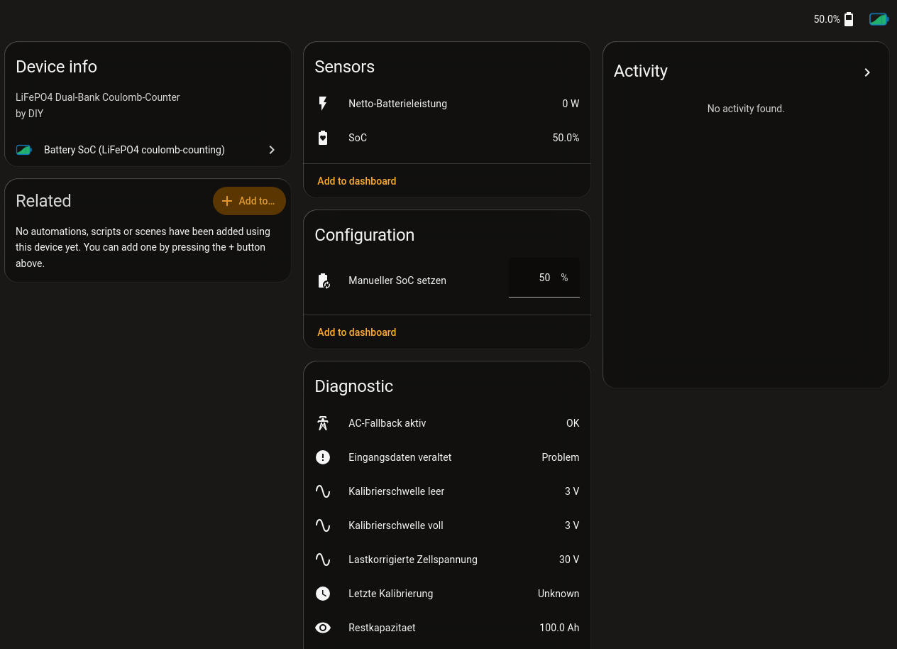

# battery_soc — Home Assistant Custom Integration


A Home Assistant custom integration for LiFePO4 battery state-of-charge estimation using coulomb counting. Reuses the transport-agnostic `battery_soc_core` library (vendored here).

The icon source is [`custom_components/battery_soc/brand/icon.svg`](custom_components/battery_soc/brand/icon.svg); `icon.png` / `icon@2x.png` are generated from it (`magick -background none -density 512 icon.svg -resize 256x256 -depth 8 -strip PNG32:icon.png`).

Where each surface gets the icon from:

| Surface | Source | Covered? |
|---|---|---|
| Home Assistant UI (device page, config flow) | local `custom_components/battery_soc/brand/` (HA 2025.x+ serves it at `/api/brands/integration/…`) | ✅ ships in-tree |
| HACS / hassfest validation (`brands` check) | local `brand/icon.png` | ✅ ships in-tree |
| HACS **store list**, **update-entity dialog**, README header | `brands.home-assistant.io` CDN, by domain (fetched by the browser) | ❌ needs a [`home-assistant/brands`](https://github.com/home-assistant/brands) PR — `custom_integrations/battery_soc/{icon,icon@2x}.png`. Checklist in [`.docs/knowledge/integration/hacs-brands-pr.md`](../../.docs/knowledge/integration/hacs-brands-pr.md). |

## Setup

The vendored core is at `custom_components/battery_soc/battery_soc_core/` — see `_VENDORED.md` there. Do not edit it directly; Plan 3 automates syncs from `src/battery_soc_core`.

## Running Tests

This integration has a separate test environment (`.venv-ha`) to avoid conflicts between the plain core test suite and Home Assistant's pytest plugins.

**First time only:** build the test venv:
```bash
python3.14 -m venv .venv-ha
.venv-ha/bin/pip install -e ./src/battery_soc_core -r integrations/homeassistant/requirements-test.txt
```

**Run tests:**
```bash
cd integrations/homeassistant && ../../.venv-ha/bin/pytest -q
```

Expected: 2 passed (smoke tests verifying core is vendored and importable).

## Lovelace card

The integration ships its own Lovelace card, `custom:battery-soc-card`, and
registers it with the frontend itself — no manual resource entry under
Settings → Dashboards → Resources is needed. It offers two displays, a column
(stock and time remaining) and a trajectory (ring plus a six-hour history and
six-hour projection):

```yaml
type: custom:battery-soc-card
display: trajectory          # column | trajectory
soc_entity: sensor.speicher_soc_combined
power_entity: sensor.speicher_net_power
capacity_kwh: 12.8
reserve_percent: 10          # 0 = no reserve
invert_power: false          # true if your meter reports discharge as positive
runtime_entity: sensor.speicher_time_to_empty   # optional, wins over the linear estimate
```

`soc_entity` is the only required option. Without a Recorder history for
`soc_entity` (Recorder disabled, or retention shorter than six hours) the
trajectory display falls back to showing only the projection — that's the
normal case after a restart, not an error.

## Manifest

`manifest.json` carries the real public identifiers (`Developer-Simon` /
`ha-battery-soc`). `scripts/publish_mirror.sh` re-applies them from
`mirror/release.env` when it assembles the HACS mirror, and stamps the release
version.

## Screenshot



Captured on a German-language Home Assistant; the integration ships `en` and `de`
translations and follows the HA language setting. `publish_mirror.sh` copies
`docs/img/` into the mirror so the public README can reference it.
